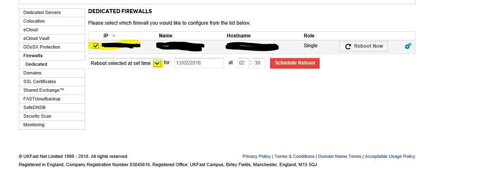

# How do I schedule a reboot for my firewall?

Firewall reboots should be done through my UKFast. Navigate to "Products and Services >> Firewalls >> Dedicated". At this point, you should be able to see the following screen:



Choose the firewall that you would like to reboot and choose the time. Click the "Schedule Reboot" button.


# What do I do if my firewall needs upgrading?

If your business is running the Java-based ASDM to manage your firewall, or AnyConnect VPN with either SSL or IKEv2, your firewall needs updating.

Your UKFast support team has already uploaded the latest imaging software to resolve this bug. All it takes now is for you to schedule your firewall to be restarted.

We have made this as easy as possible for you and your business: please head over to your MyUKFast account and select when you wish to schedule your firewall restart. Once this update is complete, all functions will continue as normal.

```eval_rst
  .. meta::
     :title: Rebooting a Firewall | UKFast Documentation
     :description: A guide to rebooting a dedicated firewall through MyUKFast
     :keywords: ukfast, firewall, rebooting, network, myukfast, cloud, hosting
```
