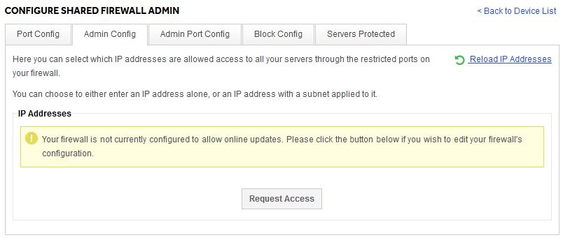

# How to secure your shared firewall

Your firewall is your first line of defence against malicious actors on the public internet. The best way to keep your server secure from attackers is to make sure they get blocked by your firewall.

Sometimes the more advanced firewall features are disabled by default. If you see a message like the following when attempting to use a feature you need, please do hit the "Request Access" button and we'll be alerted to your request.



## Locking down vital services to Admin IPs only

There are often services that you as the server owner will want to control access too. Common examples are SSH, RDP, MySQL, or even your control panels like Plesk or cPanel/WHM. While you and your authorized contacts need to access these, in general the rest of the internet does not. Leaving them open to the world allows attackers to attempt to exploit them.

Fortunately, there is an easy way to stop this. If you know the IPs you want to authorize, you can lock down these admin services on your firewall so only your authorized admin IPs are able to see these vital services.

To do so, you can add your authorized admin IPs in the Admin Config tab:


Then in the Admin Port Config tab, you can configure port rules which apply only to your admin IPs. This is the same interfaces as the standard Port Config tab.

## Blocking an IP

There are some situations where the best solution is to block an IP entirely. On the UkFast shared firewall you can do this under the Block Config tab of your firewall interface. It looks like this:


You can simply add a single IP and Save Changes, and any future connections from that IP will be dropped by your firewall.

Our interface also allows you to add subnet ranges. If you are not familiar with how subnets work, they basically allow you to block a number of IPs in the same subnet range, by using a subnet mask. While it's possible to learn how to these ranges by hand, it is easy to use the many online tools, like this one from [MXtoolbox](https://mxtoolbox.com/subnetcalculator.aspx).

```eval_rst
.. warning::
    UKFast is not responsible for the performance of 3rd party software or testing tools.
```

```eval_rst
  .. title:: Secure your shared firewall
  .. meta::
     :title: Secure your shared firewall | UKFast Documentation
     :description: How to lock down and secure your UKFast shared firewall
     :keywords: ukfast, firewall, shared, secure, block, IP, port, ports
```
