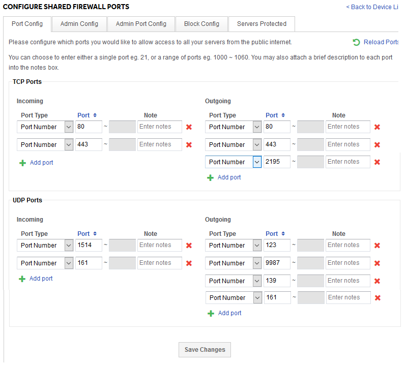
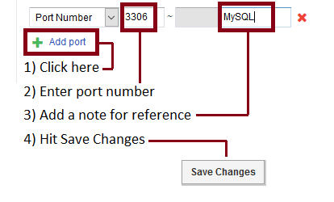

# Managing ports on your shared firewall

We open a default set of ports for each server we deploy, and that works for most of our customers. However every client is different and there are many cases where you may wish open more than the default set of ports on your shared firewall. Examples might be to open ports to allow passive-mode FTP connections, or if want to allow remote access to a MySQL server for development.

The port configuration screen for our shared firewall looks like this:



As you can see, it's fairly simple. By default, all ports are blocked, so only the ports you can see listed there are open. To add more, just hit the "Add port" links. You can add a single port, or a port range. You can also add a note to say exactly why that port is open to help you in future maintenance.



The firewall looks at traffic in both directions. "Incoming" refers to connections from the internet to your server. "Outgoing" means connections from your server to the internet. This means you can control traffic in either direction independently. For example, you might want to allow SSH outbound from your server, but not allow SSH in from the internet.

There are also 2 sections. TCP (Transmission Control Protocol) and UDP (User Datagram Protocol). If you are unsure which you use for your application, you are probably using TCP! The vast majority of common tasks use TCP so unless you are hosting a specialist service like VOIP, streaming hosting your own DNS, you're probably using TCP. The one common UDP port we open is 123 which is for Network Time Protocol (NTP).

```eval_rst
  .. title:: Managing your shared firewall
  .. meta::
     :title: Managing your shared firewall | UKFast Documentation
     :description: How to manage your UKFast shared firewall configuration
     :keywords: ukfast, firewall, config, configuration, access, shared
```
