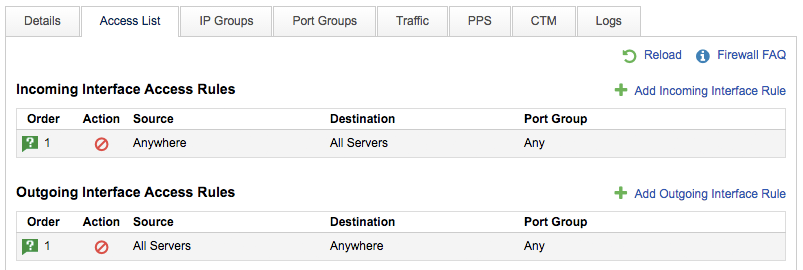

# Accessing your firewall configuration through MyUKFast

You can view your current firewall configurations in [MyUKFast](https://my.ukfast.co.uk/server/dedicated-firewall.php).  You can search and browse your firewalls, clicking on the IP or Name to take you to the specific firewall.  The tabs shown in the screenshot below will enable you to perform the various actions needed to manage your firewall, as described in more detail by the other guides in this section.




```eval_rst
  .. meta::
     :title: Accessing your firewall through  | UKFast Documentation
     :description: How to access your UKFast firewall configuration
     :keywords: ukfast, firewall, config, configuration, access
```
