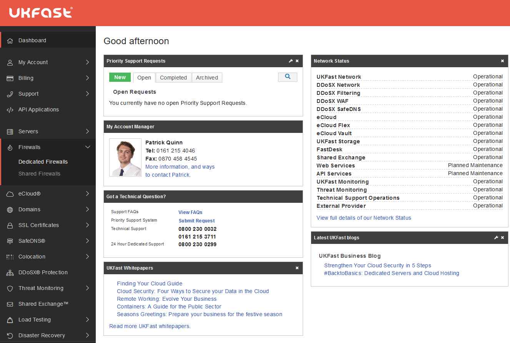
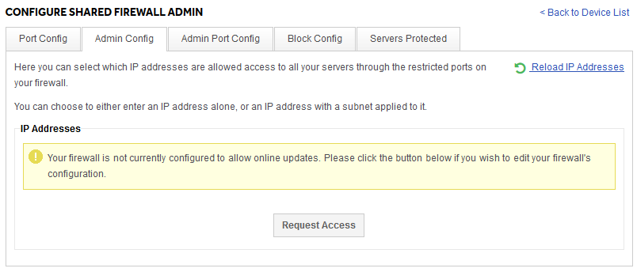

# Accessing your firewall configuration through MyUKFast

UKFast offers two types of firewalls, shared and dedicated. Both offer a level of customisation via the MyUKFast portal. You can view and customise the configuration of both under the Firewalls menu:



After selecting Dedicated or Shared you will be presented with a list of that type of firewall that is associated with your servers.  The configuration pages for shared and dedicated firewalls look a little different, but they do let you have the same basic features. On all UKFast firewalls you can:

### Open/close ports
Services run on ports, so in order to allow a service to communicate through your firewall, you'll need to open a port. In general you want the minimum number of ports open possible. The fewer ports open to the internet, the fewer places a potentially attacker can target.

### Lock down a particular port to certain IPs
Sometimes you will need a port to be accessible remotely, but not to the entire internet. For example, your SSH, RDP or SQL services should only every need to accessed by you or people you authorise. UKFast firewalls let you have these ports open, but only to certain IPs you approve. So you can connect and manage your servers, but any malicious actors would see the port as closed.

### Block an IP
There are occasions when you may wish to block a single IP. UKFast firewalls let you implement blocks against single IPs and subnet ranges.

Sometimes the more advanced firewall features are disabled by default. If you see a message like the following when attempting to use a feature you need, please do hit the "Request Access" button and we'll be alerted to your request.



Our dedicated firewalls allow much finer control, as well as advanced features like VPNs, and the ability to allow ICMP traffic. You can also have more advanced setups, including redundant pairs of firewalls.

```eval_rst
  .. title:: Accessing your firewall
  .. meta::
     :title: Accessing your firewall  | UKFast Documentation
     :description: How to access your UKFast firewall configuration
     :keywords: ukfast, firewall, config, configuration, access
```
