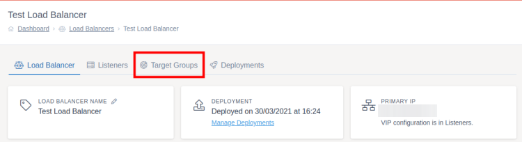

# Common Changes

This guide will go over some of the common changes you may want to carry out in the day to day administration of your loadbalancer server setup.

## Adding a new server behind the load balancer

When traffic to your website increases you can add additional servers behind your load balancer to cope with this demand. Adding more servers gives the load balancer more servers to be able to spread the load of your websites across.

Once you've configured your new server and are happy for it to start receiving requests, follow the below instructions to add it to the pool of target servers your load balancer sends traffic to.

Navigate to the load balancer you want to add the new target server to in [MyUKFast](https://my.ukfast.co.uk/load-balancers) then click on `Target Groups` at the top of the load balancer screen



Click the target group you want to add the target to.


Click the `Targets` tab at the top of the screen.


Click `Create Target` at the top right of the screen.


Fill the form in with the new target servers IP address and port. If it is a UKFast server you will be able to search for and select the server IP when you click the IP field. You can also give the target server an optional name to help you remember which server it is.

If you need to edit setting such as how often to check the health of the target server, whether to check the SSL certificate on the target server or which HTTP version to use this can be done by pressing "Show Advanced Options".


Notice that the target server you have just added will now appear in the list and you now have a message about pending configuration updates to the load balancer. Click the `deployments screen` link.


As long as the rest of your configuration is valid, you will see a `Deploy Now` button. Press this and wait for the screen to reload. Your changes have now been deployed to the load balancer and the target server you have added will now receive traffic from the load balancer.


## Replacing an expired SSL certificate

SSL certificates have expiry dates which once reached will start to show security errors to users visiting the website. You can easily replace your load balancers SSL certificates with a new one when they expire within MyUKFast.

Firstly open the affected load balancer within [MyUKFast](https://my.ukfast.co.uk/load-balancers), then click on `Listeners` at the top of the overview screen.


Click the listener which is affected by the expired SSL, followed by the `SSLs` tab.


Press the delete button on the expired SSL certificate and accept the confirmation box which pops up. You can now see there are changes ready to deploy, leave this button for now.


Click the `Create SSL` button in the top right of the screen and fill in the form with your new SSL certificate details. If the certificate has been bought within MyUKFast you can choose `Import UKFast Certificate`, select the certificate and have the details filled in automatically. Once the form is complete, press save.


Once you have created the new SSL certificate, you can click the `deployments screen` link at the top of the screen. Press `Deploy Now` and wait for the page to refresh. The old SSL certificate has now been removed from your load balancer and the new one applied


## Drain traffic from a particular target server

The weight of a target server indicates how much traffic will be sent to that target server. The higher the number, the more traffic will be sent to it in comparison to other target servers.

You can drain a target server to stop any traffic from going to it once the current requests have finished being dealt with. This stops a users request from being interrupted and the user potentially getting an error.

Navigate to the load balancer you want to edit in [MyUKFast](https://my.ukfast.co.uk/load-balancers) then click on `Target Groups` at the top of the load balancer screen


Click the target group which contains the target server which you want to drain.


Click the `Targets` tab at the top of the screen.


Click `Edit` next to the target server you want to remove from load.


Change the "Weight" field to `0`, then press save at the bottom of the screen.


Notice that the number next to the weight on the target server you have just edited has changed to `0` and you now have a message about pending configuration updates to the load balancer. Click the `deployments screen` link.


As long as the rest of your configuration is valid, you will see a `Deploy Now` button. Press this and wait for the screen to reload. Your changes have now been deployed to the load balancer and the target server you have edited will.
no longer be receiving traffic.


To allow traffic to be sent to the server again, repeat the above steps but change the "Weight" to 1 or more.

## Temporarily remove a target server from behind the load balancer

You may want to remove a target server from the load balancer to stop traffic going to it temporarily. For instance to run updates or to be able to restart the server.

This will immediately take the target server out of load. If you're using "Source" as a load balancing method to send users to the same target server each time, this could disrupt their session. You should first [drain the server](#drain-traffic-from-a-particular-target-server).

Navigate to the load balancer you want to edit in [MyUKFast](https://my.ukfast.co.uk/load-balancers) then click on `Target Groups` at the top of the load balancer screen.


Click the target group which contains the target server which you want to temporarily remove.


Click the `Targets` tab at the top of the screen.


Click `Edit` next to the target server you want to remove from load, notice how it currently says `Active` next to
the target.


Uncheck the "Target is Active" box near the bottom of the form, then press save.


Notice that the tag in the target server you have just edited has changed to `Inactive` and you now have a message about
pending configuration updates to the load balancer. Click the `deployments screen` link.


As long as the rest of your configuration is valid, you will see a `Deploy Now` button. Press this and wait for the screen to reload. Your changes have now been deployed to the load balancer and the target server you have edited will
no longer be receiving traffic.


To allow traffic to be sent to the server again, repeat the above steps but check the "Target is Active" box instead.

```eval_rst
   .. title:: Load Balancers | Common Changes
   .. meta::
      :title: Load Balancers | Common Changes | UKFast Documentation
      :description: Making common changes to UKFast load balancers
```