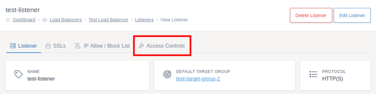
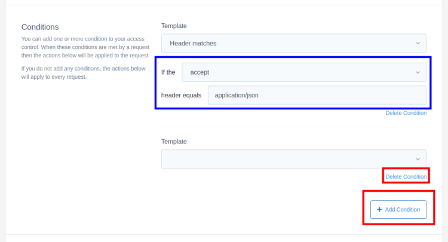
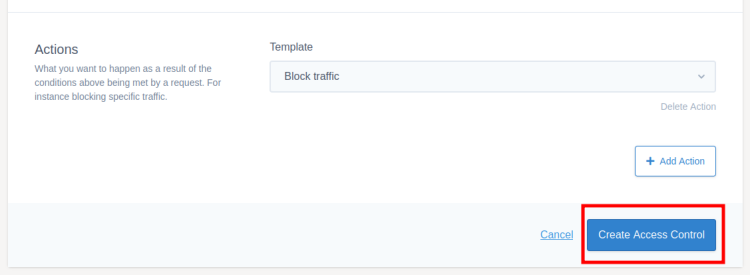

# Access Controls

Access controls can be added to both the listeners and target groups of your load balancer. These allow you more fine-grained over traffic routing and who can access your web applications.

Certain actions and conditions are only available for listeners or target groups not both (for instance the use target group action can only be used with listeners). Only the actions and conditions you can use for that type of access control will be shown within MyUKFast.

To get started adding your access control go to either the listener or target group you want to add an access control to within the [load balancers section](https://portal.ans.co.uk/load-balancers) of MyUKFast. Then click the `Access Controls` tab at the top of the screen.



Click `Create Access Control`, you will then be presented with the access control form. You can give the access control a name to help you remember what it's for later on.

The conditions for an access control are optional, if none are provided the access control will always run. You can use this, for example, if you want to always add a header to any request which passes through the load balancer.

The actions are what will happen if all the conditions are met, you must have at least one action for each access control.



Some templates require additional information. If this is the case, additional inputs will be added once you've selected that template. For instance, the header matches condition will ask for which header to check and what value to check for as shown in the blue box above.

You can add multiple conditions and actions to an access control by clicking the `Add Condition` and `Add Action` buttons respectively. If you no longer need a specific action or condition you can press `Delete Condition` and `Delete Action` to remove them from the access control. These are highlighted in the red box below.

## Available Conditions

* **No conditions** - Always true, the actions will be carried out on every request.
* **Header matches** - Will be true if the specified header matches a certain value.
* **URL begins with** - Will be true if the URL being visited begins with a certain value.

## Available Actions

* **Block traffic** - Stops the request from reaching the server, the user will get a 403 response.
* **Redirect traffic** - Enter the full web address for the redirect location. Status codes should normally be 301 for a permanent change or 302 for a temporary redirect.
* **Use target group** - Will send all requests to the specified target group which must be on the same load balancer.
* **Set request header** - Adds the specified header with value to the requests going into the load balancer and being passed on to target servers.
* **Set response header** -  Adds the specified header with value to the responses leaving the load balancer from the target servers.
* **Choose header for originating IP** - Allows you to specify the request header name that the originating IP information will be copied in to.

If you are looking for behaviour that's not on this list, speak to your account manager to see if we can add it to our templates list.

## Saving and Deploying



Once you've finished an access control, click the `Create Access Control` button shown above to save the new access control. Once you've set up all the access controls you need, make sure you [deploy your changes](/network/load-balancers/deploying-changes).

If you are looking for behaviour that's not on this list, speak to your account manager to see if we can add it to our templates list.

## Saving and Deploying


Once you've finished an access control, click the `Create Access Control` button shown above to save the new access control. Once you've set up all the access controls you need, make sure you [deploy your changes](/network/load-balancers/deploying-changes).

```eval_rst
   .. title:: Load Balancers | Access Controls
   .. meta::
      :title: Load Balancers | Access Controls | ANS Documentation
      :description: Settings for access controls within UKFast load balancers
```
