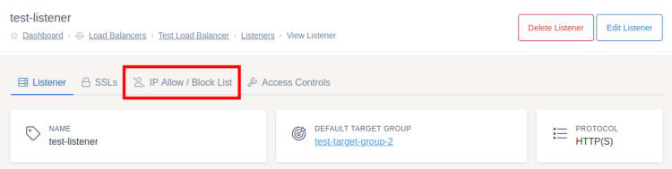
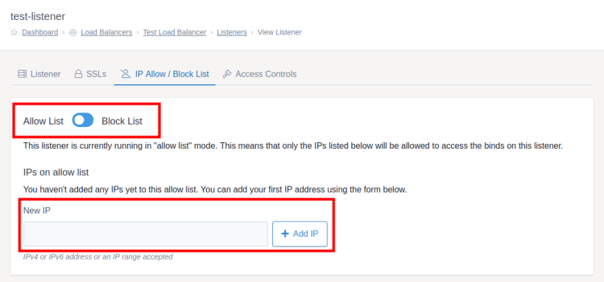
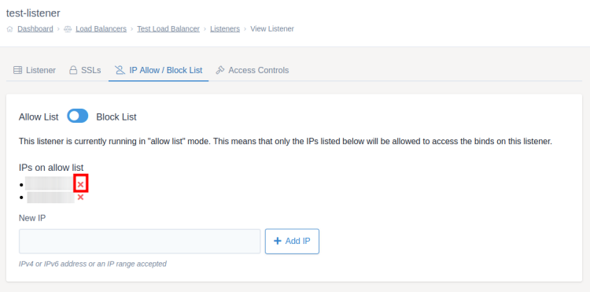

# Access IPs

You can use access IPs on listeners to block certain IPs from accessing your load balancer (block list) or only allow certain IPs to access your load balancer (allow list).

To get started go to the listener you want to change the access IP settings for within the [load balancers section](https://portal.ans.co.uk/load-balancers) of MyUKFast. Then click the `IP Allow / Block List` tab at the top of the screen.



Select either the allow list or block list option using the blue toggle at the top of the screen. You will get a popup box asking you to confirm the change when you press the toggle.

## Adding IPs

You can then add as many IP addresses as you want to the list by using the text box at the bottom of the screen to add an individual IP and then clicking `Add IP`. This input will accept IPv4 and IPv6 addresses as well as IP ranges.



## Removing IPs

To remove an IP from the allow / block list, click the red cross next to the IP address / range you want to remove. You will then need to accept the confirmation popup.



## Deploying

Once you're happy with the access / block list settings, make sure you [deploy your changes](/network/load-balancers/deploying-changes).

```eval_rst
   .. title:: Load Balancers | Access IPs
   .. meta::
      :title: Load Balancers | Access IPs | ANS Documentation
      :description: Settings for access IPs within UKFast load balancers
```