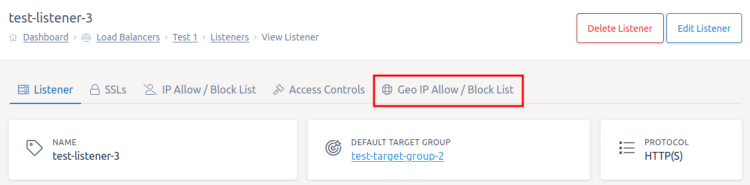
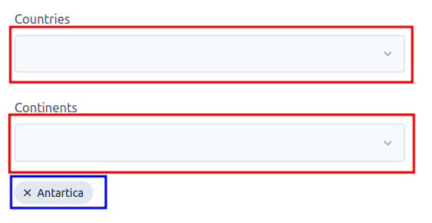
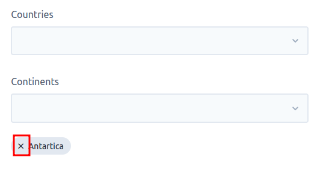

# Geo IP

You can use the Geo IP settings on a listener to allow or deny requests from specific countries and continents..

To get started go to the listener you want to change the Geo IP settings for within the [load balancers section](https://my.ukfast.co.uk/load-balancers) of MyUKFast. Then click the `Geo IP Allow/Block List` tab at the top of the screen.



Firstly enable Geo IP on the listener by clicking the toggle at the top of the screen to change the setting to "Enabled".

## List Type

You can toggle the list between an allow and deny using the "List Type" toggle.

* Allow List - Only users in the countries/continents specified will be allowed to access your load balancer
* Deny List - Any user in a country/continent specified will be blocked from being able to access your load balancer

## EU Filtering

As well as being able to specify specific countries or continents, you can also add all countries within the EU to the list as a group. For instance, if you only want EU customers to be able to access your website you could have an allow list setup with EU filtering included.

## Adding Countries/Continents

To add a country or continent to the allow or deny list, find the country or continent you want to add in the two lists. Clicking on the country/continent will add that location to the list which you can see below each input (highlighted in blue).



## Removing Countries/Continents

To remove a country or continent from the allow or deny list, click the cross next to the location's name on the settings page.



## Deploying

Once you're happy with the Geo IP settings, click the `Save` button at the bottom of the screen. Then make sure you [deploy your changes](../deploying-changes.html).

```eval_rst
   .. title:: Load Balancers | Geo IP
   .. meta::
      :title: Load Balancers | Geo IP | UKFast Documentation
      :description: Settings for Geo IP within UKFast load balancers
```