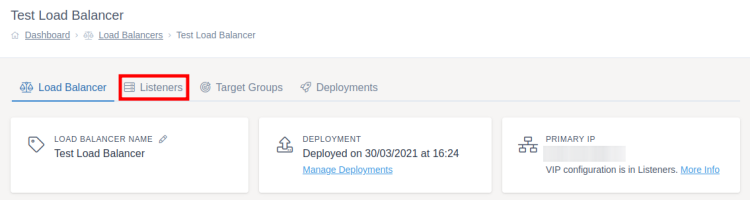
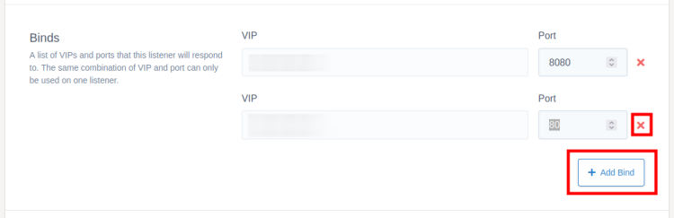
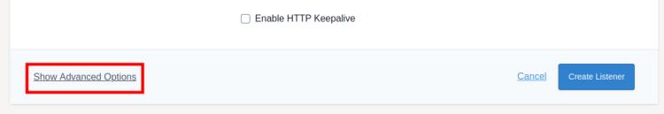

# Listeners

Listeners are used to configure the IP, port and traffic routing information for the load balancer.

To add your listeners, first go to the load balancer you want to add the listener to. Then click `Listeners` on the tabs at the top of the screen, followed by `Create Listener`.



### Basic Configuration

When creating a new listener you will first need to give it a unique name. The default target group is where traffic from the listeners binds (see next section) will be sent to by default unless you override this behaviour with an access control rule. You can then choose whether you want the listener to be HTTP or TCP.

### Binds

These are the combinations of Virtual IP and port that this listener will respond to, you can add multiple binds per listener. If you only have one Virtual IP assigned to a load balancer then this will automatically be filled in to the VIP field, otherwise you will get a search box allowing you to select the correct VIP for that bind.

Each listener needs to have at least one bind and can have as many as needed. Click the "Add Bind" button to add a new VIP / Port combination and the red X to delete a bind.



### Additional SSL Settings

These settings will not be shown for TCP listeners.

You can set this listener to enable HSTS for visitors, this means that the website will always need to have a valid SSL for users to access the website. If your SSL certificate is ever removed or expires, the user's browser remembers that there should be an SSL certificate and stops the user from accessing the website. **If you are going to enable this setting make sure you have an SSL certificate ready to use.**

You can also enable "Redirect to HTTPS" which similar to HSTS will redirect non-HTTPS traffic to HTTPS ensuring the user's data is encrypted between their computer and the server. However, unlike HSTS this isn't enforced and you can disable this setting if needed in the future.

## Advanced Options



These settings have already been set to sensible defaults by UKFast, however if you do need to make changes you can access these settings by pressing "Show Advanced Options" at the bottom left of the listener form. These settings aren't shown for TCP listeners.

**Minimum TLS Version:**

Using the slider, you can change the minimum TLS version used by the listener. UKFast recommends v1.2 at this time. v1.0 and v1.1 are now deprecated and don't meet PCI requirements if this is required by your business. v1.3 uses modern ciphers which means older browsers will not be able to connect to your servers.

## Saving and Deploying

Once you've finished filling in the listener form, click `Create Listener` to add the listener to the load balancer. Once you've finished setting up all your listeners, make sure you [deploy your changes](../deploying-changes.html).

```eval_rst
   .. title:: Load Balancers | Listeners
   .. meta::
      :title: Load Balancers | Listeners | UKFast Documentation
      :description: Settings for listeners within UKFast load balancers
```