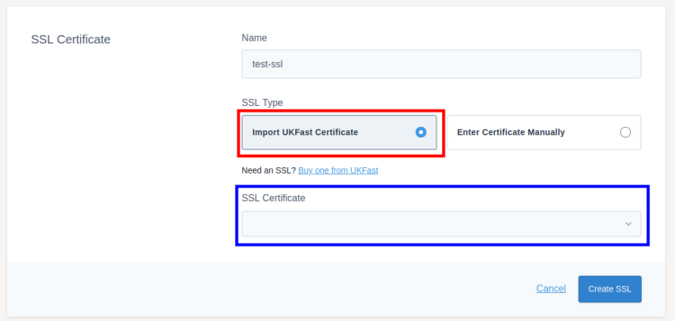

# SSLs

SSLs are used to encrypt traffic between the load balancer and the target servers. You can use an SSL certificate you have bought from UKFast or an SSL from elsewhere.

To add your SSL certificates, first go to the listener you want to add the certificate to. Then click `SSLs` on the tabs at the top of the screen, followed by `Create SSL`.


You first need to give your SSL certificate a name to help you identify the SSL later.

## Using a UKFast SSL

If you want to use an SSL certificate bought from UKFast, click `Import UKFast Certificate` highlighted in red on the below screenshot. You can then search for and choose the SSL certificate using the dropdown menu highlighted in blue below.



If you can't find the SSL certificate you are looking for, make sure it hasn't expired in the [SSL section](https://portal.ans.co.uk/ssl/index.php) of MyUKFast.

## Using an SSL from elsewhere

If you're using an SSL not from UKFast, such as Let's Encrypt or a certificate bought from another provider, you will need to provide the details yourself.

Click `Enter Certificate Manually`, then copy the details you have been given into the appropriate certificate, key, and CA bundle fields. CA bundle is an optional field and not all SSL certificates will have one.


## Saving and Deploying

Click `Create SSL` to add the SSL to the listener

Once SSLs have been created, for security, you'll only be able to edit the name of the certificate. If you need to change any other values (such as the key) you should delete the SSL from MyUKFast and re-add it with the new details.

Once you've set up the SSLs you need on a listener, make sure you [deploy your changes](/network/load-balancers/deploying-changes).

```eval_rst
   .. title:: Load Balancers | SSLs
   .. meta::
      :title: Load Balancers | SSLs | ANS Documentation
      :description: Settings for SSLs within UKFast load balancers
```