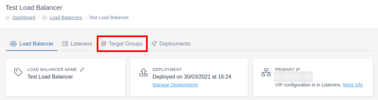

# Target Groups

Target groups are a collection of target servers which will receive and process requests to the load balancer.

To add your target groups, first go to the load balancer you want to add the target group to. Then click `Target Groups` on the tabs at the top of the screen, followed by `Create Target Group`.



## Basic Configuration

All target groups need to be given a name which is unique on that load balancer cluster, you will also need to pick whether the target group will be using the HTTP or TCP mode.

## Cookie Settings

You are able to use cookies to ensure that a user will always go to the same target server when making requests to a load balancer. This is useful, for instance, when you could be using the PHP session to keep a user logged in to an application. If the session is not shared between the targets then the user would be logged out if they moved to a different page within the application and the request was served by a different target server.

To enable sticky sessions you should make sure the "Enable Sticky Sessions" option is checked. You can then enable change various options for the cookie which will be saved to the users device, for instance whether to make the cookie secure and how long it should be saved for.

## Load Balancing Methods

There are 3 ways to balance traffic between the target servers, know as the load balancing method:
* **Round Robin:** Sends traffic first to server A, then to server B, then to server A and so on. This has a slightly lower overhead but can lead to hot spots developing if sticky sessions are in use.
* **Least Connections:** Intelligently sends traffic to the target server that has the least connections when the request is received
* **Source:** The source IP address of the request is hashed and then this is used to determine which target server should be used. It ensures that the IP will always end up on the same target server providing no servers are added or removed.

## Timeouts

The load balancer will wait so long before a request timeouts. In this section you are able to configure how long this delay is if the default values are not suited to your use.

* **Server Timeout** - The maximum time a target server has to return response headers. 
* **Connection Timeout** - The maximum time a target server has to accept a connection.

## Monitoring

By default, the load balancer will check the default site for each target server to see if it responds with a status code between 200 and 399. If the target server doesn't respond (or responds with a status code outside this range) the target server will be marked as unhealthy and no traffic will be sent to it until it recovers.

You can use the target group configuration screen to manage which URL to hit on a target server as either a HEAD, OPTIONS or GET request if you don't want to use the default site. For example, if you have a health check URL that performs additional checks before returning a 200 you could put the host, port and path of this URL into the form.

If you've got a Lumen or Laravel PHP application and want to create a health check URL for your application, why not take a look at our [Health Check Package](https://github.com/ukfast/laravel-health-check)?

## SSL Settings 

There are various SSL settings you can configure to determine how SSLs will work alongside your target groups:
* **Enable SSL Communication** - When enabled SSL communications will be used with targets under this group. For targets with a port of 443 this will automatically be enabled.
* **Enable SSL Verification** - When enabled SSL certificates on targets will be verified before being used to make sure they are valid certificates and in date.
* **Enable SNI** - When enabled, the SNI handshake will be passed through to your target servers. This does not affect SNI on your listeners, which is always enabled.

## Advanced Settings

The other settings on this page are for more advanced control over your load balancer. We've set them to sensible defaults and most people won't need to change them.

## Saving and Deploying

Once you've finished filling in the target group form, click `Create Target Group` to add the target group to the load balancer. Once you've finished setting up all your target groups, make sure you [deploy your changes](../deploying-changes.html).

```eval_rst
   .. title:: Load Balancers | Target Groups
   .. meta::
      :title: Load Balancers | Target Groups | UKFast Documentation
      :description: Settings for target groups within UKFast load balancers
```