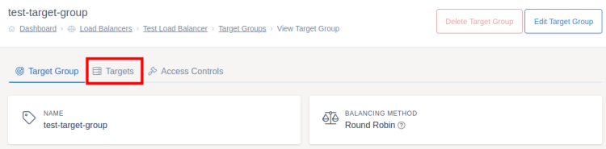
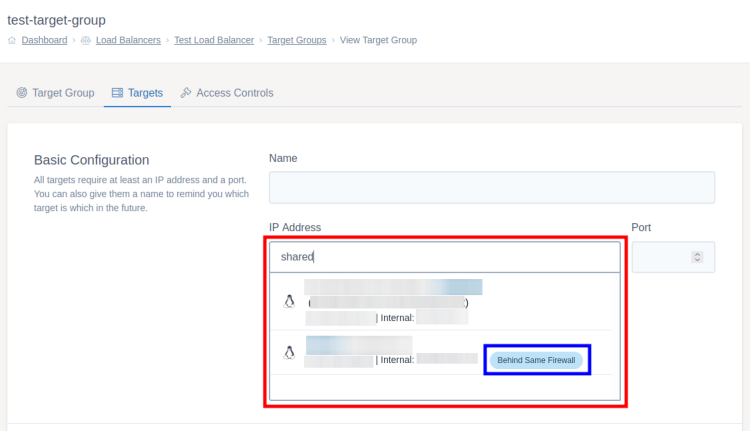
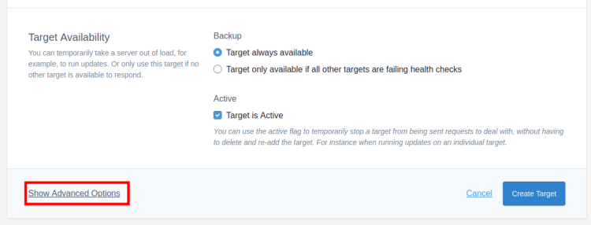

# Targets

Targets are the individual servers that sit behind your load balancer. When the load balancer receives a request, a target will be picked based on the balancing method chosen and the target will then receive the request to deal with.

To add your targets, first go to the target group you want to add the target to. Then click `Targets` on the tabs at the top of the screen, followed by `Create Target`.



## Basic Configuration

Each target needs to have at least an IP, port, and weight assigned. The name is optional and can be used to help remind you which target is which.

**IP Address:**

If you are using a UKFast server as the target, you can search for the server in the IP box by its name, internal or external IP. If you are using a server from another provider you should copy the IP address into the IP field. For UKFast servers, if the target is behind the same firewall as the load balancer the internal IP address will be used. Otherwise, the external IP will be used.

UKFast servers behind the same firewall as the load balancer will be highlighted on this list with the "Behind Same Firewall" label.



**Port:**

This is the port on the target that the load balancer will send requests to.

**Weight:**

The weight field is used to specify how much traffic each target will receive from the load balancer. For instance, if you have two targets both with a weight of 1 then they will receive equal traffic. If target A has a weight of 1 and target B has a weight of 2 then target B will receive twice as much traffic as target A.

You can set weight to 0 to "drain" the target. This means that any existing connections will remain open till they close but no new connections will be sent to that target. This is a way to gradually remove a target server from load without disrupting existing users.

## Target Availability

**Backup:**

You can set a target to only be used if all the other targets on that group are failing health checks, to do this change this option to "Target only available if all other targets are failing health checks". Otherwise, the target will be used as normal alongside the rest of the target group.

**Active:**

This is enabled by default and means your target will be included in the load balancers pool of servers. If you wanted to take a server out of the pool without losing the settings (for instance to run updates) you can mark the server as inactive. You should consider draining the target first to stop any existing connections from being dropped.

## Advanced Options



These options have already been configured with sensible defaults by UKFast and most users won't need to change them. If you do need to alter these settings click "Show Advanced Options" at the bottom left of the target form.

The load balancer will check each target periodically to see if it is online and able to take requests. If the target is offline the load balancer won't send requests on to the target but will continue to check for when it comes back online. These are configured in the "Check" settings below.

* **Check Rise** - How many successful checks need to be made before a target is considered online.
* **Check Fall** -  How many failed checks need to be made before a target is considered offline.
* **Check Interval** - How often the checks will be carried out in seconds.
* **Enable Check SSL** - Checks the SSL certificate being used by the target is valid and in date.
* **HTTP Version** - Which HTTP version should be used on this target.

## Saving and Deploying

Once you've finished filling in the target form, click `Create Target` to add the target to the load balancer. Once you've finished setting up all your targets, make sure you [deploy your changes](../deploying-changes.html).

```eval_rst
   .. title:: Load Balancers | Targets
   .. meta::
      :title: Load Balancers | Targets | UKFast Documentation
      :description: Settings for targets within UKFast load balancers
```