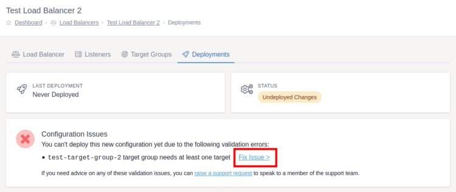

# Deploying Changes

Once you have made the changes you want to your configuration, these need to be deployed to the load balancer. Until this is done the load balancer will continue to use the old configuration.

Once any change has been made to the load balancer which needs to be deployed you will see the below blue box at the top of the screen. Clicking `deployments screen` will take you to the page to deploy these changes. If you are still using the onboarding wizard then this box won't be shown, instead the "Deploy Now" button will activate once you've finished the required steps.


Once on the deployments screen, there are 3 states this screen can be in:
- No changes to deploy
- Ready to deploy
- Configuration error

**No changes to deploy**

If no changes are detected between the current configuration deployed to the load balancer and the current configuration within MyUKFast, the deployment screen won't allow you to attempt a deployment. If you believe this is an error you should contact support using the [Create PSS request](https://my.ukfast.co.uk/pss/create) page.

**Ready to deploy**

If you've made changes since the last deployment and the configuration is valid then you will get a blue "Deploy Now" button. Clicking this will deploy the configuration you have created in MyUKFast to the load balancer so that your changes start to take effect.


**Configuration error**

If you've made changes since the last deployment but the configuration isn't valid then you will be told what changes need to make to fix the configuration. Clicking "Fix Now >" next to the problem will take you directly to the screen needed to make the fix.

Some reasons that you're configuration may be invalid include:
* No target groups created
* No listeners created
* No target servers added to a target group
* Listeners being set to redirect to HTTPS without an SSL certificate to work alongside
* Listeners being set to redirect to HTTPS without a bind being added on port 443

If you are unsure what the configuration validator is asking you to do, you can always [create a PSS request](https://my.ukfast.co.uk/pss/create) to speak to a member of our support team*.

Once you've fixed all the issues and gone back to the deployments screen it will change to the "ready to deploy" screen.



\* *Not available for eCloud VPC load balancers unless you have the optional support add-on*

```eval_rst
   .. title:: Load Balancers | Deploying Changes
   .. meta::
      :title: Load Balancers | Deploying Changes | UKFast Documentation
      :description: Deploying changes to a UKFast load balancer
```
