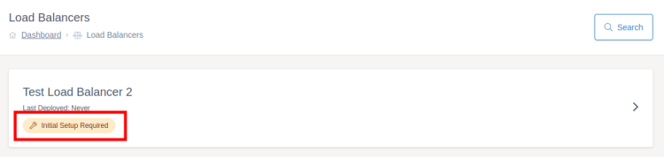
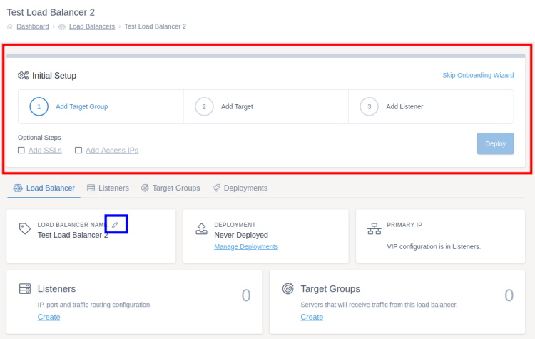
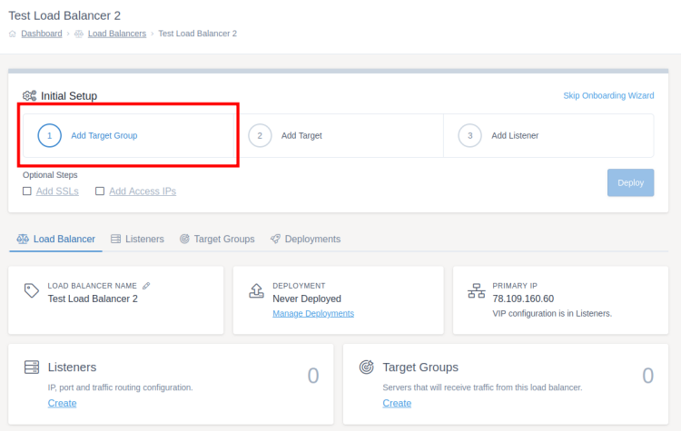
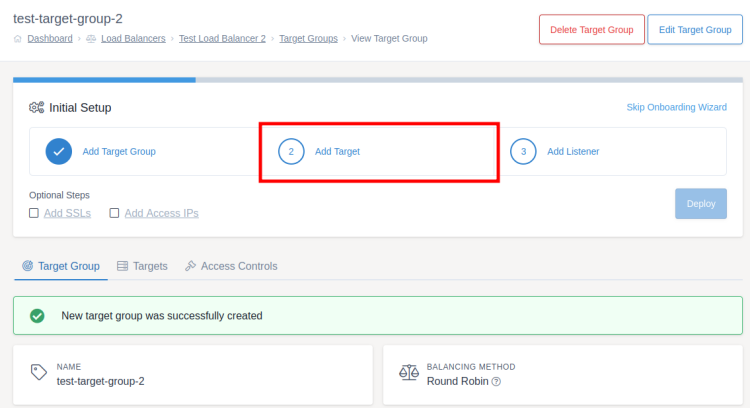
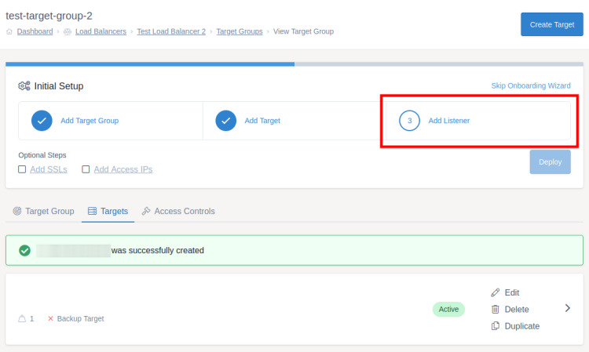

# Getting Started

## Load Balancer Overview

Once your new load balancer has been launched, it will appear in the [load balancers section](https://portal.ans.co.uk/load-balancers) of your MyUKFast account. Any load balancers which haven't had their initial deployment will be marked with "Initial Setup Required".

Clicking on the load balancer will take you to the screens which you use to configure and deploy your new load balancer.



From the load balancer overview screen, you can work your way through the onboarding wizard. If you already know how to set up a UKFast load balancer, you can skip this wizard and work your way through the screens yourself by clicking "Skip Onboarding Wizard".

You can also rename a load balancer to help you remember which load balancer is which if you have multiple in your account. This is done by clicking the pencil icon (highlighted in blue on the screenshot below) typing in the new name and clicking the save icon.

```eval_rst
.. warning::

   The primary IP on this page is not a VIP for you to use, it is the IP of the actual load balancer device. You should set up your virtual IPs when configuring your listeners. Each load balancer comes with one VIP by default but you can buy more if needed by speaking to your account manager.

```



A load balancer needs at least three resources configuring before the first deployment can be made:
- At least one target group
- At least one target within that target group
- At least one listener

There are also optional aspects that can be configured within a load balancer, for example:
- Access IP controls
- SSL certificates
- Access control rules

For more information on these terms, check out the [key terms page](key-terms).

## Target Groups

The first step of configuring a load balancer is to add a target group. You can do this by clicking "Add Target Group" in the onboarding wizard or by going to the "Target Groups" tab and clicking "Create Target Group".



Fill the form in and then press "Create Target Group" at the bottom right of the form. For more information on target group settings, check the [target groups documentation](components/target-groups).

## Targets

Once you've created a target group, you can start adding targets to it. Targets are the servers that the load balancer will share requests between, you can add as few or as many as you would like. You can do this by clicking "Add Target" in the onboarding wizard or by going to the "Targets" tab and clicking "Create Target".



Fill the form in and then press "Create Target" at the bottom right of the form. For more information on target settings, check the [targets documentation](components/targets).

## Listeners

Once you've created a target group and at least one target, you can add a listener. You can do this by clicking "Add Listener" in the onboarding wizard or by going to the "Listeners" tab from the load balancer overview and clicking "Create Listener".



Fill the form in and then press "Create Listener" at the bottom right of the form. For more information on listener settings, check the [listeners documentation](components/listeners).

## First Deployment

Once you have finished configuring your load balancer, it is time to [deploy your changes](/network/load-balancers/deploying-changes).

```eval_rst
   .. title:: Load Balancers | Getting Started
   .. meta::
      :title: Load Balancers | Getting Started | UKFast Documentation
      :description: Getting started with UKFast load balancers
```
