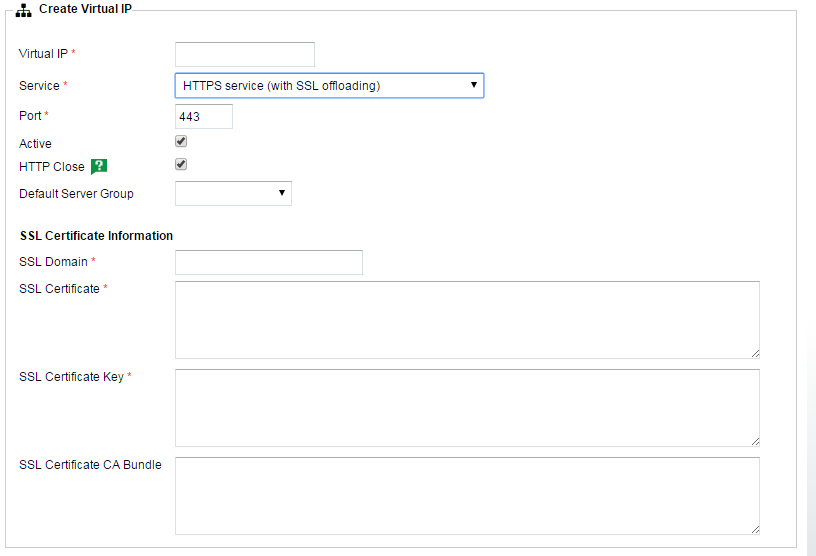
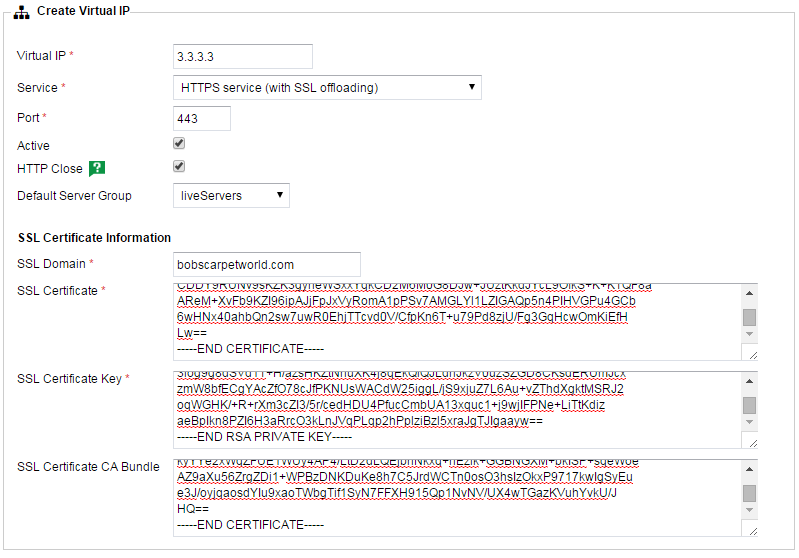
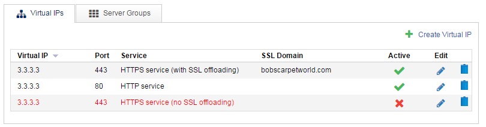

# SSL Passthrough vs Offloading

There are two ways of handling your `HTTPS` traffic on a UKFast loadbalancer.

The first is `passthrough` which, as the name suggests, simply passes `HTTPS` traffic through to the backend server with no interaction from the loadbalancer. This is the simplest form of handling your `HTTPS` traffic and has the lowest overhead as it doesn't require any decrypting of traffic on the loadbalancer, it's all passed through fully encrypted.

This may all sound good, but if you don't decrypt the traffic, no layer 7 actions can be carried out, which means no access rules, no redirects, no blocking and most importantly, no cookie based sticky sessions.

If your application doesn't share sessions between servers, if a clients journey would be impacted by flip flopping between different servers in a server group (most sites manifest this as lost baskets) then it's advisable to switch to using `SSL offloading` instead.

`SSL offloading` means that all `HTTPS` traffic is decrypted on the loadbalancer, any layer 7 actions are carried out on it and then it's passed back to port `80` on the backend server as plain `HTTP` traffic. There main side effect of this is that your backend servers seem to be no longer receiving any `HTTPS` traffic. If you have any specific logic that detects `HTTP` traffic and attempts to redirect to `HTTPS`, you'll need to check for the presence of a new header called `X-Forwarded-Proto`. This header is added when traffic goes through the offloading process, so if you find the `X-Forwarded-Proto` header set with content of `https` then you know that the traffic can essentially be treated as if it was `HTTPS`.

## Switching between passthrough and offloading

`Passthrough` and `Offloading` are configured as different services when setting up your `VIP`. To switch an existing `passthrough` vip to an `offloaded` one, we need to head into the `Virtual IP` section of your loadbalancer:


We're looking to add an `offloaded` service for `3.3.3.3`, so hit `Create Virtual IP`.

With `HTTPS service (with SSL offloading)` selected from the `Service` drop down, you should see the following:



The `SSL Certificate` section is the only real departure from the previous `Create VIP` screen we saw in the quickstart.

Fill in the relevant fields until it looks something like this:



```eval_rst
.. warning::
  Note that the `Default Server Group` selected is an `HTTP` one, not the `HTTPS` one we use in the `passthrough` VIP. As explained previously, this is because all traffic  that goes through the `offloading` process will be decrypted and treated as `HTTP` by the backend servers.
```

With the `offloading` now created, we just need to disable the previous `passthrough` vip.

Head back to the `Virtual IPs` tab and edit your `HTTPS service (no SSL offloading)` vip. With this open, uncheck the `Active` box to deactivate this vip and press `Update Virtual IP` to save it.

You should now have this:



Hit `Reload Load Balancer Config` on the yellow banner at the top to put it all live and you should now be offloading traffic instead of passing it through.

As ever, if you have any questions or concerns about this process, please contact [support](http://www.ukfast.co.uk/support.html).
