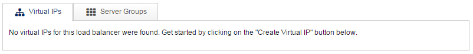
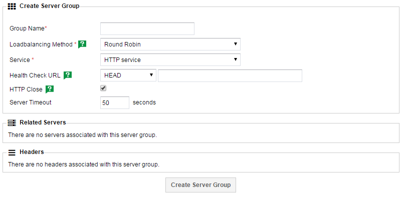
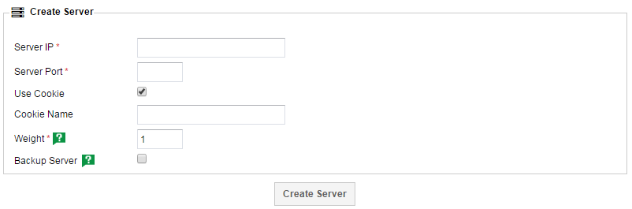
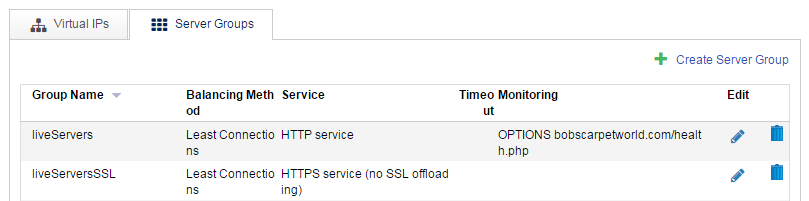

# Quickstart

This aim of this guide is to take a brand new UKFast loadbalancer and configure it with a relatively standard set of rules. The setup will be one `VIP` listening on both `HTTP` and `HTTPS`, passing traffic back to two servers.

```eval_rst
   .. note::
      All the following steps can be carried out on a UKFast loadbalancer through your MyUKFast area accessible here: https://my.ukfast.co.uk/server/loadbalancers/
```

## Terminology

Here's a brief rundown of some of the terms that will be used throughout this guide and in the loadbalancer interface:

* `Virtual IP` - A Virtual IP (VIP) is the frontend IP address and associated service in a loadbalanced solution.


* `Service` - The protocol that a VIP uses. These can be either `HTTP`, `HTTPS`, `HTTPS Offloaded` or `TCP`


* `Server Group` - A server group is a collection of backend servers. Each VIP points to a server group.


* `Backend Server` - One or more backends are contained within a server group, determining where traffic is delivered.


* `Passthrough` - A listener with a protocol of `HTTPS` is said to be operating in passthrough, as traffic is sent directly to the backend server on port `443` without any   decryption.


* `Offloaded` - If the `HTTPS Offloaded` service is used then `HTTPS` traffic on the loadbalancer is decrypted before being sent to the backend servers on port `80`. This has the benefit of allowing layer 7 actions to be carried out on the traffic.

## Configuring your first server group

### Creating the Server Group

First things first, we need to set up a server group, which will ultimately determine where traffic is going to go.

With your loadbalancer open in MyUKFast, you should be confronted with something like the following:



Click into the `Server Groups` tab and then hit the `Create Server Group` button to get started. You should then have the following screen:



Here's a breakdown of the fields:

* `Group Name`

  This is just a friendly name for you to identify the group by, though it should be unique. Something memorable, short yet descriptive is advised.


* `Loadbalancing Method`

  You've got three options here, `Round Robin`, `Least Connections` or `Source IP`. These methods determine how traffic is distributed between your backend servers. Most people should probably stick with `Least Connections` as this method intelligently sends traffic to the backend that has the least connections at any one time.
  `Round Robin` will blindly send traffic first to server A, then to server B, then to server A etc. This has a slightly lower overhead but can lead to hotspots developing if sticky sessions are in use.
  `Source IP` is quite different. The source IP address of the request is hashed and then this is used to determine which backend server should be used. It ensures that that IP will always end up on the same backend server providing no servers are added or removed from the pool.


* `Service`

  The protocol being handled by the backend servers. In the vast majority of cases, you just need to use `HTTP` if you're dealing with `HTTP` traffic and `HTTPS` if you're dealing with `HTTPS`, the only exception to this is if you're employing SSL offloading. `TCP` should be used for traffic that isn't `HTTP` or `HTTPS`.

**Advanced Options** - These options are not mandatory and can safely be left as their defaults unless you're comfortable with changing them.

* `Health Check URL`

  Used to specify the health check used in determining if a backend server is healthy or not. Left blank, the default health check will be used, which essentially checks the HTTP status code of the default site on the backend server. If the status is >=200 and <400 it'll be deemed valid for receiving traffic. If the default site isn't suitable for this, or if it doesn't respond in 3 seconds, it'll be better to set up an alternative health check url. If you were to use the example of `example.com/health.php` as your health check URL, then each backend server would be tested in a way best described as `curl -IH'Host: example.com' 1.1.1.1/health.php`, where `1.1.1.1` is the ip of the backend server. `HEAD`/`OPTIONS`/`GET` are different HTTP verbs that you can use when carrying out the health check. If you're not sure which one to pick, stick with `HEAD`.


* `HTTP Close`

  This option is best left enabled. If disabled, connections will be left open to the backend sever for re-use. Whilst this does have a slightly lower overhead, it does have an impact on any injected headers (such as `X-Forwarded-For` with ssl offloading) as it's only injected on the initial packet in any HTTP transaction.


* `Server Timeout`

  The amount of time that a connection will be kept open to the backend server before timing out. If you have any long running transactions or scripts that run through the load balancer, you may want to increase this.


With this filled in, you should have something to the following:


Press the `Create Server Group` button to save it and then move onto the next section to add some servers into your new group.


### Adding servers to the group

Back on the `Server Groups` tab, you should now see the group you just created. Click on it to get a screen similar to the following:


Press the `Add Server` button under the `Related Servers` section to start adding to this group, landing you on a screen like this:



Here's a breakdown of the fields available to you:

* `Server IP`

  The IP of the backend server, where traffic should be sent. If you're adding a UKFast IP into here, it should recommend available servers, though any IPs can be typed into here. If your loadbalancer is behind a dedicated firewall, please note that you should use the internal ip addresses of any backend servers. If you're unsure, please contact support_ for assistance.


* `Server Port`

  The port to which traffic should be sent. In most instances, if you're dealing with `HTTP` traffic then this should be `80` and if it's `HTTPS` then it should be `443`. Again, the only exception to this is if you're using SSL offloading, in which case the backend should be `80` as explained in :doc:`/myukfast/loadbalancing/passthroughoffload`. If you're using the `TCP` option then you should already know what port you're dealing with here.


* `Weight`

  The weighting is essentially the ratio used to determine how much traffic is sent to each server. If you have two servers and they both have a weighting of `1` then the ratio is `1:1` and they'll both receive `50%` of the traffic. If you weight them `2:1` then one will receive twice as much traffic as the other, and so on. If you add more servers in, the ratio expands out as you'd expect. If you have 4 servers all weighted 1, they receive 25% each, if you have them weighted 3, 3, 1, 1 then the first two will receive 3 times as much traffic as the second two.


* **Advanced Options**

  These options are not mandatory and can safely be left as their defaults unless you're comfortable with changing them.


* `Use Cookie`

  The loadbalancers use cookies as a method of setting up `sticky sessions`, which is a way of ensuring that a visitor ends up on the same backend server each time (for example, so that they don't lose their basket on an eCommerce site). If this isn't important to you, you can disable the cookie here and visitors will be distributed using whatever loadbalancing method you selected previously.


* `Cookie Name`

  Allows you to name the cookie mentioned above. By default it'll use a randomly generated string. Setting a name such as `dot115` is an easy way of seeing which backend server you've arrived on, and also allows you to set the cookie manually to force yourself onto a particular backend, but please be aware that using a simplistic naming convention like this may allow people to guess the IP addresses of your backend servers.


* `Backup Server`

  Completely unrelated to any backup solution your may employ, this is actually a way of denoting a server as a stand-in, so that it only receives traffic if all other servers are failing their health checks and are therefore offline. Setting a server to `Backup` and changing it's cookie name is a quick way to ensure that no people are heading to a particular server.


With all that filled in, you should have something like this:


Now press `Create Server` and then repeat this step to add more servers to your group as necessary.

With another server added and carrying on with my above example, you should now have a server group screen that resembling something like this:


With that complete, it's time to move onto adding a `VIP` so that we can direct traffic to our new group.


## Configuring your VIP

Back on the initial page for your loadbalancer, you should head over to the `Virtual IPs` tab:


Press the `Create Virtual IP` button to get started, bringing you to this page:


Once again, here's a breakdown of the fields available to you:

* `Virtual IP`

  This is where you define the `VIP` itself. The field should automatically recommend available IPs, but support_ can help you identify which are available to you if you're unsure. It's possible that you many need to purchase more IP addresses if you don't have any available. If this is the case, your account manager will be able to help.


* `Service`

  As mentioned in the terminology section, this is the protocol that a VIP uses. These can be either `HTTP`, `HTTPS`, `HTTPS Offloaded` or `TCP`. SSL offloading is a bit more complex and is explained in here: :doc:`/myukfast/loadbalancing/passthroughoffload`.


* `Default Server Group`

  This is the main event, this drop down allows you to select which set of server group you want to send traffic to. Select your server group you named with `Group Name` in the previous section.


* **Advanced Options**

  These options are not mandatory and can safely be left as their defaults unless you're comfortable with changing them.


* `Port`

  This should be automatically populated by your choice of service and should be left at that unless you're certain you need to use a non-standard port.


* `Active`

  Simply allows you to activate or deactivate a whole `VIP`. If you untick this, the `VIP` won't work.


* `HTTP Close`

  Same functionality as on the server group, this option is best left enabled. If disabled, connections will be left open to the backend sever for re-use. Whilst this does have a slightly lower overhead, it does have an impact on any injected headers (such as `X-Forwarded-For` with ssl offloading) as it's only injected on the initial packet in any HTTP transaction.


Filled in, it should look something like this:


Press `Create Virtual IP` to save it and then repeat the step for any other services you may need.

Here's a series of screenshots showing my final setup:

```eval_rst
.. note::
  Note the inclusion of a second server group called `liveServersSSL`. This is the `HTTPS` equivalent of `LiveServers` that the `HTTPS VIP` points to.
```

**Virtual IPs**


**Server Groups**




## Put it all live

With all this set up, you're almost live, you just need to tell the loadbalancer to reload its configuration. This can also be done using through MyUKFast, indeed you should have been seeing the following banner since you started making changes:


Click `Reload Load Balancer Config` to push it up to the loadbalancer and put it live. Providing there weren't any issues with what you configured, it should be live a few seconds later. If you have any issues with this step, or if you see unexpected behaviour, it's worth contacting [support](http://www.ukfast.co.uk/support.html) for assistance.

## Going Forward

This has been a rundown of the basic functionality of the UKFast loadbalancers, but there's far more you can do with them! The other guides in the loadbalancer category will discuss topics such as setting up SSL offloading and using access control lists to divert visitors to different locations based on various layer 7 quantifiers.

```eval_rst
   .. title:: Load Balancing | Quick Start
   .. meta::
      :title: Load Balancing | Quick Start | UKFast Documentation
      :description: Information and guidance on using the CDN on DDoSX
```
