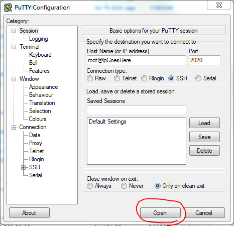

# Connecting to your server via SSH

If you've ordered a control panel with your Linux solution, then this will be the main way you interact with your server.
Both Plesk and cPanel allow you to easily add domains and mailboxes, as well as other various things.

The minute you find yourself wanting to do something outside the scope of your control panel however, you'll need a way of interacting with your server at a more base level.

This is where SSH steps in. SSH is actually a protocol, a way of connecting to your server. This is already set up and working, so all you now need is a way of connecting to it.

If you are using pretty much any operating system apart from Windows, there will already be an SSH client installed. This is accessible via your command prompt, usually known as terminal or console on differing operating systems. If this is the case, you can connect with the following command:

`ssh -p2020 root@putYourIPHere`

This will then prompt you for a password, which is the root password sent to you when you first opened your account with UKFast.

With Windows, the best way of connecting to SSH is probably via a program called PuTTY, available using the following installer: http://ninite.com/putty/ which automates the install somewhat. It's also always available from [the original PuTTY project site](http://www.chiark.greenend.org.uk/~sgtatham/putty/)

When opened, put your IP in the HostName field, enter the port as `2020` and press Open.



As before, your user name is root, and your password is the one provided to you when you opened your account (this can be resent if you like)

Once logged in, this will provide you with a command line to execute your various commands.

For further advice on what to do once you've connected in this fashion, you could refer to our other documentation in the [linux basics](/linux/basics/) range. Alternatively, there are a multitude of resources out there on the internet.

However, whilst using your server like this offers you the most powerful way of maintaining your setup, it also provides you with the most powerful way to destroy your setup.

If you have any questions about the command you're about to run, please don't hesitate to contact our support staff, they'll be happy to advise you.


## Connecting using private key

In order to connect using a private key, you will have to set PuTTY to use this before you open a session. To do this, navigate to the “Connection” tab and expand the “SSH” section. Now click on “Auth” and you should be presented with the following page:


Tell PuTTY where the private key is located on your computer by clicking “Browse…” and navigating to the folder where the key is located and opening the file.

Now click “Open” and the session should open using the private key as authentication.


  ```eval_rst
  .. title:: {title goes here}
  .. meta::
     :title: Connecting to your server via SSH | UKFast Documentation
     :description: Guidance on connecting to Linux using SSH 
     :keywords: ukfast, ssh, key, private key, putty, ssh client, linux, server
  ```
