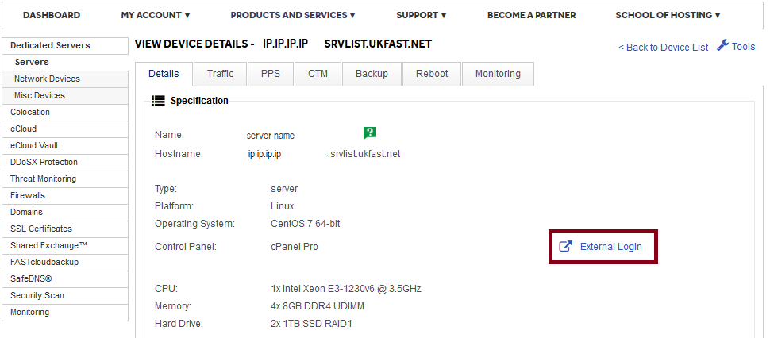
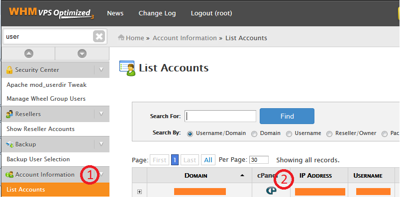

# Overview

cPanel/WHM gives you a powerful web based GUI to manage many aspects of your server, taking a lot of the work out of managing a server with multiple sites.

If a server is said to have cPanel installed on it, there are two distinct interfaces:

* WHM
* cPanel

WHM, or Web Host Manager, is the top level control panel that allows you to create user accounts (domains) and manage server level options.

cPanel is for management of individual sites and controls things such as mailboxes and site specific variables.

## Connecting to WHM

You can connect to WHM using the server's IP and the port 2087. If you put that into a browser window, you should get to the WHM login screen.

```console
  https://ip.ip.ip.ip:2087
```

You can also connect to your panel though the MyUKFast portal by navigating to the server screen and clicking the link highlighted in red here:



WHM will require you to use your server's root credentials for access.

## Connecting to cPanel

cPanel is for managing individual sites, so generally you would use the site URL and the cPanel port, 2083

```console
  https://example.com:2083
```

Logging into cPanel will require a set of account credentials that you created through WHM.

```eval_rst
.. note::
   The first time you access this, it will likely show a certificate warning that varies depending on which browser you're using.

   This is nothing to be worried about, it's just that cPanel uses a self-signed certificate to encrypt traffic.
```

It is also possible to use WHM to connect directly to any accounts cPanel without need for their credentials using the following method:



1. Find the 'List Accounts' page in the navigation pane on the left
2. Press the 'cP' logo next to the domain you want to access

## Further Documentation

Due to the frequent updates brought to cPanel, describing individual cPanel issues is beyond the scope of this page. Fortunately, cPanel maintain an official usage and troubleshooting guide here:

<https://documentation.cpanel.net>

```eval_rst
  .. meta::
     :title: Using cPanel on Linux | UKFast Documentation
     :description: A guide to using the cPanel control panel on Linux servers
     :keywords: ukfast, server, cpanel, cloud, whm, control, panel, virtual
