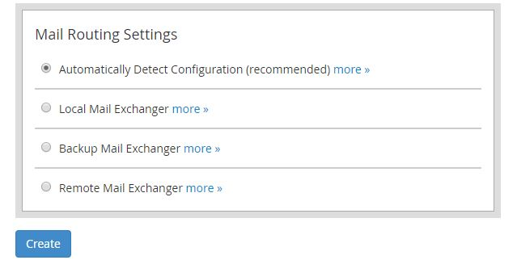

# How to Add a New Account in WHM

Once you've got your WHM server setup, you're going to want to add an Account. In WHM, an Account can be thought of as a catch-all term for a domain and associated resources. When you add an Account, this creates:

* A `Virtual Host` for your domain.
* A `User` for FTP / SFTP / SSH administration
* A `Control Panel` for your domain, allowing for per user site administration (*email, subdomains, PHP settings etc.*)

On the homepage of WHM, you will see a section called "Manage Your Accounts", and a "Create a New Account" button below that:


This will present you with a page to fill in information regarding the account that you're adding. The top section is "Domain Information". Fill in the relevant information for the account you're adding:

```eval_rst
.. warning::
  Avoid adding a domain that is the same as the hostname of the server, as this will break many WHM services.

```


The next three sections can be left as the defaults:


For the "DNS Settings" section, untick the box labelled "Enable DKIM on this account":


For the final section, "Mail Routing Settings", choose the automatic configuration option, then you can click "Create":



You've now added an account to WHM. You can now login, [using the guide here!](/operatingsystems/linux/controlpanels/cpanel_connect.html#connecting-to-cpanel)

```eval_rst
  .. title:: cPanel | How to Add a New Account in WHM
  .. meta::
     :title: How to Add a New Account in WHM | UKFast Documentation
     :description: How to Add a New Account in WHM
     :keywords: ukfast, cpanel, whm, domain, account, control, panel, tutorial, cloud, server, guide, virtual
```
