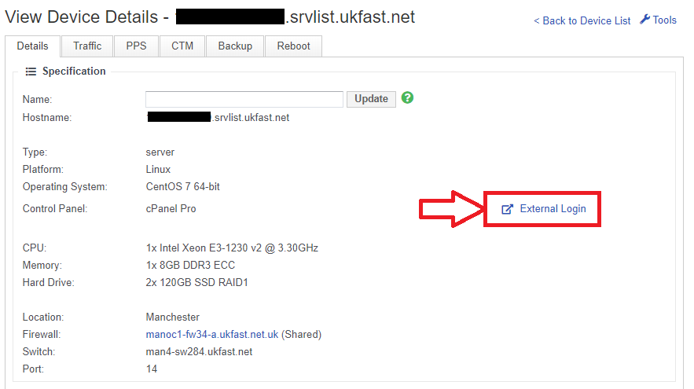
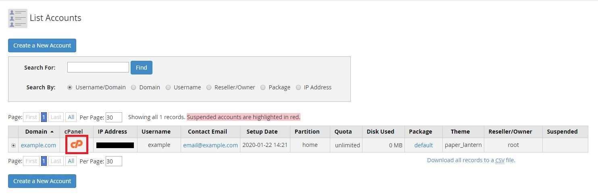

# Connecting to WHM and cPanel

There are 2 components to a cPanel server. There's WHM, which is the interface to manage reseller accounts. Then there is cPanel, which is the control panel for each account.

## Connecting to WHM

### Via MyUKFast Link
First, log in to your MyUKFast area, and navigate to the server page.  
  
In the top section of the page, you will see the "External Login" button. This will take you straight to the login page for WHM:




### Via URL
You can also connect to WHM, by appending `:2087` onto the hostname or IP of your server in a browser:
```
https://IP.IP.IP.IP:2087
```

## Connecting to cPanel

### Via URL
There are 2 ways that you can connect to cPanel. The first is to append `:2083` onto the IP or hostname of your server in your browser:
```
https://IP.IP.IP.IP:2083
```

### Via WHM
If you're logged into WHM, you can login to any of the cPanel accounts on that server. Login and navigate to:
```
Account Information >> List Accounts >> "cP" Button
```




```eval_rst
  .. title:: Connecting to WHM or Cpanel | UKFast Documentation
  .. meta::
     :title: Connecting to WHM or Cpanel | UKFast Documentation
     :description: Guide on connecting to a WHM/cPanel server
     :keywords: ukfast, cpanel, whm, control, panel, tutorial, cloud, server, guide, virtual