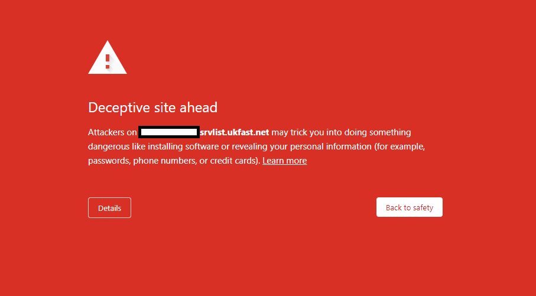
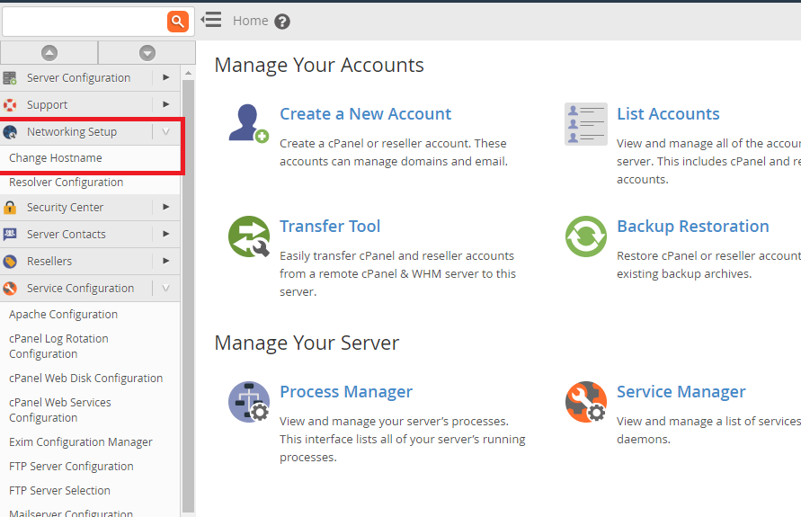
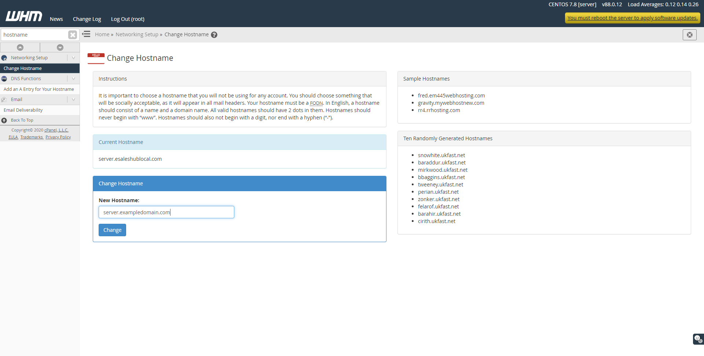
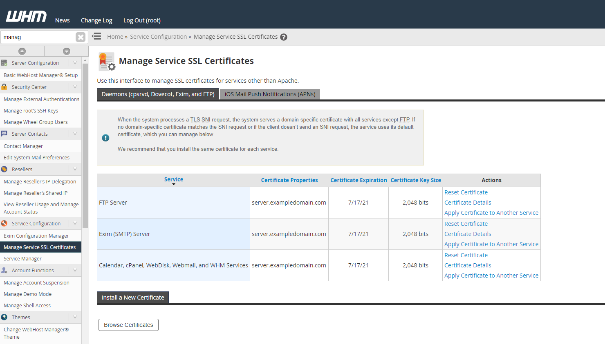
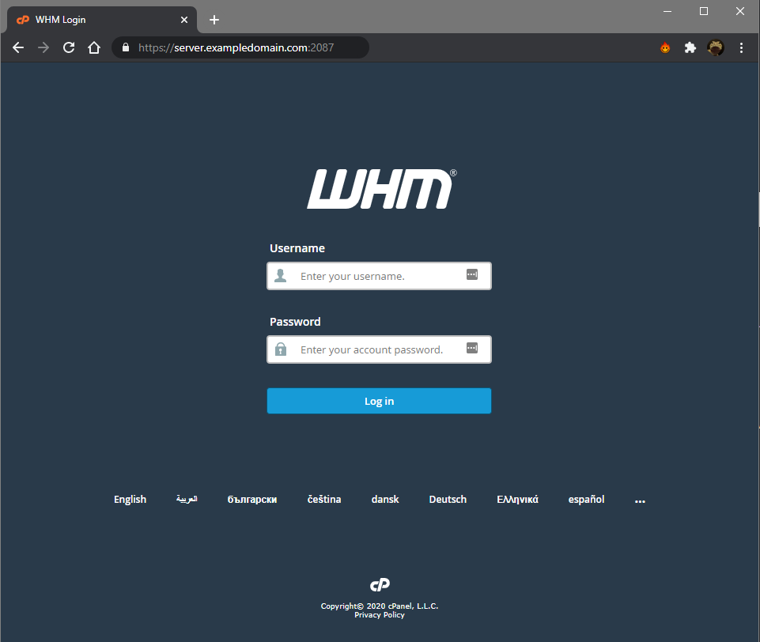

# Fixing Deceptive Site warning on WHM Login

Google Chrome's latest update is showing a "Deceptive site ahead" Warning on WHM for server using their default `srvlist.ukfast.net` hostname:



To resolve this, you'll need to set a hostname on each of your cPanel servers, and use this hostname in future to access the server.

First, choose a hostname on a domain that you own, and can create DNS records on. We will use `server.exampledomain.com` in our examples.

You can choose any hostname you want, as long as each cPanel server has a unique name. Don't use any of the subdomains that cPanel would use (`mail.`, `cpanel.`, etc.) as this may cause issues.


Set an A record for the hostname you've chosen, and point it to the IP address you use to access WHM/cPanel.

If you use SafeDNS you can follow the guides below, for external DNS Services the records you need to create are the same, but the interface will be different, contact your DNS Provider for instructions if needed.

[Add a domain to SafeDNS](/domains/safedns/addnewdomain)
[Add an A record to a Domain in SafeDNS](/domains/safedns/addarecord)

Once the A record is created, you may need to wait for the record to propagate for it to work in your browser, this can take anywhere from 5 minutes to 48 hours depending on that domain's TTL Setting.

You can continue with this guide in the meantime. Next we'll need to set the hostname on the server.

Using an alternate browser (as this issue only affects the latest chrome update) you'll be able to log into WHM.

Once logged in, in the navigation bar on the left, click the dropdown for "Networking Setup", and the Select "Change Hostname".



In the New Hostname box, enter the hostname you've chosen to use, and click "change".



You'll see a confirmation screen that looks like the following. If no errors are shown then the change was successful.


WHM Should now automatically update the SSL certificate for the new hostname, but If you want to double check, go to the "Manage Service SSL Certificates" option, under Service configuration in the navigation bar, and check the "Certificate properties" field, to ensure it matches the new hostname.



If it does not match, then click the corresponding "reset certificate" option.

Once the A record has propagated, you'll now be able to browse the WHM Login, using the server's hostname and port `2087` without any warnings, e.g. `https://server.exampledomain.com:2087/`.



You will also need to update the server's rDNS in MyUKFast to match the new hostname, otherwise you may experience issues sending email from the server. You can use the following guide for this:

[Configuring Reverse DNS Records](/domains/rdns)


```eval_rst
  .. title:: Fixing Deceptive Site warning on WHM Login
  .. meta::
     :title: Fixing Deceptive Site warning on WHM Login
     :description:  A guide on how to fix WHM showing a deceptive site warning
     :keywords: ukfast, cpanel, whm, control, panel, fix, warning, deceptive, login
```
