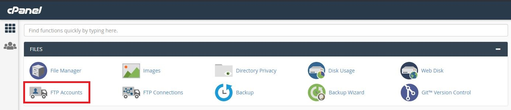
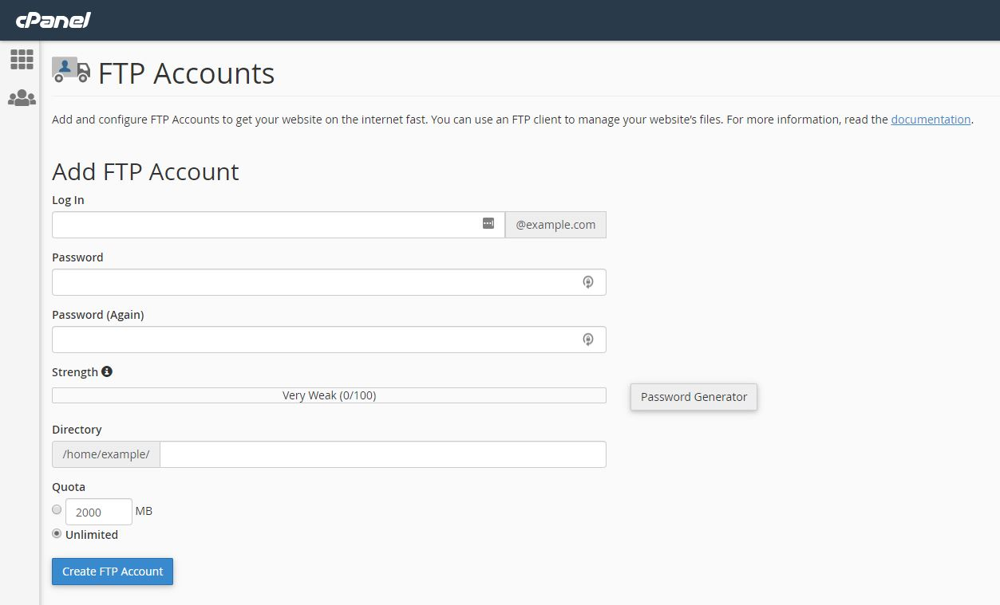

# How to Create an FTP Account In cPanel

You might need to create FTP accounts in cPanel, so that you and/or your developers can upload and download content from your website.

In order to do this, start by logging into the cPanel account that you want to create the FTP account for. [You can find our guide on this here!](/operatingsystems/linux/controlpanels/cpanel_connect)

Now, navigate to:

```none
Files >> FTP Accounts
```



You will be looking at this page:



Firstly, choose and input a username and password for your account.

The next box is "Directory". Unless the account you're adding should only be allowed to access a specific subdirectory of the site, this can be left as blank. This will allow the FTP user to access all the files in the site's home directory.

The last box is for "Quota". This determines how much bandwidth the FTP account can use. By default, this can be left as unlimited.

Now you can click "Create".

```eval_rst
  .. title:: cPanel | How to Create an FTP Account In cPanel
  .. meta::
     :title: How to Create an FTP Account In cPanel | UKFast Documentation
     :description: How to Create an FTP Account In cPanel
     :keywords: ukfast, cpanel, whm, control, panel, ftp, cloud, server, guide, virtual
```
