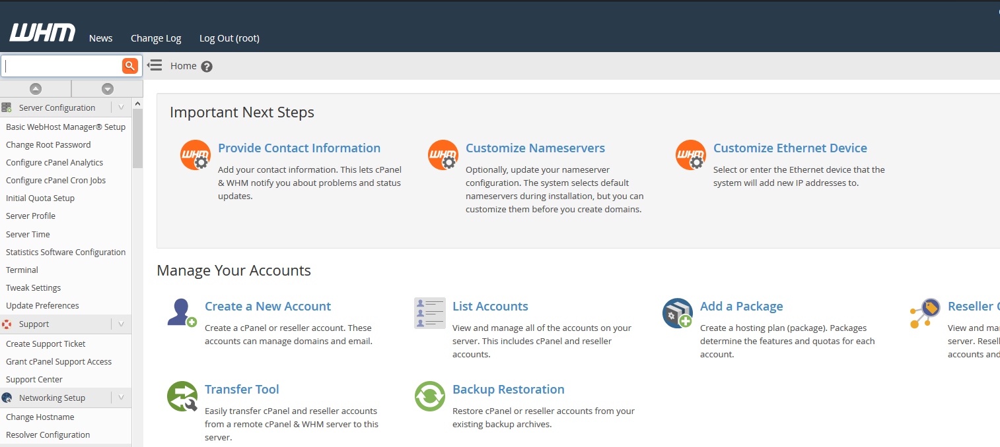
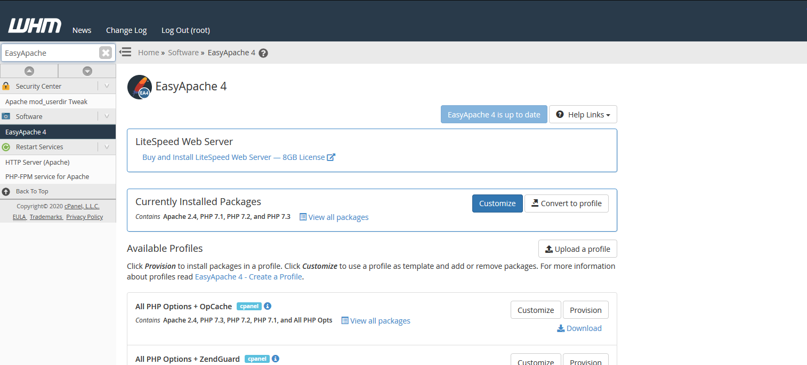
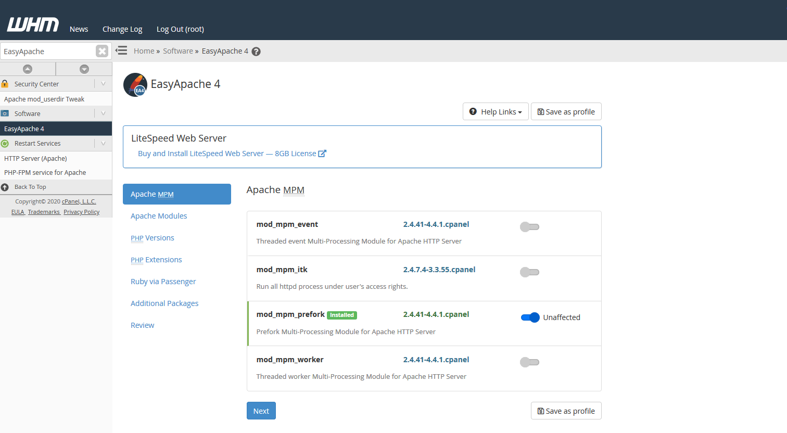
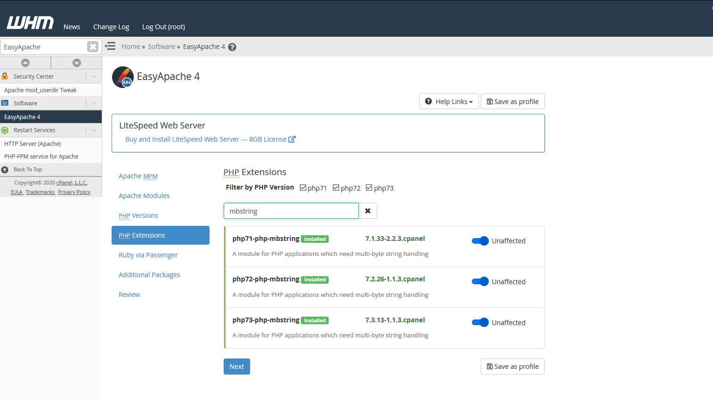
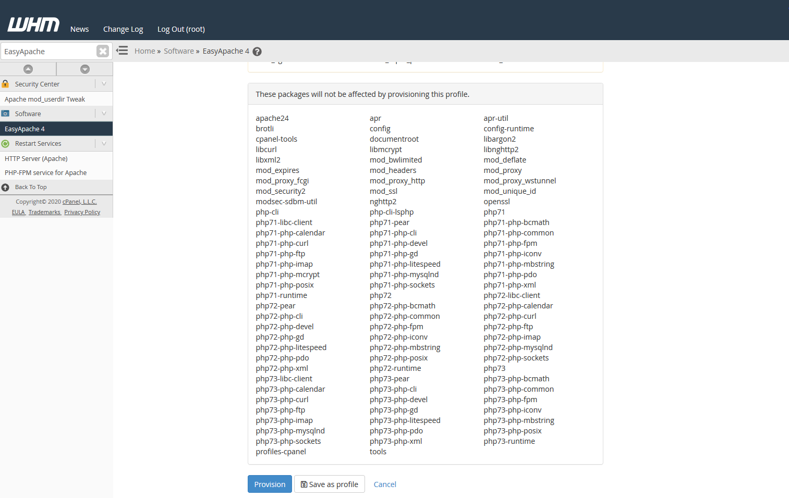
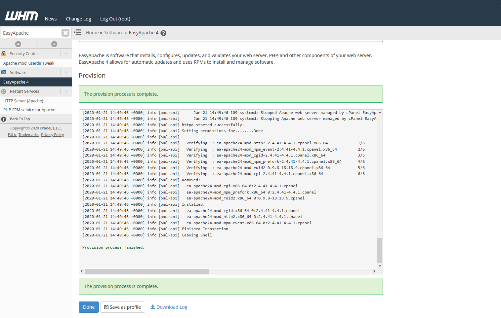

# Installing a PHP Extension via EasyApache4

Before you begin to install a PHP Extension on your WHM/cPanel server, you need to log in to your WHM Panel.
Installing a PHP Extension requires you to be logged into the WHM panel as opposed to cPanel for a specific domain, this is because access to EasyApache4 is required.
EasyApache4 is used to install packages on a server-wide level and can not be used by domain level users to install package unless they have access to WHM.



Once you are logged into WHM, use the search box in the top left under the WHM logo to search for EasyApache4.
EasyApache4 is located under the Software category of WHM's administration features and can be also be navigated to by going following the below path:

#### Home > Software > EasyApache4



When you are within WHM, click on the blue "Customise" button alongside "Currently Installed Packages" to amend the EasyApache4 Profile currently in use.
Clicking the "Customise" button on the profile currently in use will redirect you to menu in which you are able to select packages for install/uninstall accordingly.



To install a PHP extension, click the blue "Next" and again on each page until you are on the "PHP Extensions" page
You can use the search box to locate the extension you need to install and then use the slider within the row to select the extension you need for install.



```eval_rst
.. note::
   As well as marking extensions for install, you can untick any extensions you do not require and they will be marked for uninstall by EasyApache4.
```

```eval_rst
.. warning::
   Installing a PHP Extension that could clash with another your site or application relies on may affect how your site/application performs.
   We always recommend you check that the extension is required by your site/application before you install it and recommend you test any untested configurations within a development environment that could affect your application in production.
```

Once you have made the necessary changes, you can proceed through the EasyApache4 menu by clicking the blue "Next" button on each page until you reach the "Review" page.
On this page, you can review all the changes that are going to be made to the EasyApache4 profile. Happy with all the changes? You can apply the changes by clicking the "Provision" button.



You will then be redirected to the final page in which will include an output window of the processes that EasyApache4 does to action your requested changes.
Once the process has finished, click the "Done" button to close your EasyApache4 session and return to the main EasyApache4 page.



Using this guide, you have successfully installed a PHP extension using EasyApache4!

```eval_rst
  .. title:: cPanel | Installing a PHP Extension via EasyApache4
  .. meta::
     :title: Installing a PHP Extension via EasyApache4 | UKFast Documentation
     :description:  A guide for installing a PHP Extension via EasyApache4
     :keywords: php, extension, module, easy, easyapache, easyapache4, cpanel, install``
```
