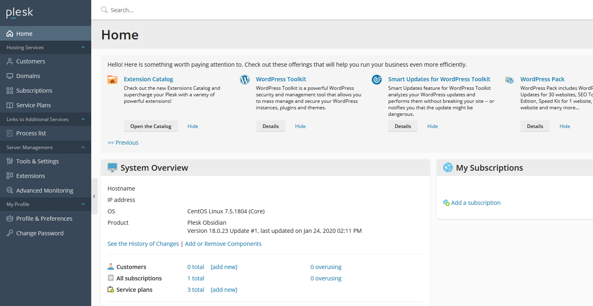
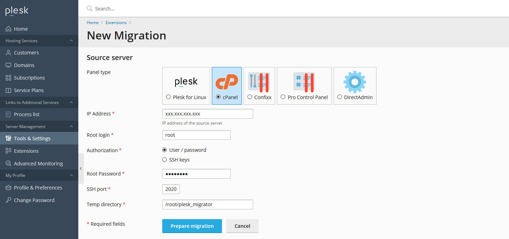

# Performing a cPanel to Plesk Migration

A guide on performing a cPanel to Plesk Migration

```eval_rst
.. note::
   Plesk requires the ability to connect to your cPanel server via your defined SSH port to complete any migrations.
```

To begin your migration you first need to ensure you are logged into your Plesk Web Interface.
Once you are logged in, click on the "Tools and Settings" link on the left hand side menu.



When you are on the "Tools and Settings" page, click on "Migration and Transfer Manager" which is under "Tools & Resources".


Now you are within the Migration and Transfer Manager, click on "Start a New Migration".


For "Panel type", select cPanel and then populate the rest of the details accordingly.

```eval_rst
.. note::
   UKFast Linux Servers listen on port 2020 for SSH by default
```

Once the details have been filled in, click the "Prepare Migration" button.



When Plesk has scanned the remote server for migratable cPanel Accounts, select what you want to copy over.
Ensure that your chosen cPanel Accounts are in the "Selected" box in the "Subscriptions".
Make sure you have ticked what content you want to transfer under the "Content that must be transferred" section.
Once you are ready to start the migration, click the "Migrate" button.


When the migration completes, you can go to the "Domains" page linked on the left hand side menu and see the site(s) you have transferred over.


You have successfully performed a cPanel to Plesk Migration!

Before amending your DNS to point to your new server, you can test your websites using a hostfile change
You can view more information on that [here](https://my.ukfast.co.uk/safedns/index.php)

```eval_rst
  .. meta::
     :title: Performing a cPanel to Plesk Migration
     :description:  A guide to performing a cPanel to Plesk Migration
     :keywords: ukfast, cpanel, migration, move, website, transfer, whm, plesk
