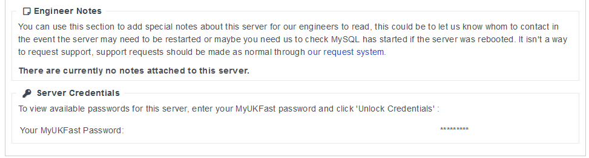
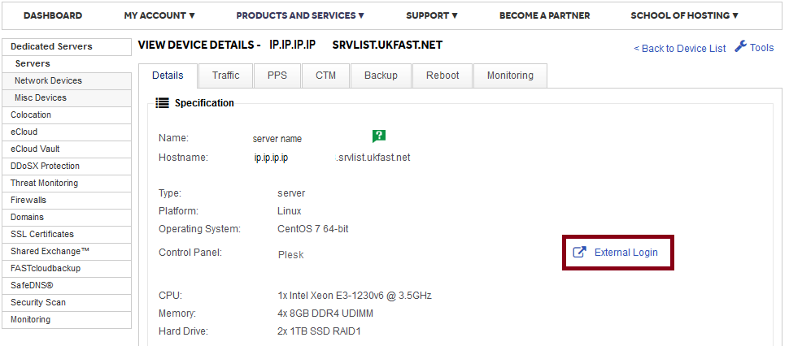

# Connecting to your Plesk Control Panel

The Plesk control panel lets you manage many aspects of your server though an web GUI, taking a lot of the low level work out of setting up sites.
Plesk allows users to maintain and make use of their Linux server with ease, even if they are not comfortable managing a Linux server via a command line interface.

Plesk runs on port 8443 by default. You can access your Plesk panel via the external IP of the server or via an A record that is pointing that IP Address.

```console
https://xxx.xxx.xxx.xxx:8443
```

```eval_rst
.. note::
   The first time you access this, it will likely show a certificate warning that varies depending on which browser you're using.

   This is nothing to be worried about, it's just due to Plesk using a self-signed certificate to encrypt traffic.
```

How to skip the warning depends on the browser you are using.
If you are using Google Chrome to access your Plesk Control Panel, when greeted with the warning mentioned above, click on the "Advanced" button first.
Following that, you will see a link at the bottom "Proceed to `link` (unsafe)", click that link to proceed to the Plesk Login Screen.

If you are using Mozilla Firefox to access your Plesk Panel, when the warning appears, first of all click on the "Advanced" button.
Following that, click the "Add Exception" button and then in the pop-up window, click the "Confirm Security Exception" button to proceed to the Plesk Login Screen.

Now you are on the Plesk Login Screen, you can log in using the details provided on server launch.
If you need the details for you Plesk Server, the Primary Contact on your Account can retrieve them via their MyUKFast Area.



In addition to the above, you can also connect to your panel though the MyUKFast portal by navigating to the server screen and clicking the link "External Login" as shown in the screenshot below.



If you encounter any issues connecting to your Plesk Control Panel using the instructions above, please do not hesitate to get in touch with our support team.

```eval_rst
  .. title:: Connecting to your Plesk Control Panel
  .. meta::
     :title: Connecting to your Plesk Control Panel | ANS Documentation
     :description: A guide for getting into your Plesk Control Panel
     :keywords: ukfast, plesk, control, panel, tutorial, cloud, server, guide, virtual
```
