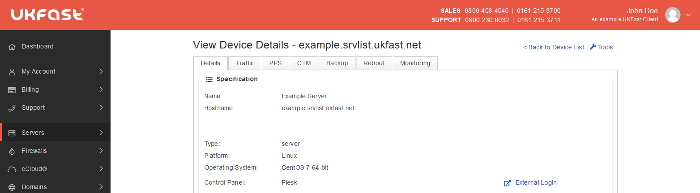

# Overview

The Plesk control panel lets you manage many aspects of your server though an web GUI, taking a lot of the low level work out of setting up sites.

## Connecting to Plesk

You can be access the login page using the server IP:

```console
  https://ip.ip.ip.ip:8443
```

```eval_rst
.. note::
   The first time you access this, it will likely show a certificate warning that varies depending on which browser you're using.

   This is nothing to be worried about, it's just that Plesk uses a self-signed certificate to encrypt traffic.
```

Once you've skipped the warning, you'll be at the Plesk login page. Later versions of Plesk will accept the root credentials for the server, but the traditional way is the use the `admin` username and the Plesk password provided by UKFast on server launch.

You can also connect to your panel though the MyUKFast portal by navigating to the server screen and clicking the link



## Further Documentation

As Plesk is frequently updated with new features and fixes, we recommend checking out the official user guides which are maintained by Plesk:

<https://docs.plesk.com/>
<https://support.plesk.com/>

```eval_rst
  .. meta::
     :title: Using Plesk on Linux | UKFast Documentation
     :description: A guide to using the Plesk control panel on Linux servers
     :keywords: ukfast, plesk, control, panel, tutorial, cloud, server, guide, virtual
