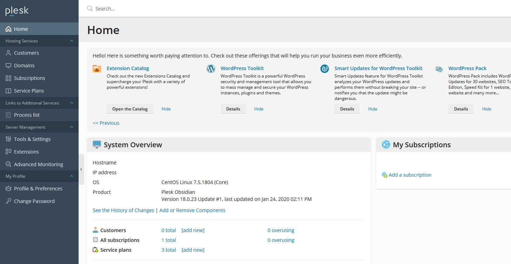
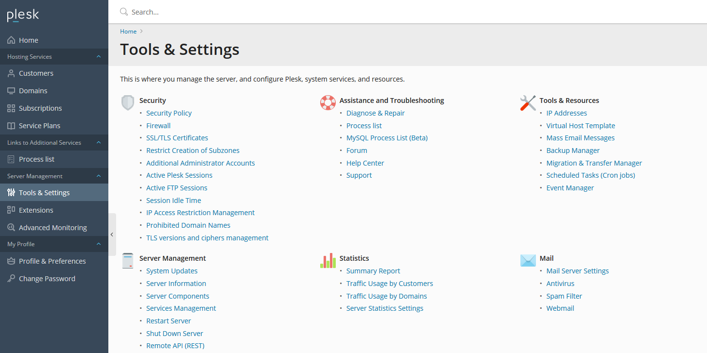
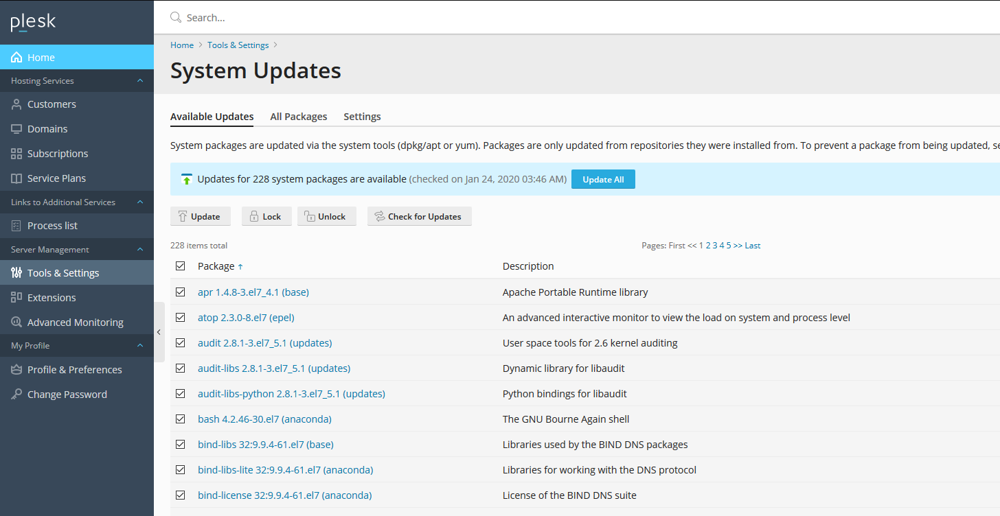
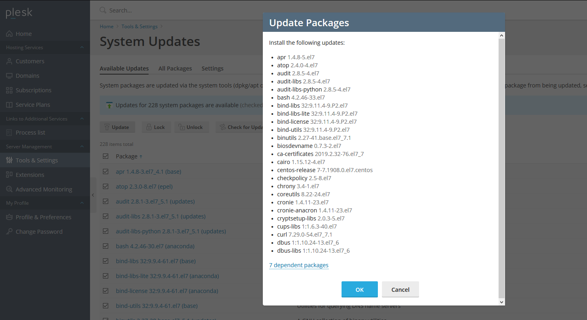
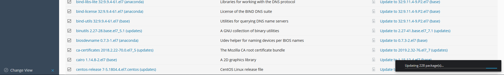
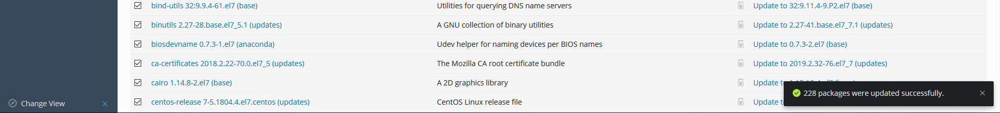
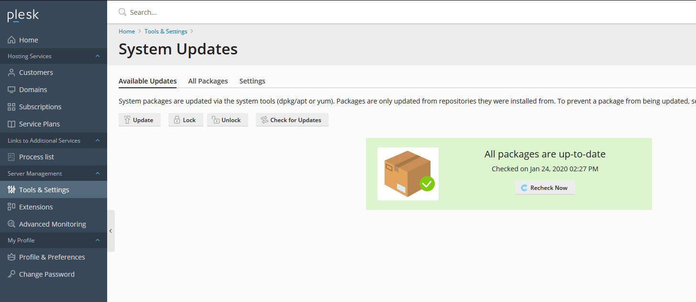

# Applying system updates on your Plesk Server

```eval_rst
.. note::
   Plesk System Updates may impact running services depending on the updates being applied.
   We always recommend you review the updates available before applying them.
```
To begin applying your system updates on your Plesk server, you first of all need to be logged into your Plesk Web Interface.
Once you are logged in and you are on the Plesk homepage, click on "Tools & Settings" on the left hand side menu.



When you are on the "Tools & Settings" page, click on System Updates which is under the "Server Management" section



You will now be on the "System Updates" page. Select the updates you want to action and then click on the "Update" button located above the list of packages.



Before the update process begins, you will be greeted with a list of the updates Plesk will action in which you can click "OK" to proceed.



 When the update process is running, you will see a pop-up in the bottom right showing that the packages are being updated.



Once the package updates are complete, the pop-up in the bottom right will show accordingly.



Refresh the page and you will see that there are no longer any outstanding system updates.



When you go back to the home page you will see that there is no longer any alerts about outstanding updates.

You have successfully applied system updates on your Plesk server!

```eval_rst
  .. meta::
     :title: Applying system updates on your Plesk Server
     :description:  A guide on applying system updates on your Plesk Server
     :keywords: ukfast, packages, upgrade, move, website, update, plesk
