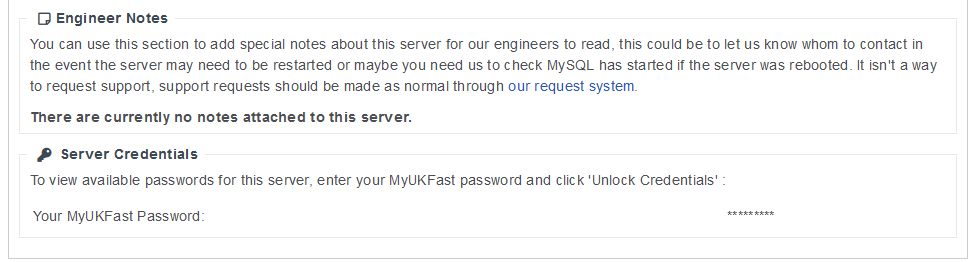

# Retrieving your Plesk Admin Password

You can get your Plesk Admin Password via your MyUKFast Area as the Primary Contact on your Account.
Head to your Server's dedicated information page within MyUKFast and scroll down to the bottom.
As shown in the screenshot below, you will see a "Server Credentials" section where you can enter your MyUKFast Password to reveal the credentials we have on record for you server. 



If you ever change your Plesk Admin password and do not let us know so we can update it on our side, the password in your MyUKFast Area will be incorrect.
Following that, if you forgot your password, you will be unable to gain access to Plesk using the details in MyUKFast.

If that ever was the case, there are methods of recovering the password as described below.

## Version <10

In very old versions of Plesk, the admin password is stored in Plain Text within /etc/psa/.psa.shadow
You can retrieve the password from that file by running the command below within an SSH Session.

``#
  cat /etc/psa/.psa.shadow
``
Should you be unable to establish a connection to your server via SSH, please do not hesitate to get in touch with our support team for assistance.

Once you have gained access to your Plesk control panel, we highly recommend you contact our support team to arrange an upgrade of your Plesk to the latest version.

## Version 11 - 12.5

Following on from version 10, Plesk increased the security of the admin password storage. The password is still within the /etc/psa/.psa.shadow file however it is hashed and therefore unreadable. To retrieve the password via an SSH session you need to run one of the following commands:

``#
  /usr/local/psa/bin/admin --show-password
``

``#
plesk bin admin --show-password
``
Should you be unable to establish a connection to your server via SSH, please do not hesitate to get in touch with our support team for assistance.

Once you have gained access to your Plesk control panel, we highly recommend you contact our support team to arrange an upgrade of your Plesk to the latest version.

## Version 17=<

Following on from Plesk Version 12.5, to improve security, Plesk removed the ability to retrieve the password for the control panel in plain text.
The new method implemented provides you with a one time login link that will let you access Plesk without the password.

``#
plesk login
``
The above command generated the one-time login link however once logged in, you will not be able to reset the password.
There is a separate command for resetting the password via SSH below.

``#
plesk bin admin --set-admin-password -passwd "**********"
``

```eval_rst
.. note::
   Bear in mind you are resetting your password using a shell command, so we recommend avoiding using special characters like & or $ which the shell might try to interpret! If you want to have these characters in your password you can always change it again in the Plesk panel once you're able to log in.
```

Should you be unable to establish a connection to your server via SSH, please do not hesitate to get in touch with our support team for assistance.

```eval_rst
  .. title:: Retrieving your Plesk Admin password
  .. meta::
     :title: Retrieving your Plesk Admin password | UKFast Documentation
     :description: A guide to retrieving your Plesk password on Linux servers
     :keywords: ukfast, plesk, password, get, retrieve, cloud, server, shadow
