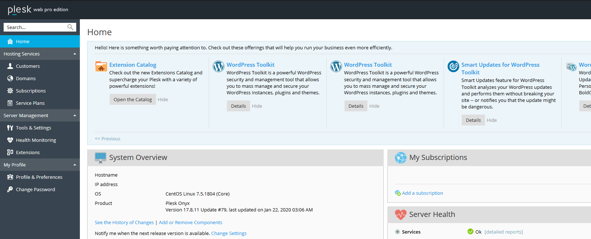
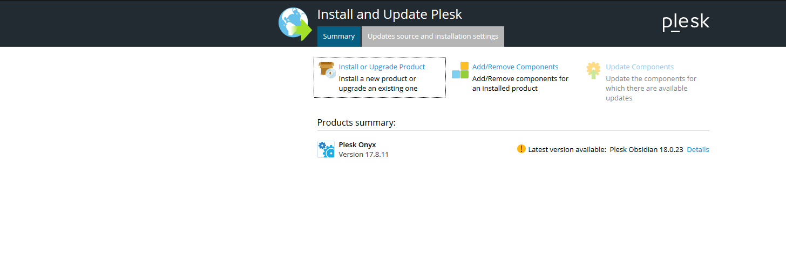
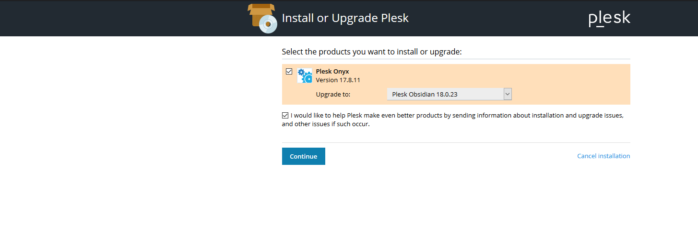
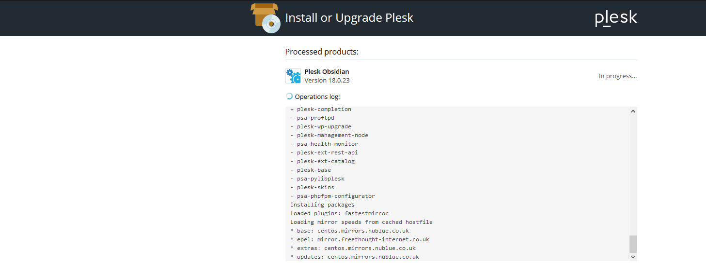
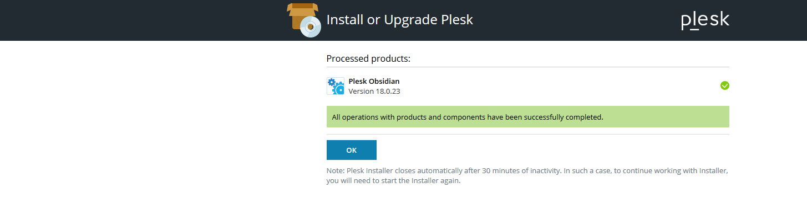

# Upgrading from Plesk Onyx to Plesk Obsidian

```eval_rst
.. note::
   Web and Databases services running on your Plesk server will be restarted multiple times throughout the Plesk upgrade process causing intermittent downtime on any live sites.
   The Plesk UI will also be inaccessible through the process and therefore we recommend you execute your Plesk upgrade at your most convenient time.
```

Plesk Obsidian has lots of new and improved features over Plesk Onyx and Obsidian is now available to Plesk users.
The following guide is on upgrading your Plesk Onyx installation in place to Plesk Obsidian via the Plesk Web Interface.



Once you are on the Plesk Homepage, go to "Tools & Settings" and then click on "Updates and Upgrades" under the "Plesk" section.
Clicking on that link will open a new window which will take you to your server on port 8447 which is the port the Plesk Installer runs on.

```eval_rst
.. note::
   Unable to access your server on port 8447? Ensure that your firewall is allowing your connection through on that port number. 
```



When you are within the Plesk Installer, click on "Install or Upgrade Product".



Select the version of Plesk you want to upgrade to and then click the "Continue" button.
You will then see an Operations Log of Plesk upgrading as per the below screenshot.



When the upgrade completes, you will see "All operations with products and components have been successfully completed."
Click the "OK" button to complete the Plesk Installer task.



Once the upgrade of Plesk is complete, you can go back to the homepage and you will see that you are now running Plesk Obsidian.


You have successfully upgraded Plesk from Plesk Onyx to Plesk Obsidian!

```eval_rst
  .. title:: Upgrading from Plesk Onyx to Plesk Obsidian
  .. meta::
     :title: Upgrading from Plesk Onyx to Plesk Obsidian
     :description:  A guide on upgrading from Plesk Onyx to Plesk Obsidian
     :keywords: ukfast, upgrade, update, plesk, onyx, obsidian
