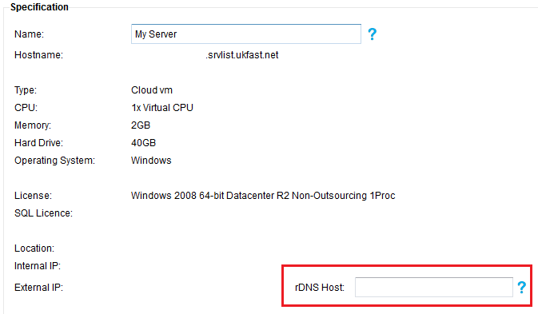

# Legitimate Mail Being Blocked

If you find that legitimate mail you send is being blocked, in many cases this is attributable to a lack of [FCrDNS](http://en.wikipedia.org/wiki/Forward-confirmed_reverse_DNS). Without this set up, a lot of remote mail servers will likely see mail sent from your server as spam.

Setting up FCrDNS in a standards-compliant way is fairly easy, with two main steps:

* Give your server a hostname that resolves to an IP on the server
* Configure your rDNS record for that IP to the same as the server hostname.

With a setup like this, the hostname resolves to the IP, and the IP points back to the hostname, giving your mails a basic air of legitimacy.

How you set your hostname varies from operating system to operating system, and relevant documentation should be used for each one.

```eval_rst
.. note::
  We recommend you set the hostname to something like 'mail.yourdomain.com'. This is a fairly standards-compliant choice and it's highly likely you already have a 'mail.yourdomain.com' record for your domain.
```

Reverse-DNS is a system which lets you define what hostname an IP address resolves to. Your server will have an IP address and, by default, will reverse-resolve to `ip.ip.ip.ip.srvlist.ukfast.net`. It's important to set you hostname to something that does not contain an IP address, as the default does.


To configure it, log in to [MyUKFast](https://my.ukfast.co.uk) and go to the server in question, where you will see a page like this:



In the `rDNS` field, enter the hostname you chose earlier and press `Update`.

Your new hostname will be reflected instantly, but it will take time for the reverse-DNS to propagate across the internet - up to 48 hours - so give it time before checking everything is in place.

In a similar vein, it's also recommended you set up an SPF record for your domain. This is covered in more in-depth in
[Configuring SPF Records](/Domains/safedns/spf.html)

## Further guidance

Please read our [documentation on email blocklists](/operatingsystems/linux/mail/blocklists.html) as well as the [basics of email](/operatingsystems/linux/mail/mailconfig.html) to ensure you get everything set up properly to begin with.  


```eval_rst
  .. meta::
     :title: Legitimate mail being blocked | UKFast Documentation
     :description: Information on legitimate mail being blocked on linux
     :keywords: ukfast, mail, bounces, blocked, legitimate, dns, spf, ip, address, rdns
