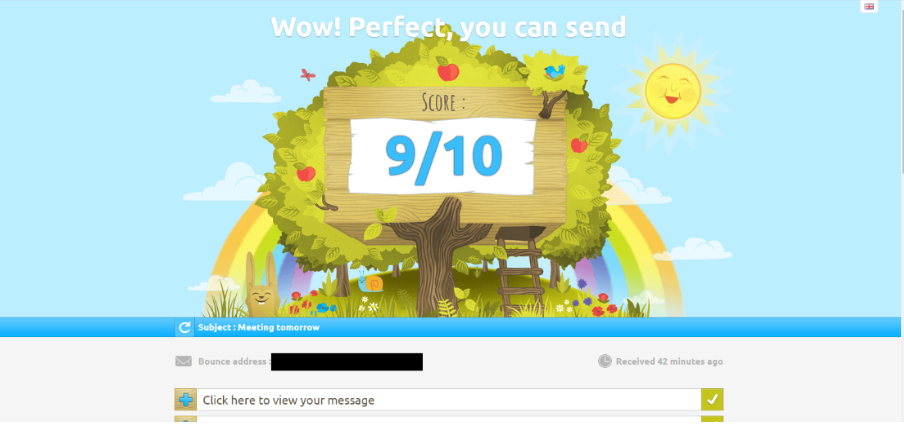

# Testing Mail

Guidance on how to use `mail-tester.com` and understanding the results.

## **Purpose**
Mail-tester is used to test the 'quality' of emails - taking into consideration:
* Your message's content
* Your mailserver's configuration
* The IP address your mail is being sent from

## **How to use it**
Firstly, go to https://www.mail-tester.com in your browser. You should see something similar to:

As instructed by the webpage, send the email you wish to test from the desired address (for example, sending a company newsletter from the appropriate address).

**You should avoid generic phrases such as** 'this is a test' **as it will likely be flagged as spam**.

Once you have sent the email, click the 'then check your score' button to proceed.

## **The results**
If no other tests were recently sent to the same address as your email, you will automatically be taken to the message sent (as below). From this, you can scroll down to see the full report.

If your test results aren't displayed automatically, a list will appear for you to select from. This includes the subject line, spam rating, and how long ago the email was submitted.

### **Explanation of Results**

### View of message
'Click here to view your message' simply displays your email's content in basic HTML & plain text view. The 'source' section within this gives more detailed information on the mail servers sending and receiving your mail (including their IP addresses, and what protocol was used to encrypt the email's content)
