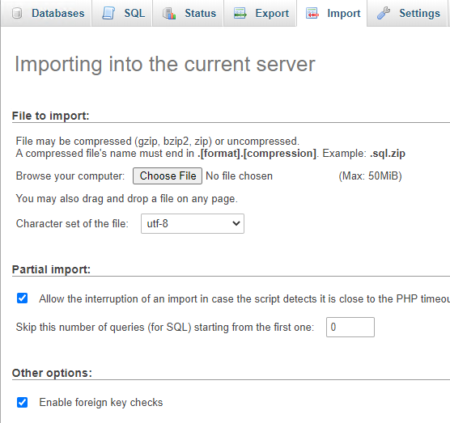
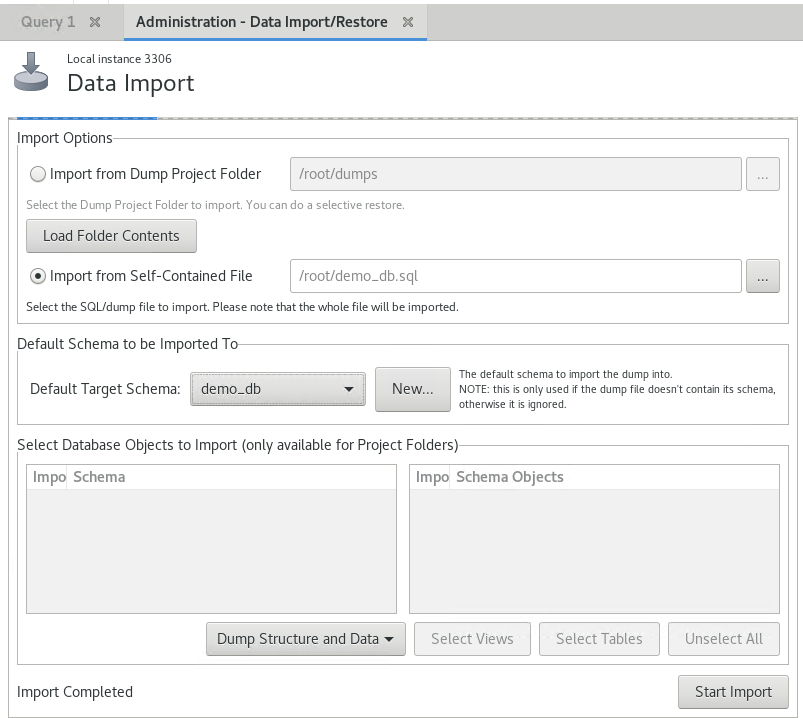

# Import A Database 

This article will give information on how to import a database file via the CLI, phpMyAdmin and MySQL Workbench. It will also dicuss prerequsites that will help the import go smoothly. 

## Before The Import
```eval_rst
.. warning::
  Ensure the .sql  file does not contain `USE` or 'CREATE DATABASE' statments as it can produce unexpected outcomes.
```

Use the following grep command to check for USE and CREATE statments:
```bash
  $ egrep "^USE|^CREATE DATABASE" example_db.sql
  CREATE DATABASE /*!32312 IF NOT EXISTS*/ `example_db` /*!40100 DEFAULT CHARACTER SET latin1 */;
  USE `example_db`;
```

Theses lines can be deleted manually, or by using the following sed commands:
```bash
  $ sed -i '/^USE/d' example_db.sql
  $ sed -i '/^CREATE DATABASE/d' example_db.sql
```

```eval_rst
.. note::
  You will see multiple USE or CREATE DATABASE satements if the .sql file contains more than one database. It's recommended to import databases individually to limit risk of overwriting or currupting data. This guide assumes you are importing a single database.
```

Now when you run the grep again, there should be no returned values:
```bash
  $ egrep "^USE|^CREATE DATABASE" example_db.sql
```

Once you have confirmed that there are no USE and CREATE statements in your .sql file you are now ready to import the contents of the file into the database. 


## MySQL CLI 

If the database you wish to import does not already exist, you will need to create it before the import:

```sql
   MariaDB [(none)]> CREATE DATABASE example_db;
```

If the database already exists, this will import on top of the existing database. If this is not the desired effect, create a new database and update the application to point to the new database name.

To import the database, run the following command:

```bash
  $ mysql -u root -p example_db < example_db.sql
```

## phpMyAdmin

1. Log in to the `phpMyAdmin` console.  

2. On the left-had side, select the database you wish to import data into.  

3. Select the `Import` tab.  

4. Select `Browse` under `File to import` and select the .sql you wish to import.

5. Hit `Go` to start the import of the database file.

6. When successful, a message should appear `Import has been successfully finished`




## MySQL Workbench


1. Log in to the `MySQL Workbench` console and and connect to the database.  

2. On the left-had side, under Management select  `Data Import/Restore`.

3. Select the `Data Import` tab.

4. Select the option “Import from Self-Contained File” and browse to the .sql file you wish to import. 

5. Select an existing database or the option to choose a new database to import into.

6. Hit `Start Import` the import of the database file.

7. When successful, a message should appear `Import of /root/exampl_db.sql has finished`



```eval_rst
  .. title:: Import a database
  .. meta::
     :title: Import a database | UKFast Documentation
     :description: A guide to importing a database from a MySQL .sql using different applicable methods.
     :keywords: ukfast, linux, mysql, database, backup, dump, restore, recovery, security, cloud, import, workbench, phpmyadmin, sql