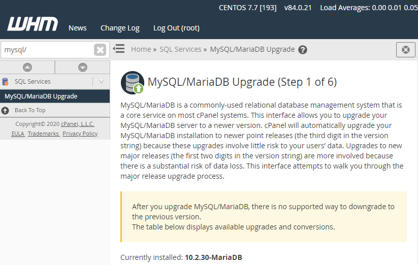
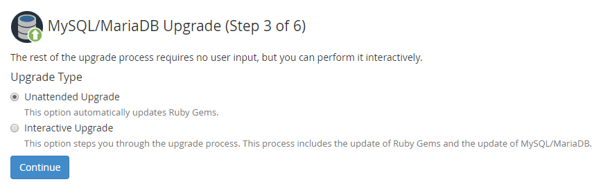
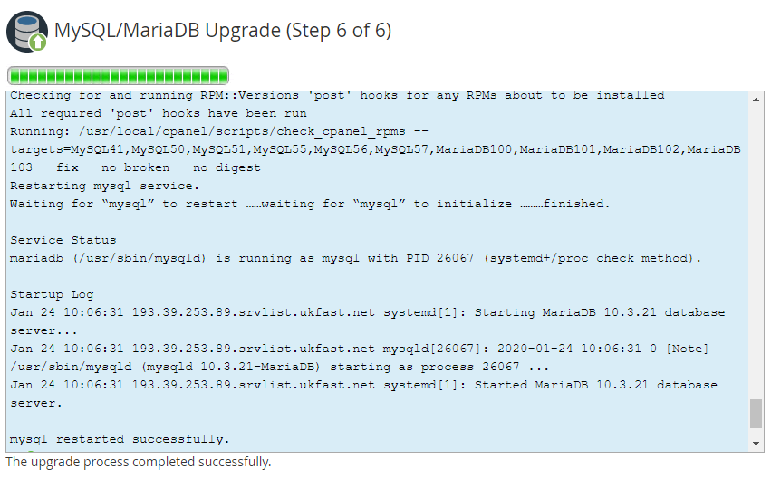

# Upgrading your MySQL/MariaDB Version

If you are not comfortable performing a `MySQL/MariaDB` upgrade, simply give the `UKFast Support Team` a call, or raise a `Priority Support Ticket` and we'll be happy to advise/help.

## Overview

Upgrading your MySQL/MariaDB version can be a daunting task, but there are steps you can take to ensure you are covered for any eventuality.

Updating the database (or any) service relies on three key steps

* **Preparation**
  * Backups - *Ensure you have a rollback option*
  * Testing - *Have a development pipeline to ensure you obtain the expected outcome*
  * Maintenance- *Disable monitoring during your work, and put your website into maintenance*

Both `Plesk` and `cPanel` allow you to upgrade your database service, but take different approaches to it. `Plesk` makes you do this outside of the control panel, whilst `cPanel` requires you to log into the panel and complete the upgrade there.

Here, we will run through how to perform both types of upgrades depending on your solution.

```eval_rst
.. warning::

   Before proceeding, please ensure that you have checked that your sites/services are compatible with the upgraded version of MySQL/MariaDB, and that you have backed up your databases.

```

### Upgrading

```eval_rst
.. note::

   Plesk supports versions 5.1 through to 5.7, but will drop support for older versions in due course. Therefore it is in your best interest to upgrade to 5.7 or equivalent.

```

Upgrading between MySQL versions can be straightforward, but you do have to upgrade incrementally

In this example, we will upgrade from *5.1* to *5.5* to show you the first step in safely incrementing your `MySQL` version on a **CentOS 7** server.

```eval_rst
.. warning::

   We would encourage you to put your website into maintenance mode to ensure database consistency and to prevent false alerts.

```

* First, dump out your MySQL databases (ensuring you have enough room first). Verify that the dump is of expected size before proceeding.

```bash
mkdir mysqldumps
mysqldump --events --triggers --all-databases > mysqldumps/all_databases.sql
```

* Install the **MySQL Community Repo**

```bash
yum install https://dev.mysql.com/get/mysql80-community-release-el7-1.noarch.rpm
```

* Edit the newly installed repo to **enable** `MySQL 5.5` and **disable** `MySQL 8.0` (in a text editor of your choice. Here we are using `vim`)

```bash
vim /etc/yum.repos.d/mysql-community.repo

[mysql55-community]
name=MySQL 5.5 Community Server
baseurl=http://repo.mysql.com/yum/mysql-5.5-community/el/7/$basearch/
enabled=1

....
[mysql80-community]
name=MySQL 8.0 Community Server
baseurl=http://repo.mysql.com/yum/mysql-8.0-community/el/7/$basearch/
enabled=0
```

* Stop `MySQL`
```bash
systemctl stop mysqld
```

* Upgrade `MySQL`
```bash
yum upgrade mysql
```

* Start it up
```bash
systemctl start mysqld
```
* Run `mysql_upgrade` to bring the databases up to date
```bash
mysql_upgrade
```

* Once happy, you can edit the yum repo file to *disable* **5.6**, enable **5.7**, dump your databases and follow the above steps again to upgrade to the next version.

```eval_rst
.. note::

   Be sure to test your website functionality after each change.

```

Plesk have some additional documentation for upgrading MariaDB from 5.5 to 10.x at the following link

[MariaDB Upgrade](https://support.plesk.com/hc/en-us/articles/213403429)

### cPanel

```eval_rst
.. warning::

   WHM does not offer a downgrade option, so any rollback would require a full server restore to revert this change.

```

* Log into [WHM](/operatingsystems/linux/controlpanels/cpanel)
* In the *search bar*, search for `MySQL/MariaDB Upgrade`



* WHM will show the minimum version as being whatever is installed, and doesn't offer below 5.6 (soon to be 5.7). It also provides a brief description of any **new features**, along with the **release date** and **end of life** date.

* Pick your desired version. In this example, we will be upgrading from `MariaDB 10.2` to `MariaDB 10.3`, but if you are skipping versions, you will get a notification like the following

```
The selected MySQL version (5.7) is more than one generation newer than the currently installed version. The upgrade process will iterate over each intervening version to ensure tables are upgraded appropriately.
```

* There are two options for the type of upgrade;
  * *`Unattended`* will automatically upgrade the packages and run `mysql_upgrade` *post-installation*. **This is the recommended option.**
  * *`Interactive`* will prompt you every step of the way.



* Click `Continue`, and the upgrade will complete automatically.




```eval_rst
.. note::

   Be sure to test your website functionality after this change

```

```eval_rst
  .. title:: How to Upgrade MySQL/MariaDB
  .. meta::
     :title: How to Upgrade MySQL/MariaDB | UKFast Documentation
     :description: A guide for upgrading MySQL/MariaDB on a Linux server
     :keywords: ukfast, linux, mysql, upgrades, backups, server, guide, tutorial
```
