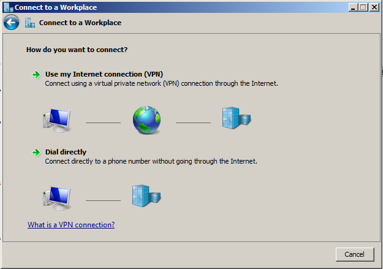
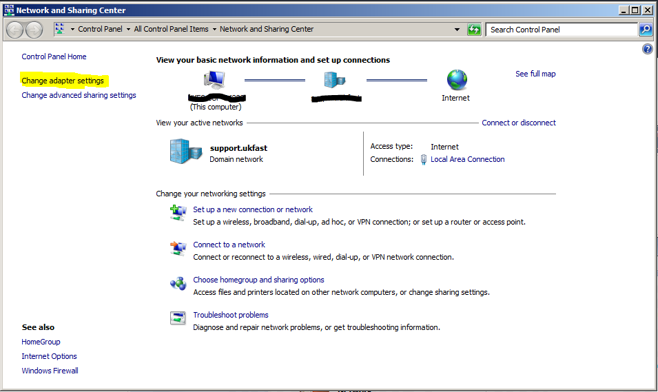
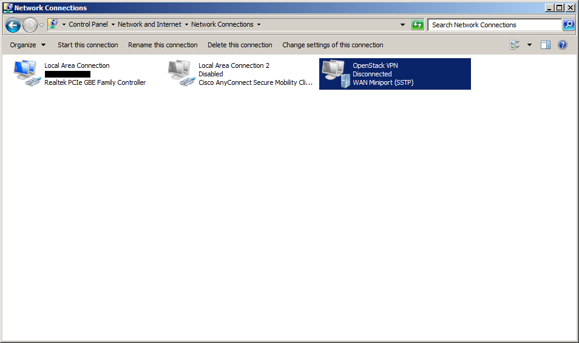
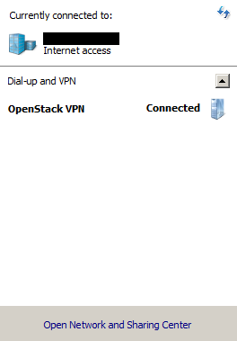

# How to set up a Multi-Protocol VPN Server using SoftEther

```eval_rst
.. meta::
    :title: Multi-Protocol VPN Server using SoftEther | UKFast Documentation
    :description: Detailed guidance on setting up a multi-protocol VPN server using SoftEther
```

## Set up the VPN server
### Introduction

This article explains how to install and configure a multi-protocol VPN server using the SoftEther package. We enable and configure OpenVPN, <nospell>L2TP</nospell> over IPsec and SSTP VPN Servers on Linux.

### What is SoftEther

SoftEther VPN is one of the world's most powerful and easy-to-use multi-protocol VPN software, made by the good folks at the University of Tsukuba, Japan. It runs on Windows, Linux, macOS, FreeBSD and Solaris and is freeware and open-source. You can use SoftEther for any personal or commercial use free of charge.

### Step 1: Create a Virtual Server

First, you need to create a CentOS 7 server. As mentioned in SoftEther's website, SoftEther will work on almost every Linux distribution with kernel `v2.4` or above; however, it's recommended to choose one of these distributions: CentOS, Fedora, or Red Hat Enterprise Linux.

Personally I have only tried it on CentOS 7 64-bit edition, but it has worked perfectly.

### Step 2: Update your Server Software

Using the command below, update and upgrade your server software packages to the latest version:

* **Debian / Ubuntu**:

```bash
apt-get update && apt-get upgrade
```

* **CentOS / Fedora**:

```bash
yum upgrade
```

### Step 3: Download SoftEther

You can download the latest SoftEther server package for Linux from their website:

* <http://www.softether-download.com/en.aspx>

Unfortunately, there is no repository in place for getting the latest version of SoftEther, and so we'll need to download the latest version to use from their site. Therefore, you have to browse their website using a desktop browser to download the package.

First, browse their website on your own computer and choose the appropriate `Component`, `Platform` and `CPU`, then find the link to the appropriate package. This will download the latest stable version (at the time of writing) for `Linux x86_64`:

```bash
wget http://www.softether-download.com/files/softether/v4.20-9608-rtm-2016.04.17-tree/Linux/SoftEther_VPN_Server/64bit_-_Intel_x64_or_AMD64/softether-vpnserver-v4.20-9608-rtm-2016.04.17-linux-x64-64bit.tar.gz
```

### Step 4: Install and Configure SoftEther

Now we have to extract the package we received from the SoftEther download page and compile it. The package used in this tutorial is named `softether-vpnserver-v4.20-9608-rtm-2016.04.17-linux-x64-64bit.tar.gz` so we will extract it using the command below:

```bash
tar xzvf softether-vpnserver-v4.20-9608-rtm-2016.04.17-linux-x64-64bit.tar.gz
```

After extracting it, a directory named `vpnserver` will be created in the working folder. In order to compile SoftEther, the following tools and packages must be installed on your server:

```bash
make, gccbinutils (gcc), libc (glibc), zlib, openssl, readline, and ncurses
```

Make sure these are installed. You can install all the packages necessary to build SoftEther using the command below:

* **Debian / Ubuntu**:

```bash
apt-get install build-essential -y
```

* **CentOS / Fedora**:

```bash
yum groupinstall "Development Tools"
```

```eval_rst
.. note::

    On Fedora, I have found that the ``gcc`` package doesn't get installed using the command above so you have to install it manually using ``yum install gcc``.

```

Now that we have all the necessary packages installed, we can compile SoftEther using the following commands.

First `cd` into `vpnserver` directory:

```bash
cd vpnserver
```

And now run `make` to compile SoftEther into an executable file:

```bash
make
```


SoftEther will ask you to read and agree with its License Agreement. Select `1` to read the agreement, again to confirm read, and finally to agree to the License Agreement.

SoftEther is now compiled and made into executable files (`vpnserver` and `vpncmd`). If the process fails, check if you have all of the requirement packages installed.

Now that SoftEther is compiled we can move the `vpnserver` directory to someplace else, here we move it to `/usr/local`:

```bash
cd ..
mv vpnserver /usr/local
cd /usr/local/vpnserver/
```

And then change the files permission in order to protect them:

```bash
chmod 600 *
chmod 700 vpnserver
chmod 700 vpncmd
```

If you like SoftEther to start as a service on startup create a file named `vpnserver` in `/etc/init.d` directory a follows.

First create and open the file using `vi`:

```bash
vi /etc/init.d/vpnserver
```

And paste the following into the file:

```bash
#!/bin/sh
# chkconfig: 2345 99 01
# description: SoftEther VPN Server
DAEMON=/usr/local/vpnserver/vpnserver
LOCK=/var/lock/subsys/vpnserver
test -x $DAEMON || exit 0
case "$1" in
    start)
        $DAEMON start
        touch $LOCK
        ;;
    stop)
        $DAEMON stop
        rm $LOCK
        ;;
    restart)
        $DAEMON stop
        sleep 3
        $DAEMON start
        ;;
    *)
        echo "Usage: $0 {start|stop|restart}"
        exit 1
esac
exit 0
```

Finally save and close the file by pressing `esc` and typing `:wq` to close `vi`.

We have to make a directory at `/var/lock/subsys` if one does not exist:

```bash
mkdir /var/lock/subsys
```

Now change the permission for the startup script and start `vpnserver` using command below:

```bash
chmod 755 /etc/init.d/vpnserver && /etc/init.d/vpnserver start
```

Use the command below make it to run at startup:

#### Debian / Ubuntu:

```bash
update-rc.d vpnserver defaults
```

#### CentOS / Fedora:

```bash
chkconfig --add vpnserver
```

SoftEther VPN Server is now installed and configured to run at startup. Finally, we have to check if the VPN server is working:

```bash
cd /usr/local/vpnserver
./vpncmd
```

Now press `3` to choose `Use of VPN Tools` and then type:

```bash
check
```

If all of the checks pass, then your server is ready to be a SoftEther VPN server and you can move on to the next step. Type `exit` to exit `VPN Tools`.

There are two ways to configure SoftEther VPN server. You can use the Windows-based server manager to manage and configure any number of SoftEther VPN servers remotely, or use the built-in `vpncmd` tool to configure your servers.

You can download SoftEther Server Manager for Windows using their website and do the configuration using the GUI that it provides, which is a preferable way if you are a Windows user.

Here we will use `vpncmd` to configure our VPN server.

### Step 5: Generate a Let's Encrypt certificate

Check out this link for a guide on using Certbot to automate generating Let's Encrypt certificates: [SafeDNS Authenticator plugin for Certbot](/domains/safedns/certbotplugin)

Further reading: [https://certbot.eff.org/docs/using.html](https://certbot.eff.org/docs/using.html)

Install the `certbot` package from the EPEL repository as follows:

```bash
yum install epel-release
yum install certbot
```

Decide what domain name to use to point to our VPN server:

```bash
FQDN=vpn.mydomainname.com
```
Here we'll use the `standalone` option to create a temporary web server listening on port `80`. We specify the challenge type `http-01` as the SoftEther will be listening on port `443/tcp`.

```bash
certbot certonly --standalone-supported-challenges http-01 --standalone -d vpn.mydomainname.com
```

If `certbot` managed to generate and validate your certificate, then you should receive a message like the following:

```text
IMPORTANT NOTES:
 - Congratulations! Your certificate and chain have been saved at
   /etc/letsencrypt/live/vpn.mydomainname.com/fullchain.pem. Your cert
   will expire on 2017-01-17. To obtain a new or tweaked version of
   this certificate in the future, simply run certbot again. To
   non-interactively renew *all* of your certificates, run "certbot
   renew"
 - If you like Certbot, please consider supporting our work by:

   Donating to ISRG / Let's Encrypt:   https://letsencrypt.org/donate
   Donating to EFF:                    https://eff.org/donate-le
```

Certbot will have generated a number of files now including the private key, certificate, full certificate chain, etc. and stored them in `/etc/letsencrypt/live/vpn.mydomainname.com`

We can now add the automatic renewal command into `cron` so that the certificate will be auto-renewed before it expires. You'll need to do this yourself, but the command to renew the certificate is:

```bash
certbot renew --quiet
```

### Step 6: Change Admin Password

Now that you have SoftEther VPN server installed, you have to assign an administrator password in order to use with SoftEther. You can do this using `vpncmd` which is SoftEther's command line based administration tool:

```bash
./vpncmd
```

Press `1` to select `Management of VPN Server or VPN Bridge`, then press `Enter` without typing anything to connect to the `localhost` server, and again press `Enter` without inputting anything to connect to server by server admin mode.

Then use command below to set the admin password:

```console
ServerPasswordSet
```

Enter and then re-type your new password. You'll need this whenever you want to change the server-wide options, like the IPSEC Pre-Shared Key (PSK).

### Step 7: Create A Virtual Hub

To use SoftEther we must first create a Virtual Hub. Here as an example we create a hub named `VPN`, in order to do that enter command below in the `vpncmd` tool:

```console
HubCreate VPN
```

Next you will be asked to enter an `administrator password` for the hub. This password will be used whenever you are not logged in as `server admin` mode, and you want to manage that specific hub.

Now select the Virtual Hub you created using this command:

```console
Hub VPN
```

### Step 8: Enable `SecureNAT`

There are two ways of connecting your hubs to the server network:
*  using a `Local Bridge` connection
*  using the `SecureNAT` function.

You can use each one separately, but using these two together will cause problems.

Here we use `SecureNAT`, which is very easy to setup and works pretty well in most situations. You could also use `Local Bridge` mode, but then you have to install and configure a DHCP Server too.

`SecureNAT` is a combination of Virtual NAT and DHCP Server function. By default, it will allocate the VPN clients from the subnet `192.168.30.0/24`, although this can be configured.

You can enable `SecureNAT` using the command below:

```console
SecureNatEnable
```

If you require `split routing`, whereby all VPN client traffic will not be forced over the VPN, set the `/GW:none` option in the `DhcpSet` command.

Unfortunately, you need to specify the full DHCP configuration again, so get the current values using `DhcpGet` first. Here's an example:

```console
DhcpSet /START:192.168.30.10 /END:192.168.30.10 /MASK:192.168.30.10 /EXPIRE:7200 /GW:none /DNS:192.168.30.1 /DNS2:8.8.8.8 /DOMAIN:none /LOG:yes /PUSHROUTE:none
```

### Step 9: Create and Manage Users

Now we have to create users for our Virtual Hub to use the VPN. We can create users for our Virtual Hub using the command `UserCreate` and view the list of current users by using `UserList`. Users can be added to groups and can even have different types of authentication modes (including: Password, Certificate, RADIUS, NTLM, etc.).

By using command `UserCreate` we create a user named `test`:

```console
UserCreate test
```

The default type of authentication is `Password` but we can change it to a different type using commands below:

* `UserNTLMSet` for NT Domain Authentication
* `UserPasswordSet` for Password Authentication
* `UserAnonymousSet` for Anonymous Authentication
* `UserRadiusSet` for RADIUS Authentication
* `UserCertSet` for Individual Certificate Authentication
* `UserSignedSet` for Signed Certificate Authentication

In this tutorial we use `Password` as the user authentication mode for our `test` user, so using this command set a password for user `test`:

```console
UserPasswordSet test
```

### Step 10: Setup <nospell>L2TP</nospell>/IPsec

To enable <nospell>L2TP</nospell>/IPsec VPN server you can use the command below:

```console
IPsecEnable
```

After entering this command, you will be asked to configure the <nospell>L2TP</nospell> server functions:

*  `Enable L2TP over IPsec Server Function`: Choose `yes` to enable <nospell>L2TP</nospell> VPN over IPsec with pre-shared key encryption. Now you can make VPN connections to this server using iPhone, Android, Windows, and Mac OS X devices.
*  `Enable Raw L2TP Server Function`: This will enable <nospell>L2TP</nospell> VPN for clients with no IPsec encryption.
*  `Enable EtherIP / L2TPv3 over IPsec Server Function`: Routers which are compatible with EtherIP / <nospell>L2TPv3</nospell> over IPsec can connect to this server by enabling this function.
*  `Pre Shared Key for IPsec`: Enter a pre-shared key to use with <nospell>L2TP</nospell> VPN.
*  `Default Virtual HUB in a case of omitting the HUB on the Username`: Users can specify the Virtual Hub they are trying to connect to by using `Username@TargetHubName` as their username when connecting. This option specifies which Virtual Hub to be used if the user does not provide such information. In our case enter **VPN**.

### Step 11: Setup SSTP/OpenVPN

The SoftEther can clone the functions of Microsoft SSTP VPN Server and OpenVPN Server. But before we enable these we have to import the SSL certificate and key from Let's Encrypt.

Here we use SoftEther's `ServerCertSet` command to point it to the SSL certificate and key for our server. Change the `vpn.mydomainname.com` to the FQDN which you provided to Let's Encrypt's Certbot tool, which should be the same one which points to your VPN server. It's imperative that it matches the one you will use long-term:

```console
ServerCertSet /LOADCERT:/etc/letsencrypt/live/vpn.mydomainname.com/fullchain.pem /LOADKEY:/etc/letsencrypt/live/vpn.mydomainname.com/privkey.pem
```

```eval_rst
.. note::

   SoftEther also comes with a built-in ``Dynamic DNS`` function, which can assign a unique and permanent hostname for your server. You can use the hostname assigned by this function for creating a SSL Certificate and connecting to your server.

```

```eval_rst
.. note::

   If you already have a SSL certificate or you have created one using ``openssl``, it can be added to the server using the command ``ServerCertSet`` as shown above, changing the paths to match where your files are.

```

Now that we have created and registered a SSL Certificate for our server, we can enable SSTP function with this command:

```console
SstpEnable yes
```

And to enable OpenVPN:

```console
OpenVpnEnable yes /PORTS:1194
```

* Note: OpenVPN's default port is `1194`, but you can change it to any port you want by changing the `/PORTS:1194` part of the command above to your desired port or ports (yes, it supports multiple ports).

After you enabled OpenVPN, you can download a sample configuration file for OpenVPN client. Here we create a sample OpenVPN configuration file and save it to `my_openvpn_config.zip`:

```console
OpenVpnMakeConfig ~/my_openvpn_config.zip
```

Then you can download it using any SFTP client such as FileZilla and apply it to your OpenVPN clients.

SoftEther also provides a dedicated VPN Client software for both Windows and Linux. It supports a SoftEther specific protocol called `Ethernet over HTTPS` or `SSL-VPN` which is very powerful. It uses HTTPS protocol and port 443 in order to establish a VPN tunnel, and because this port is well-known, almost all firewalls, proxy servers and NATs can pass the packet. In order to use `SSL-VPN` protocol, you must download and install SoftEther VPN Client, which can be obtained from their website.

Alternatively, and what we'll do here, you can use the built-in VPN capabilities of Windows 7 or above.

### Step 12: Set up IP Forwarding
We have to query the `sysctl` kernel value `net.ipv4.ip_forward` to see if forwarding is enabled or not:

```bash
sysctl net.ipv4.ip_forward
```

If it's not currently enabled, the output should be as follows. If the output is `1` then it is already enabled

```ini
net.ipv4.ip_forward = 0
```

Now edit the file `/etc/sysctl.conf` and add the following line:

```ini
net.ipv4.ip_forward = 1
```

Apply the configuration with the following command

```bash
sysctl -p
```

## Set up the VPN connection in Windows 7
### Step 1: Open Network and Sharing Centre

Start by finding the network connections icon in the bottom right corner of the screen (near the clock). The icon can be in the shape of computer display or wireless signal meter. Right click on that icon.


Select **Open Network and Sharing Centre**. You can also get there by going through `Start button` > `Control Panel` > `View network status and tasks`.


### Step 2: Set up a new connection or network

Click **Set up a new connection or network**.


### Step 3: Connect to a workplace

In the appeared window select **Connect to a workplace**, click **Next**.


### Step 4: Set as VPN

Click **Use my Internet connection (VPN)**.



### Step 5: Specify the VPN Server

**Internet address** is your server's FQDN which was used in ***Step 5 of "Set up the VPN server"***. It is not `openstackvpn.calv.tk`, that is just an example. **Destination name** can be anything you like, for example OpenStack VPN.

Check **Don't connect now; just set it up so I can connect later** and click **Next**.


### Step 6: Enter login credentials

Fill the **User name** and **Password** fields. In the ***Step 9 of "Set up the VPN server"*** we created the user **test**, so enter those details (or the ones you used instead). Check **Remember this password** and click **Create**.


### Step 7: Create the connection

Click **Close**.


### Step 8: Find the new connection

Click **Change adapter settings**.



### Step 9: Enter connection properties

In the connections list find the **OpenStack VPN** connection, the description should be `WAN Miniport (IKEv2)`. Right click on it and select **Properties**.


### Step 10: Set advanced options

Click **Security** tab, for **Type of VPN** select **Secure Socket Tunnelling Protocol (SSTP)**. For **Data encryption** select **Require encryption (disconnect if server declines)**. Click **Advanced settings**. For **Authentication** select **Unencrypted password (PAP)** and **Microsoft CHAP Version 2 (MS-CHAP v2)**. Then click **OK**


### Step 11: Start the VPN connection

Double click on the **OpenStack VPN** connection icon, or whatever you called yours.



### Step 12: Verify / enter login details

It will show the connection window. Check **Save this user name and password for the following users** and leave **Me only** selected. Click **Connect** button.


### Step 13: Check you're connected

After a few seconds it will connect and show you **Connected** status. You can also check the VPN status in the Network applet (the icon in your system tray at the bottom right). Click on that icon and you will see the connection list and their statuses.



## Further Reading

* <https://www.digitalocean.com/community/tutorials/how-to-setup-a-multi-protocol-vpn-server-using-softether>
* <https://www.softether.org/4-docs/1-manual/3._SoftEther_VPN_Server_Manual>
* <https://www.softether.org/4-docs/1-manual/7._Installing_SoftEther_VPN_Server>
* <https://www.softether.org/4-docs/2-howto/9.L2TPIPsec_Setup_Guide_for_SoftEther_VPN_Server/4.Windows_L2TP_Client_Setup>
* <https://letsencrypt.org/getting-started/>
* <https://www.ducea.com/2006/08/01/how-to-enable-ip-forwarding-in-linux/>

```eval_rst
  .. title:: How to set up a Multi-Protocol VPN Server using SoftEther
  .. meta::
     :title: How to set up a Multi-Protocol VPN Server using SoftEther | UKFast Documentation
     :description: A guide to setting up a VPN server using SoftEther
     :keywords: ukfast, vpn, softether, multi, protocol, server, security
```
