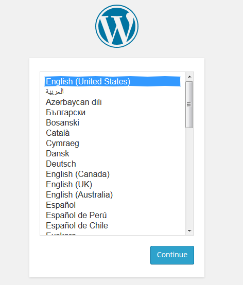
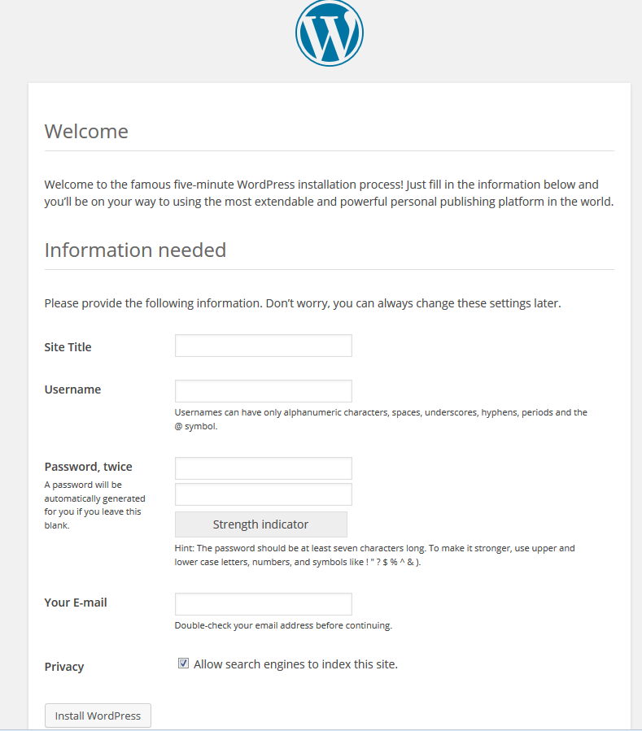

# WordPress

WordPress is an incredibly popular blogging platform that's increasingly being used as a Content Management System (CMS).

```eval_rst
.. seealso::
  If you're currently looking at a blank server, you'll first need to follow these prerequisite guides:

  - :doc:`/operatingsystems/linux/apache/installation`
  - :doc:`/operatingsystems/linux/php/installation`
  - :doc:`/operatingsystems/linux/mysql/installation`

```

```eval_rst
.. warning::
  Whilst WordPress is simple to get up and running with, you should note that it can present a security risk if WordPress, and any plugins and themes you choose to use, are not kept up to date. Due to it's popularity, WordPress is one of the most targetted applications on the internet.

  Care should be taken when installing any third party plugins or themes, as these con often be the source of a full server compromise. Only install from reputable sources and be very wary of any site that claims to have premium themes for cheap or free, these are often backdoor'ed in some way.

  For more information on keeping your WordPress site secure please see :doc:`/security/wordpress`
```

## Installation

This guide covers one method of installing WordPress, via SSH. If you're looking to install it in another way, the [installation guide from WordPress](http://codex.wordpress.org/Installing_WordPress) is a good source.

Before we can install WordPress, we first need to download it. WordPress keeps a handy link to their most recent version, so you should just be able to download it like so:

```console
wget http://wordpress.org/latest.tar.gz
```

Once you have this archive, uncompress it with this command:

```console
tar -xzvf latest.tar.gz
```

This will leave you file a directory called `wordpress` in your current directory.

Simply move the files from inside here to inside the location you specified as your `DocumentRoot` whilst setting up your virtual host:

```console
mv wordpress/* /var/www/vhosts/somedomain.tld/public_html
```

You'll also probably want to change the ownership on all those new files so that your webserver can access them. In this example, we are still using the default Apache user:

```console
chown -R apache: /var/www/vhosts/somedomain.tld/public_html
```

## Database Configuration

WordPress uses MySQL to store most of its information, so it'll need a database and user setting up.

Enter MySQL by typing `mysql` at the command line. This should leave you confronted with a prompt like this:

```bash
mysql
```

```console
Welcome to the MySQL monitor.  Commands end with ; or \g.
Your MySQL connection id is 2
Server version: 5.1.73 Source distribution

Copyright (c) 2000, 2013, Oracle and/or its affiliates. All rights reserved.

Oracle is a registered trademark of Oracle Corporation and/or its
affiliates. Other names may be trademarks of their respective
owners.

Type 'help;' or '\h' for help. Type '\c' to clear the current input statement.

mysql>
```

What you call your database and user is up to you, but in this example we'll be using `wordpress` and `wordpressuser`.

You'll need to use the `CREATE` syntax to create your new database:

```sql
CREATE DATABASE wordpress;
```

The user can be created with `GRANT` syntax:

```sql
GRANT ALL PRIVILEGES ON wordpress.* to 'wordpressuser'@localhost IDENTIFIED BY 'IamANewPasswordMonitorPlectrum';
```

Then we just flush privileges and exit:

```sql
FLUSH PRIVILEGES;
exit
```

The above series of commands will have created a databases called `wordpress` a user called `wordpressuser` with a password of `IamANewPasswordMonitorPlectrum`.

The important part to note is `'wordpressuser'@localhost`. This specifies the user `wordpressuser` can only log in from `localhost`, which is pretty good from a security standpoint. If you need access from a remote server, you could run the command again with a different IP or hostname in place of `localhost`.

```eval_rst
  .. warning::
    You could also replace ``localhost`` with ``\%``, which would allow connections for that user from any IP address, but unless you have a particular reason for this it should probably be considered a security risk.
```

## WordPress Configuration

Providing your Apache configuration is correct, you should now be able to browse to the domain name from your Virtual Host and see the following page:



Select your language and hit continue.

If you don't see the above screen, you're probably missing one of [WordPress' dependencies](https://wordpress.org/about/requirements/). If you haven't installed the `php-mysql` module, this is likely where you'll start to see issues. Check this guide on [installing PHP modules](/operatingsystems/linux/php/moduleinstallation) for further guidance.

The next page should just be letting you know that you're going to need your database credentials, but we've already covered that.

The main page you need to be concerned about is this one:


Enter the database credentials that you set up in the previous step and press 'Submit'.

If you've got your permissions set up correctly, then you shouldn't be asked to manually set up your `wp-config.php` file, but if you do, just create the file and paste in the content that's provided.

The next screen is specific to your blog and is pretty self explanatory:



From here on you're looking good - WordPress is installed and ready to use.

## Adding an admin user to WordPress

In order to add an admin user to WordPress, you will want to access the database for the WordPress site that you are adding the user too.

First, log into MySQL as `root` by typing:

```bash
mysql -u root -p
```

When prompted, enter the `root` password.

To get a list of databases, type:

```sql
SHOW DATABASES;
```

You will need to use the database for the correct site. You can do this by typing:

```sql
USE DATABASE_NAME;
```

Now you are using the correct database, below is the code required to add a user. You will want to change the values that have `***`s around them to suit your needs. Leave all the other code untouched:

```sql
INSERT INTO `wp_users` (`user_login`, `user_pass`, `user_nicename`, `user_email`, `user_status`)
VALUES ('***newadmin***', MD5('***pass123***'), '***firstname lastname***', '***email@example.com***', '0');

INSERT INTO `wp_usermeta` (`umeta_id`, `user_id`, `meta_key`, `meta_value`)
VALUES (NULL, (Select max(id) FROM wp_users), 'wp_capabilities', 'a:1:{s:13:"administrator";s:1:"1";}');

INSERT INTO `wp_usermeta` (`umeta_id`, `user_id`, `meta_key`, `meta_value`)
VALUES (NULL, (Select max(id) FROM wp_users), 'wp_user_level', '10');
```

The last thing to do is to flush MySQL privileges. You can do this by typing the following code into the MySQL shell:

```sql
FLUSH PRIVILEGES;
```

The user should now have been added successfully and you should be able to log into this account from your WordPress admin page.

```eval_rst
  .. title:: Configuring WordPress on Linux
  .. meta::
     :title: Configuring WordPress on Linux | UKFast Documentation
     :description:  How to configure WordPress and add admin users
     :keywords: ukfast, wordpress, configuration, users, databases, mysql, linux
```
