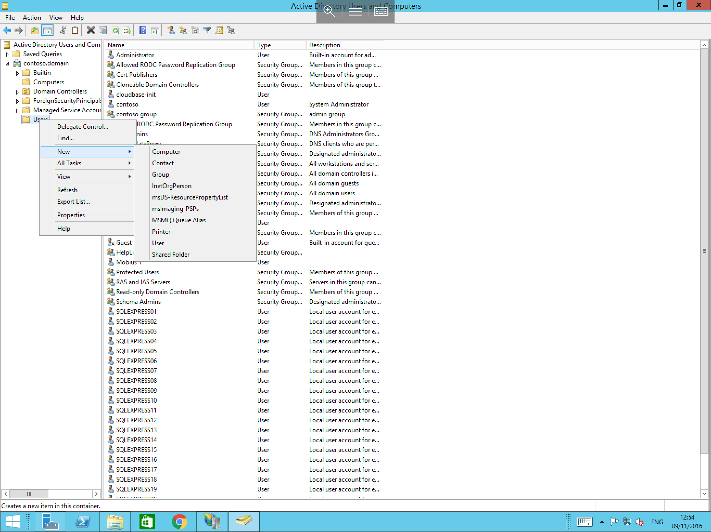
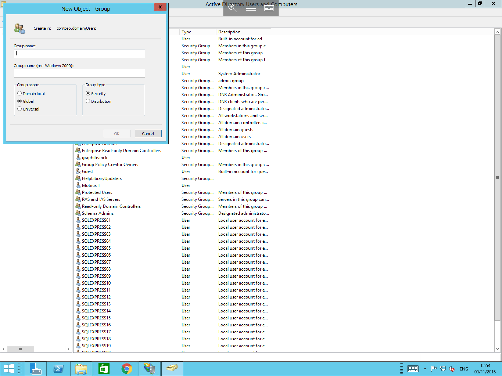

# How to Create a Group in Active Directory

* In an Active Directory Environment, you can make use of security groups for applying various configuration and permission changes across the domain, to create new Groups, please follow the below guide


Log in to the Domain controller using administrator credentials, once logged in, select start, and select "Active Directory Users and Computers" from the available list of applications as below


You will now be presented with the Active Directory Users and Computers window, on the left hand side of the window, you will see your domain, in this example `contoso.domain`, please pop out the menu by selecting the pop out arrow next to the domain.
Several more menu items will now be presented, from those new items, right click on the "Users" folder, select "New" and Select "Group" as below



You will now be presented with the "New Object - Group" window as below, in this window, enter the desired name for your new group, and select your required group scope and type.



* With the above fields completed, please select OK and you will now be able to see your new group in the list.

```eval_rst
   .. title:: Creating a Group in Active Directory
   .. meta::
     :title: Creating a Group in Active Directory | ANS Documentation
     :description: A guide to creating a group in Windows Active Directory
     :keywords: ukfast, windows, guide, active, directory, group, virtual, server, admin, management
```
