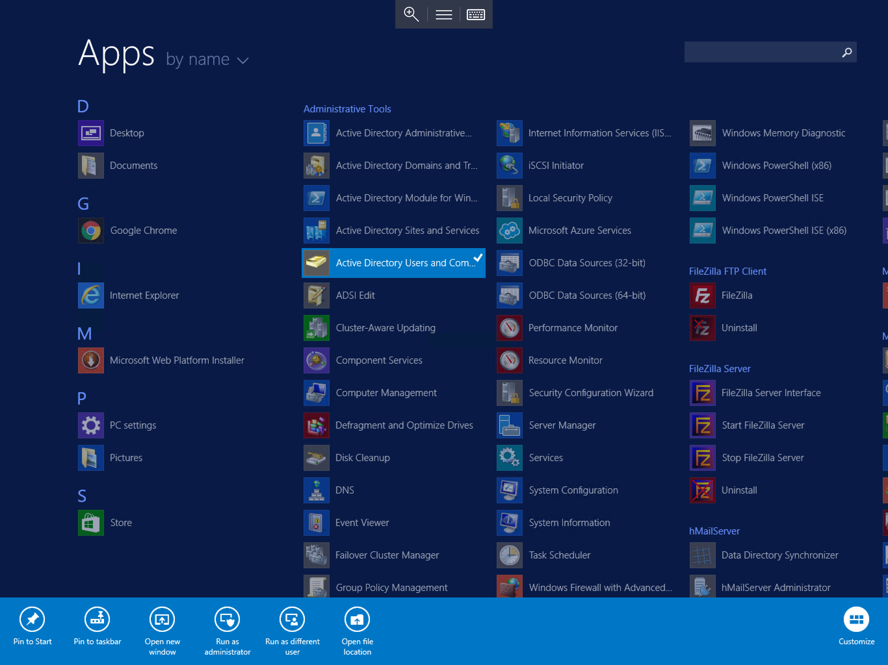
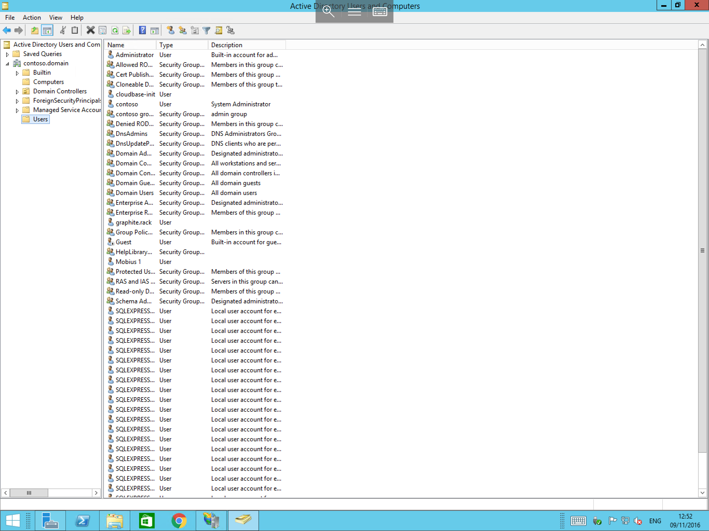
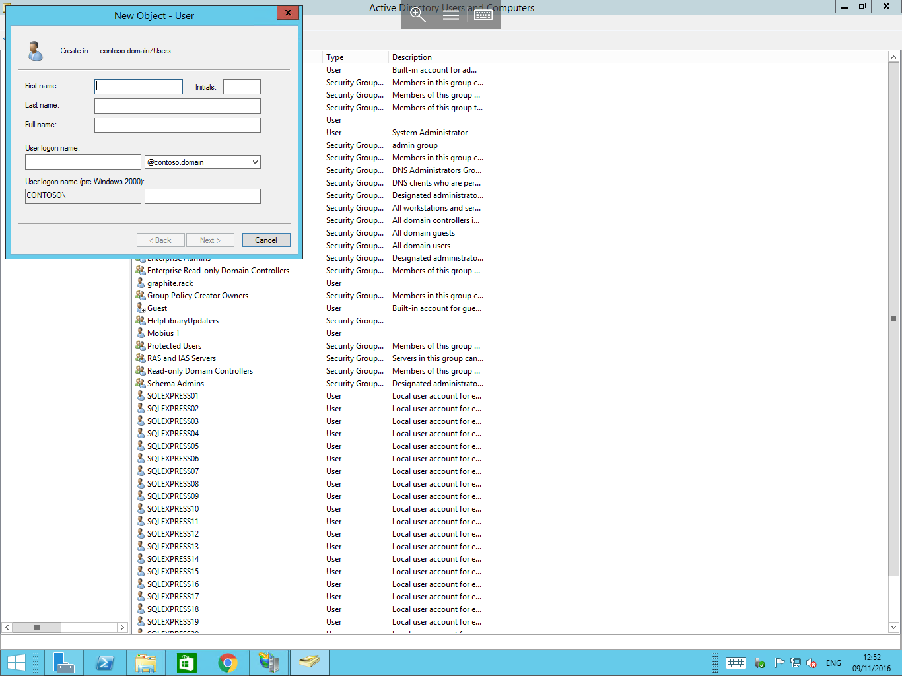
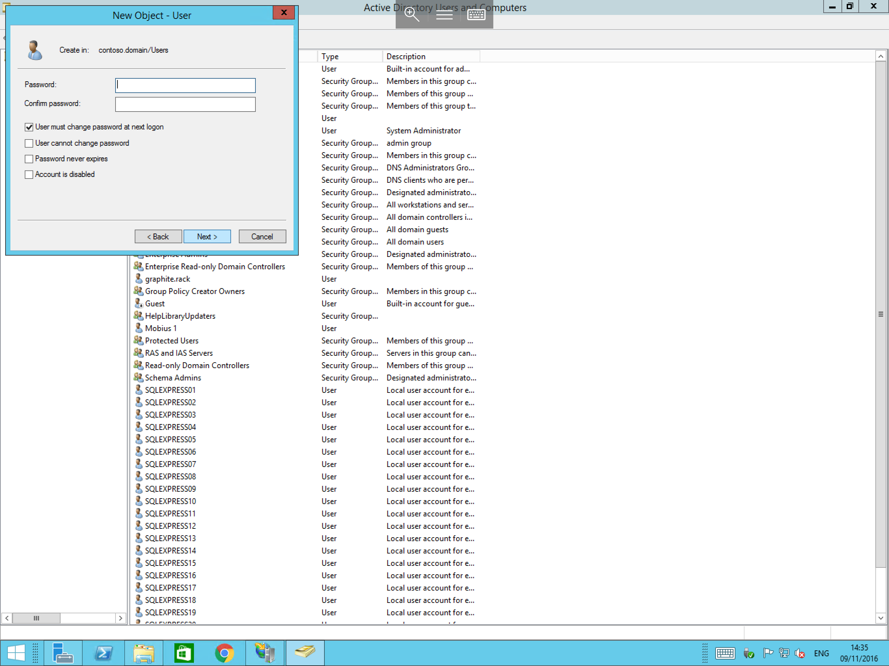

# How to Create a User in Active Directory

* If your solution makes use of an Active Directory Domain Services (Domain Controller) server, then you will need to create a Domain User account for each user that you wish to have access to servers on the Domain, (local user accounts created on individual servers, will not be suitable as they will only allow access to the machine which they were created on)
* To Create a Domain User in Active Directory, please follow the below guide.


Log on to the Domain Controller with domain administrator credentials, once logged on, open "Active Directory Users and Computers", you can do this by selecting start, and then selecting Active Directory Users and Computers from the list of available applications as below.



You will now be presented with the Active Directory Users and Computers Window as below.


In the left hand section of the window, you will see your domain, in this example `contoso.domain`, please pop out the menu by selecting the pop out arrow, and you will be presented with a number of extra folders, from the extra folders, please select "Users" as below.



Right click on the Users folder, and select New, then User as below.


You will now be presented with a "New Object - User" Window as below, in this window, enter details for your user, and then enter the desired logon name in the "User Logon name:" box, then select next.



You will now be prompted to enter a password for your new user as below, you will need to enter the password twice to ensure that the password has not been typed incorrectly, you can also set basic options for the user account here, once you have entered a password, and have chosen the required options, please select next.



You will now be presented with a summary pane as below, please review the details presented, once you have confirmed that they are correct, please select finish.


* You have now finished the process for creating a Domain User, this process can be repeated for each user that you require.

```eval_rst
  .. title:: Creating a user in Active Directory
  .. meta::
     :title: Creating a user in Active Directory | UKFast Documentation
     :description: A guide to creating a new user in Windows Active Directory
     :keywords: ukfast, windows, active directory, active, directory, server, vm, user, ad, virtual
```
