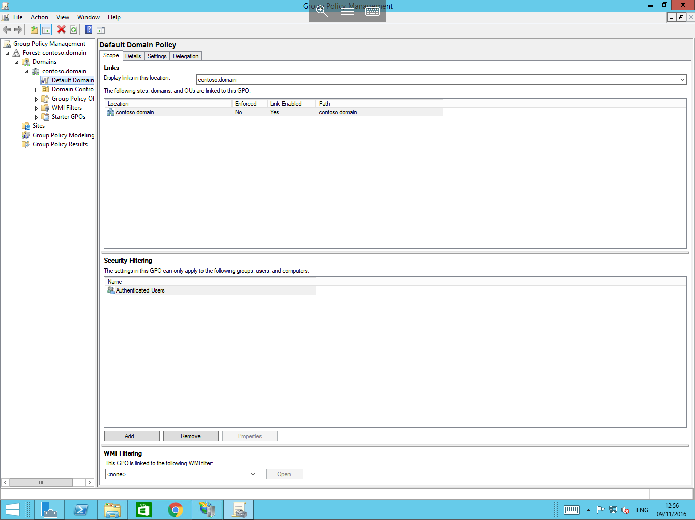
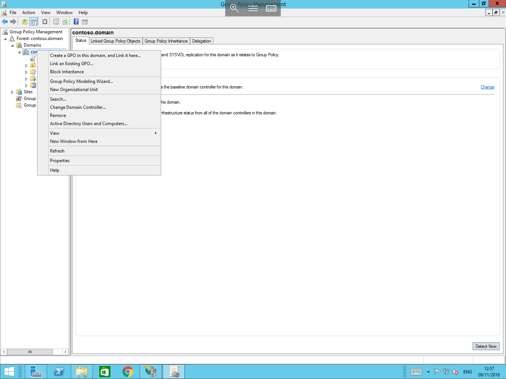
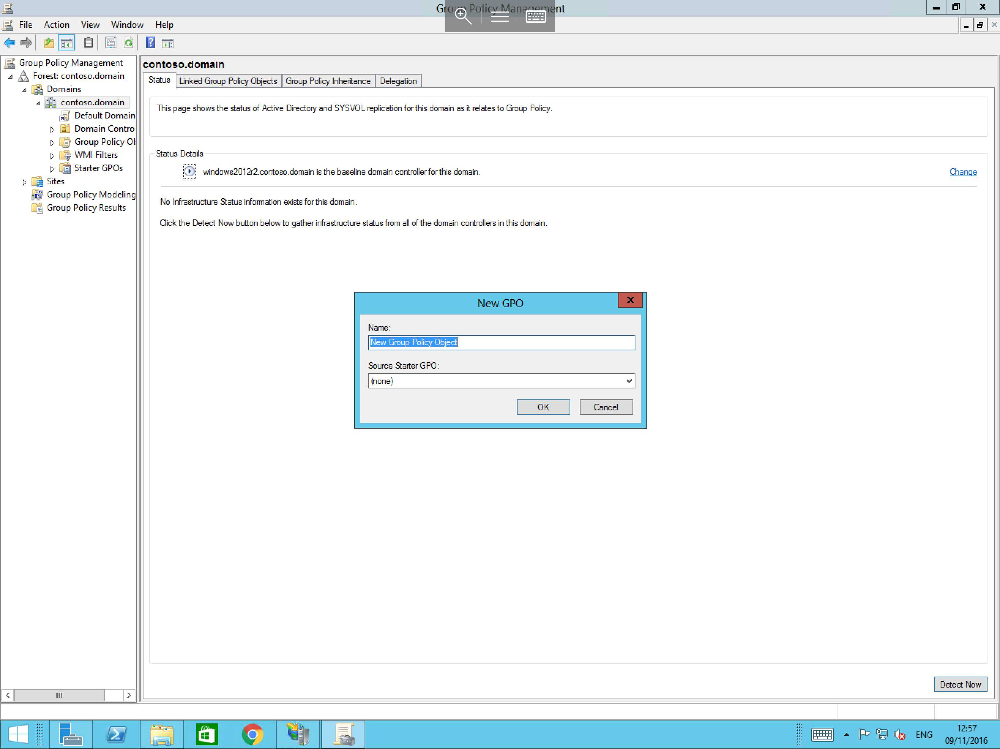
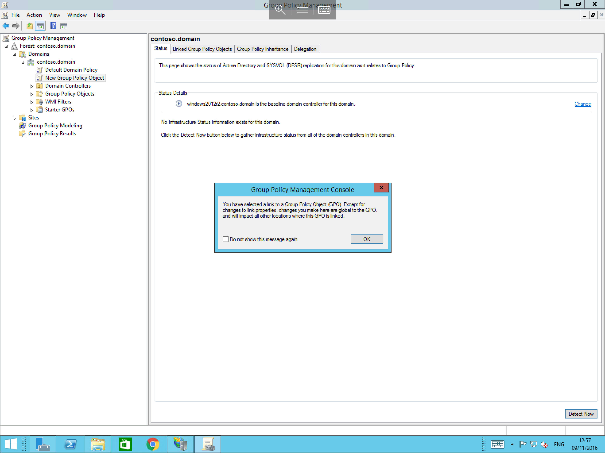
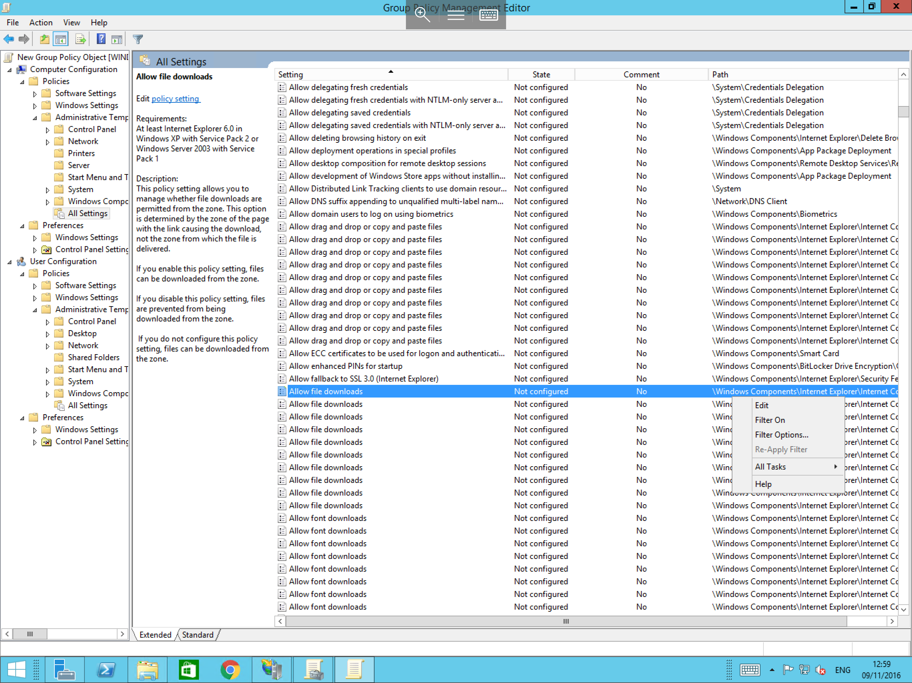

# How To Create Group Policy Objects

* In a Domain Environment, it is possible to manipulate Computer configuration and user privileges for specified groups of users and computers,
  This is done by making use of Group Policy Objects, files which contain up to 4109 different configuration options by default, with the ability to add more via use of templates to control third party software.
  The Group Policy objects can be assigned to groups of Users and/or groups of computers to control the user environment and computer behaviour rather than configuring permissions on each computer for each user.


* For a Full Explanation of Group Policy Modelling and Implementation, please visit the following link, <b>If you are not familiar with Group Policy Objects, it is Highly Advised to review the explanation provided in the link below before proceeding with this guide.</b>

  [Group Policy Planning and Deployment Guide](https://technet.microsoft.com/en-us/library/cc754948(v=ws.10).aspx)

* For a Complete Reference guide of all of the available options, please visit the following link

  [Group Policy Reference](https://www.microsoft.com/en-gb/download/details.aspx?id=25250)


## Create a New Group Policy Object

To Create a new group policy object, you will first need to access the Group Policy Management console, you can do so by selecting start, and selecting "Group Policy Management" from the list of available applications as below


You will now be presented with the Group Policy Management console as below, select your domain, in this case "contoso.domain" and pop out the arrow next to it which will display current group policy objects, by default you will only see one object name "Default Domain Policy"



Right click on your domain, in this case contoso.domain, and select `Create a GPO in this domain, and Link it here...` from the resultant context box as below



You will now be asked to Name the Group Policy Object as below and to choose a "Source Starter GPO", please leave this option as `(none)`, this option is used to select a pre-existing Group Policy Object as a template to start from.



## Edit a Group Policy Object

You will be able to see your new Group policy object in the left hand section of the window, select it or a pre existing Group policy object, if this policy is new you will be presented with a notice from the Console as below, please select OK.



Right click on your new or pre existing Group Policy Object and select "Edit" as below.


You will now be presented with your policy, the central view will contain `Computer configuration` and `User Configuration`, you will notice that the same 2 headers are also located in the left hand section of the window as below.


Pop out the `Policies` section located in both the Computer Configuration and User Configuration headings, and then pop out the `Administrative Templates` section in both headings as below.


In Both Sections, you will see `All Settings` in the left hand pane, selecting these headings will populate the central view with all of the available Group Policy options for that section as below.



```eval_rst
  .. title:: Creating Group Policy Objects in Active Directory
  .. meta::
     :title: Creating Group Policy Objects in Active Directory | UKFast Documentation
     :description: A guide to creating Group Policy Objects in Windows Active Directory
     :keywords: ukfast, windows, ad, active, directory, group, policy, objects, server, vm, virtual, management, admin, windows server

