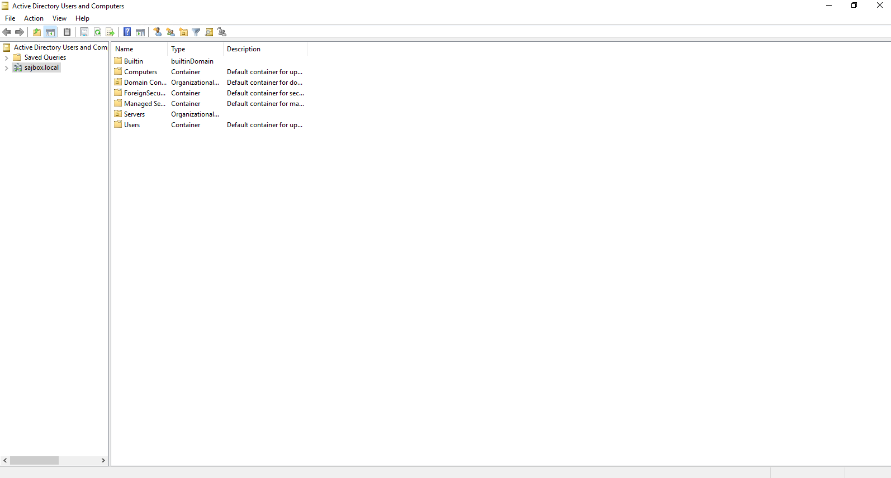

# How to Reset a User Password in Active Directory

This guide will show you how you can reset a user's password with Active Directory, you will need to gain access to the Domain Controller within your network to follow this guide.

I will be providing two examples of resetting a user's password, one using the `Active Directory Users and Computers` tool and the other using `Powershell`.

## Using the Active Directory Users and Computers Tool

- You will need to first log on to the Domain Controller with domain administrator credentials.
- Launch the `Active Directory Users and Computers` Tool, you can do this by going to `Start Menu > Windows Administrative Tools > Active Directory Users and Computers`.

You will then be presented with a window that looks similar to the below:



- Open the `Users` folder within this window.
- Right-click on the user that you would like to reset the password for.
- Click the `Reset Password...` option.

A window similar to the below will then be displayed:


- Within this window, enter a `New password` for the user.
- If the user's account has been locked, check the `Unlock the user's account` check box.
- We would recommend that you change the password upon logging into the account.

## Using Powershell

- On the Domain Controller run Powershell as an Administrator.
- Use the `Set-ADAccountPassword` cmdlet to change the user's password:
  ``` Powershell
  Set-AdAccountPassword -Identity Test -Reset -NewPassword (Read-Host -AsSecureString)
  ```   
  Change the property identity value `Test` to the username that requires a password reset.
- Now type in the new password within the Powershell window, the password will be in a secure format.
- Click `Enter` and you have successfully changed the password for your selected user.

```eval_rst
  .. meta::
     :title: Reset a User Password in Active Directory | UKFast Documentation
     :description: A guide to resetting a user password in Windows Active Directory
     :keywords: ukfast, windows, active directory, active, directory, server, reset, user, ad