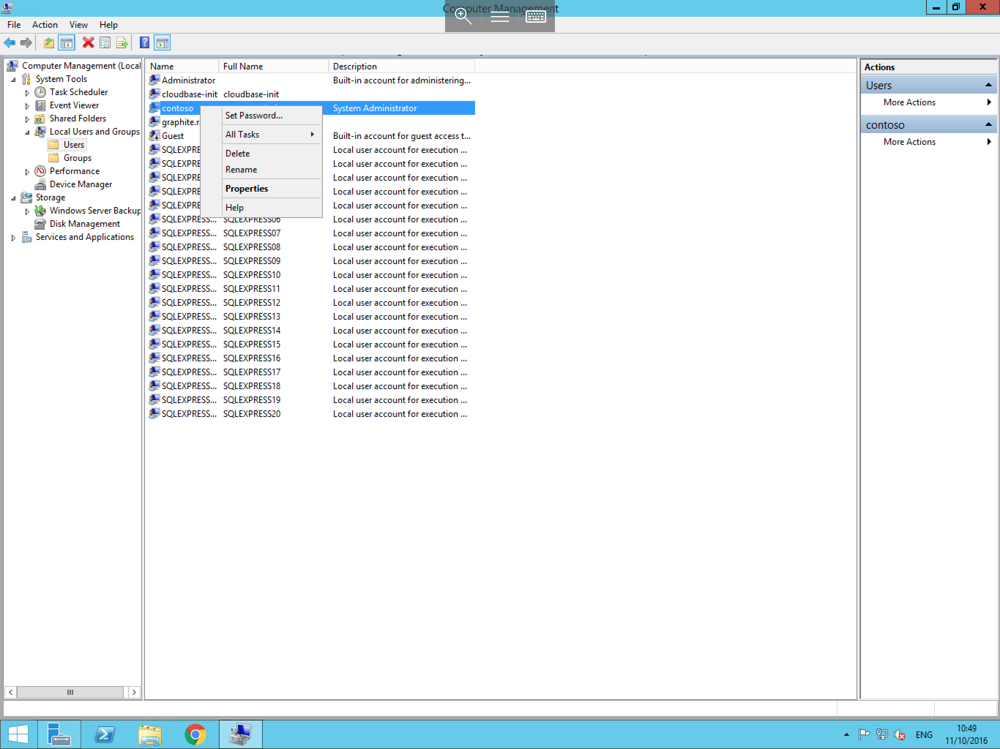
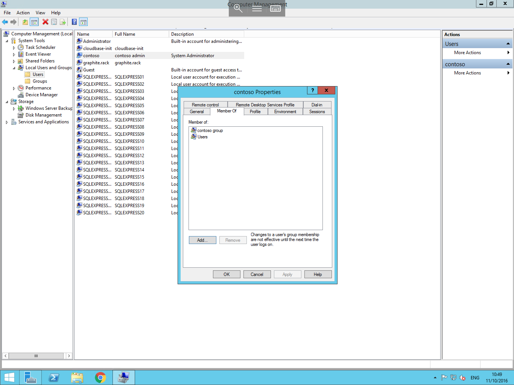

# Configuring user permissions

From the users list within the computer management console, Right click on the user you wish to configure permissions for and select Properties 



you will now be presented with the user properties, select the "Member Of" tab.

This panel will list all of the groups your user is a member of, by default this will only contain the "Users" group. In this panel, select the "Add" button. This will load the "Select Groups" windows, in the blank field at the bottom of this window, enter the name of the group which you wish to add your user to as below


Alternatively, if you are unsure of the available groups, from the "select groups" window, select "Advanced", and select "Find now". From the list that loads on this screen, select the group you wish to assign this user to and click ok to assign these permissions.

You should now be taken back to the user properties "Member Of" window, which will contain all of the new groups which you have added your user to as below



Check that all of the required groups are present, and select "Apply" to complete the process.
```eval_rst
  .. title:: Configuring user permissions in Windows Server | UKFast Documentation
  .. meta::
     :title: Configuring user permissions in Windows Server | UKFast Documentation
     :description: A guide to updating user permissions in Windows Server.
     :keywords: ukfast, windows, server, user, permissions, computer, management, virtual, vm, dedicated, applications, security
