# How to Transfer Files to/from a Server.

Depending on the size of the file, Windows offers a few different methods of transferring data between two devices.

## Remote Desktop Clipboard:

* For your convenience, Before attempting to establish a remote desktop session with your server, 
  please carry out the below steps, as they cannot be changed while a session is established.

To configure Remote desktop clipboard, please open the remote desktop connection application,(if you are unsure on how to do this, please see our guide Connecting to a server via remote desktop

You should now be presented with the remote desktop connection application which will look like below

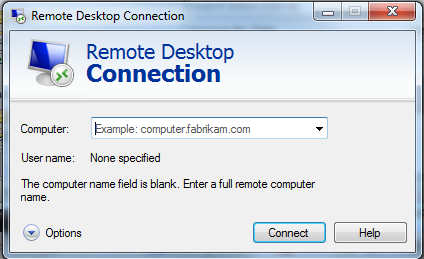

From this window, please select the "Options" button in the bottom left hand corner of the window, this will expand the window and provide you with a number of options which were previously not visible.

Select the "Local Resources" tab and ensure that the "Clipboard" option is ticked as below


With the above option set, establish your connection.

You will now find that you can copy and paste files between your local workstation and the server by either using the keyboard shortcuts (Copy) `ctrl+c` (Paste) `ctrl+v` to copy and paste respectively, or by simply right clicking files and selecting the copy/paste options as required as you would on your local workstation. please see below for an example


If you're copying a large file or a large number of files you may find FTP meets your requirements better.

## FTP (File Transfer Protocol)

### FTP Server Installation
    
* Before FTP File tranfer can be used, an FTP Server such as FileZilla Server will need to be installed on your Windows server.
  FileZilla is open source software and is available for free from the link below

[Filezilla Server](https://filezilla-project.org/download.php?type=server)

The instalation of Filezilla FTP server is fairly simple, however there are a few steps which need to be highlighted.

Upon beginning the installation, you will be presented with a licence agreement, select "I Agree".
The installation wizard will then progress to the "choose components" pane, in this pane you will need to choose the components which you wish to install and select next as below

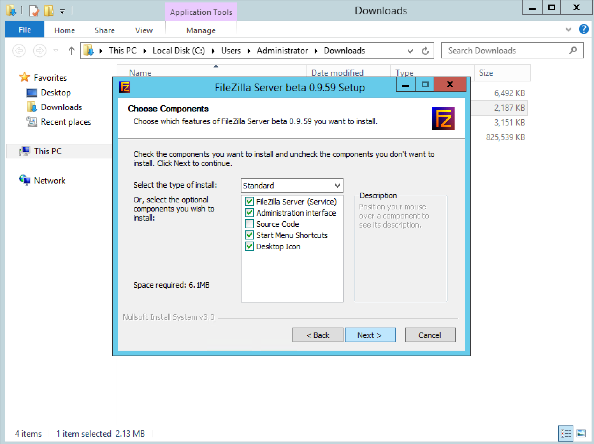

You will now be prompted to choose the install location for FileZilla Server, this will be set by default to C:\Program Files (x86)\FileZilla Server\ which is perfectly fine, but can be changed if you prefer.
Once you have chosen the installation location, please select next.

The next pane will ask you to choose the startup options for FileZilla Server, by Default this is set to "Install as service, started with Windows" which is the recommended option.
You will also be asked to provide an Admin Port which is used to remotely administrate the FileZilla Server, this will be set to port 14147 by default, but again, can be changed to your preference.
The final option on this pane is to decide if you want FileZilla to start once the setup process has been completed. as below

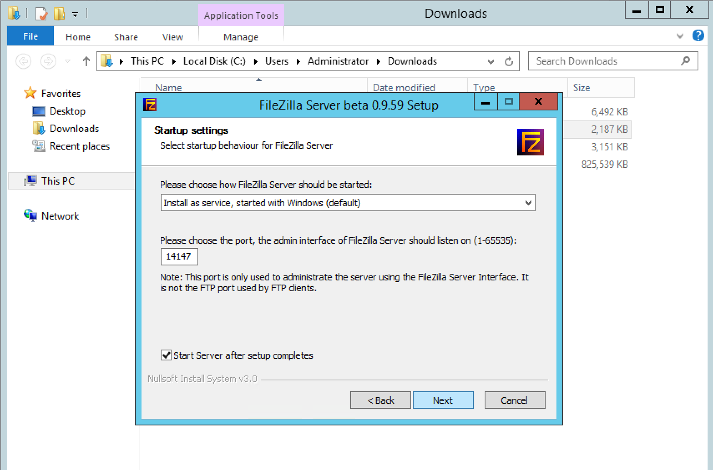

The next pane asks to you to select 2 further options before the installation begins, these options are related to the server interface.
The first option is to choose how the server interface starts,By Default this option is set to "Start if user logs on, apply to all users", this option can be set to your preference, and can be changed to start manually if you choose.
The Second option is to choose if you would like the server interface to be started once the setup process has been completed as below, once you have made your selection, click install to begin the installation process.

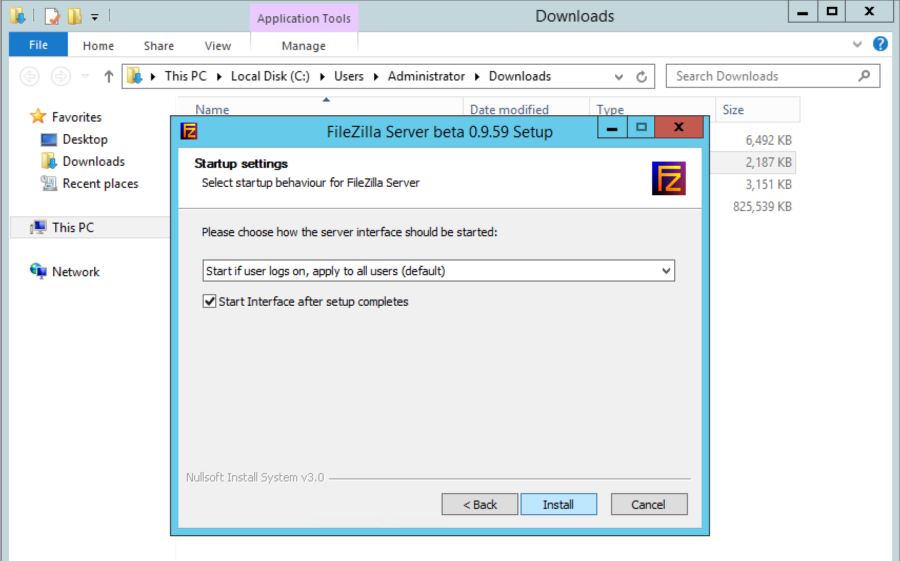

Once the installation has completed, you will be presented with a screen similar to the one below, once the completed notice is presented, you can select the close button.


###  FTP User Creation

* Now that the FTP Server has been installed, you will need to create a user account to work with.
  This section will guide you how to do this for Filezilla Server specifically, although the process is very similar in other FTP Servers also.

First of all, you will need to open the FileZilla Server interface, Depending on your chosen options during the installation process, the interface may open automatically for you,
but if not, you can launch it by selecting start and selecting "FileZilla Server interface" as below

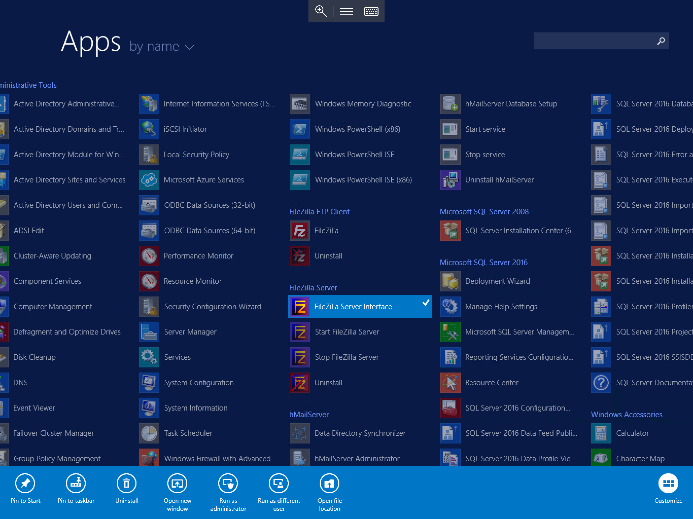

You should now be presented with the FileZilla Server interface as below. This window will be pre-populated with the host "localhost" meaning the server you are working on. and the admin port which you have chosen during the installation process.
The password field will be blank, this is as expected and does not matter at this point as a password has not yet been configured. Once you are sure that the details are as expected click "Connect"

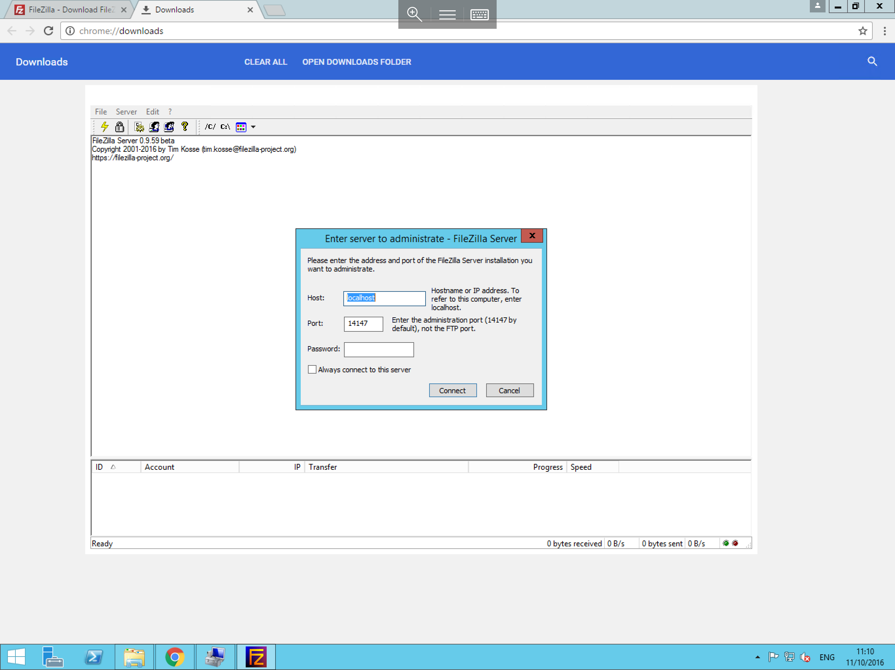


You will now be logged in to your ftp server, and will be presented with an FTP console as below.

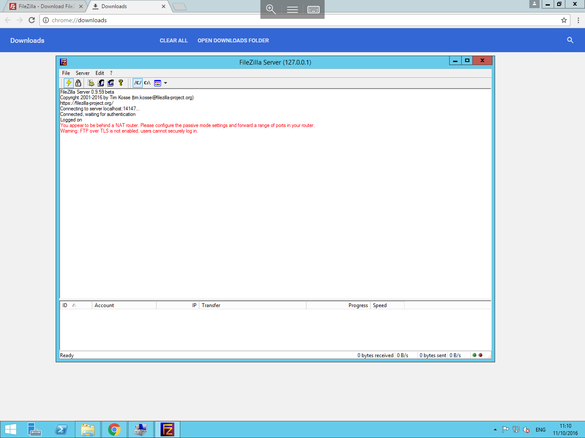

From this pane, select "Edit" and "Users" as below to open the "Users" pane.


You will now be presented with the users pane, as below. Within this menu, select "Add" on the right hand side of the pane, this will present the "Add user account" pane, please enter a user name in the text field, and select "Ok"

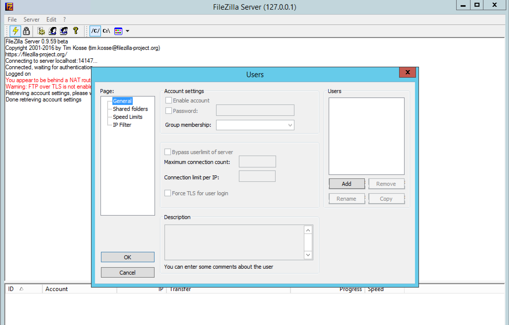

Following the last step, you will have returned to the "Users" pane, and you should now be able to see your new user account listed in the users pane to the right of the window as below.

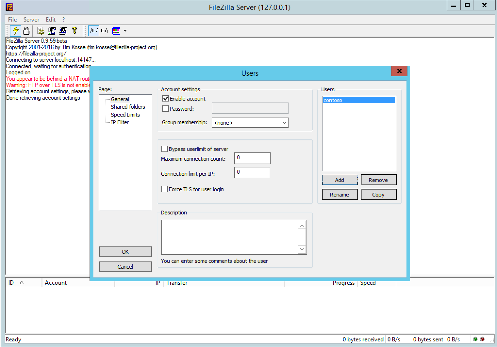

Select your new user account in the users section, and select the "password" tick box to enable a password for this account. once you have done this, enter your choice of password in to the text field next to the password option, once done, select ok.
Your new account is now protected.

Re-enter the Users pane, if you are unsure how to do this, use the steps above as a reference.

Once you have navigated back to the users pane, please select "Shared folders" from the left hand "Page" menu. in this pane, you can add the directories which you would like your user to be able to access via FTP.
To do this, please select "Add" under the "Shared folders" section of the pane, you will now be presented with a file browser pane as below, navigate to your chosen folder and select ok. 
* Please note that you can only select single directories in this menu, and you will need to repeat this step for each directory that you wish to grant access to.


You will now be returned to the Shared folders page of the Users pane, and you will be able to see the share/s which you have added. To the right hand side of this, you will see 2 small options sections "Files" and "Directories"
These are the permission options which will be granted to the user.

By default the Files section will contain the Read permission, which will allow the user to read files in your chosen directories, and the directories section will contain the list and + subdirs permissions which will allow the user to list files in your chosen directories and subdirectories thereof.
You can grant extra permissions as per your requirements by ticking the appropriate boxes as below. once you are happy with the permissions, select "Ok" and the permissions will now be granted to your user and the account will be ready to use.
* Please note that these permissions are set on a per directory and per user basis, in order to set appropriate permissions for other users, you will need to first select the user on the Users Pane, and then select the share for that user which you wish to change the permissions for.


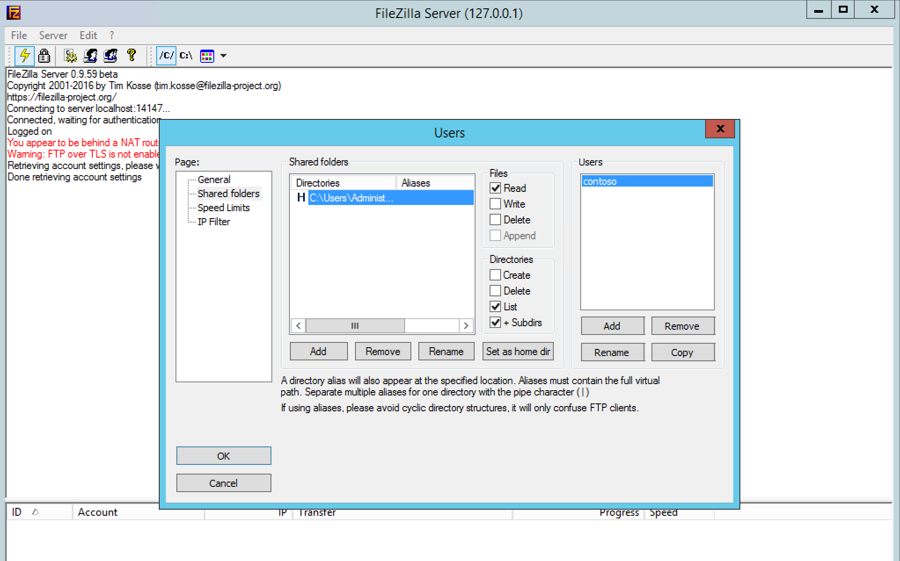


### FTP Client Installalation

* Before FTP File transer can occur between a client Machine and your server, an FTP client Such as FileZilla must be installed on your client machine.
  The FileZilla client is open source software and is available to download for free from the link below

[Filezilla Client](https://filezilla-project.org/download.php?type=client)

As with the FileZilla Server, the installation of the Filezilla client is fairly simple, but again, has a few steps which need to be highlighted.

Upon beginning the instalation, you will be presented with a licence agreement, select “I Agree”. 


You will then be presented with the installation options, this pane will ask you if you would like to make this software available to all users or just yourself, please select your chosen options and select next as below

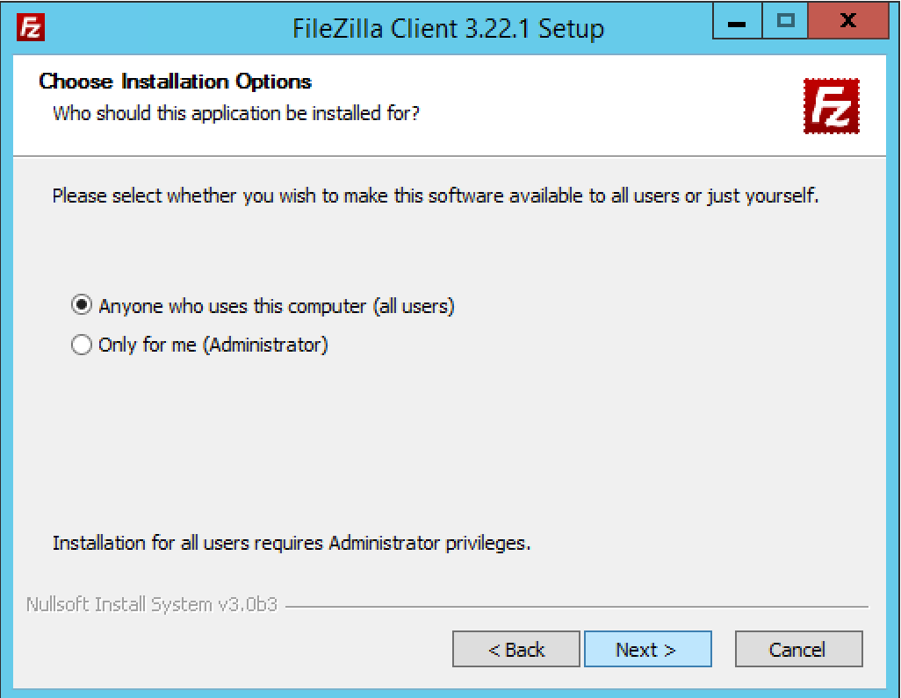

The next window will present you with the choice of components which you would like to install as below, please select the options which you require and select next.

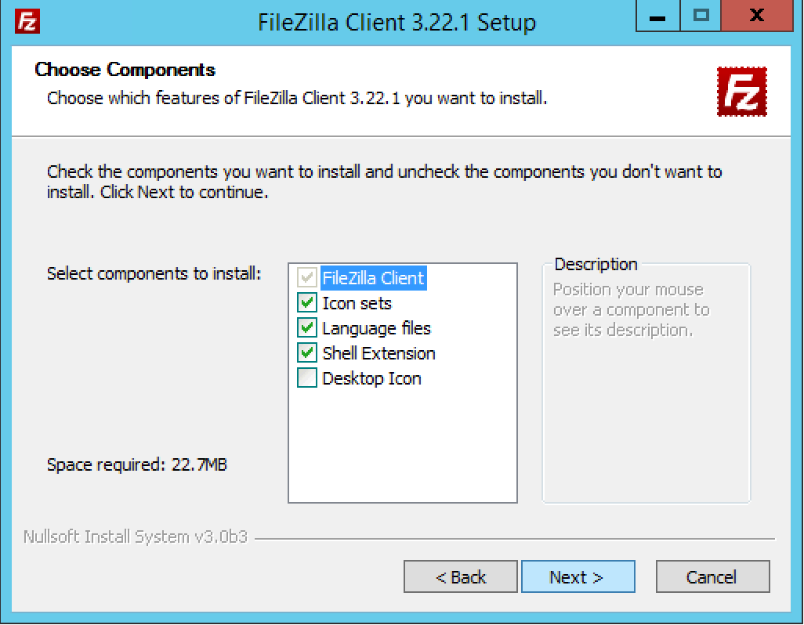

You will now be asked to choose an installation location as below, the default location is C:\Program Files\FileZilla FTP Client, however you can choose your own installation location should you wish to, once you have selected the installation location, please select next.


The next window will ask you if you would like to create a start menu folder, this is entirely optional, however i would recommend doing so, as it will make it easier to locate the Filezilla shortcut down the line should you need it. Once you have made this choice, please select install to begin the installation process.

Once the installation has completed you will be presented with the window below, by default, the option to start Filezilla now is enabled. If you do not wish to start filezilla straight away, please untick the box and select finish.


* The FTP client is now installed and ready to use


### Connecting to your FTP Server

Depending on the options which you selected during the installation stage, your FileZilla client should now be open, however if you did not opt to start FileZilla following installation, you can start it manually by selecting the start menu, and selecting the FileZilla icon as below

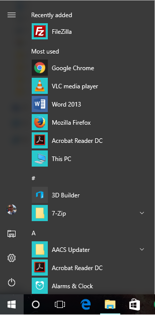

Once you have opened the FileZilla client, you should be presented with the FTP console as below, in this console, you will notice 4 blank text fields across the top of the window, Host, Username, Password and Port.
You will need to enter the details of your FTP server and account in to these fields.

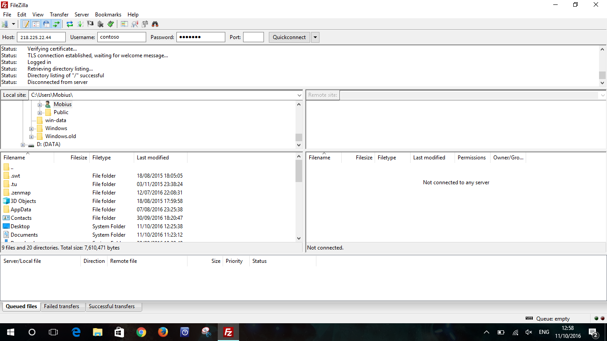

Once you have entered the details as demonstrated above, please select Quickconnect, once selected, you should begin to see a number of status updates being presented in the top field of the console window, once the connection has been fully negotiated, your chosen shares should be visible in the Remote Site section of the window, and your connection is now active as below.


* Your connection is now active and you will be able to move files between the "Remote Site" field, and the "Local Site" field, local site being your workstation, and remote site being your server.
  If you are unable to move files in a particular direction, Please review your permissions for that file and its directory on your FileZilla server, if you are unsure how to do this, please review the steps above on setting permissions.

```eval_rst
  .. title:: Transferring Files to/from a Server
  .. meta::
     :title: Transferring Files to/from a Server | UKFast Documentation
     :description:  A guide with common errors with uploading files via ftp and remote desktop
     :keywords: ukfast, windows, ftp, rdp, files, uploading, remote, server, virtual, vm, webserver, website
