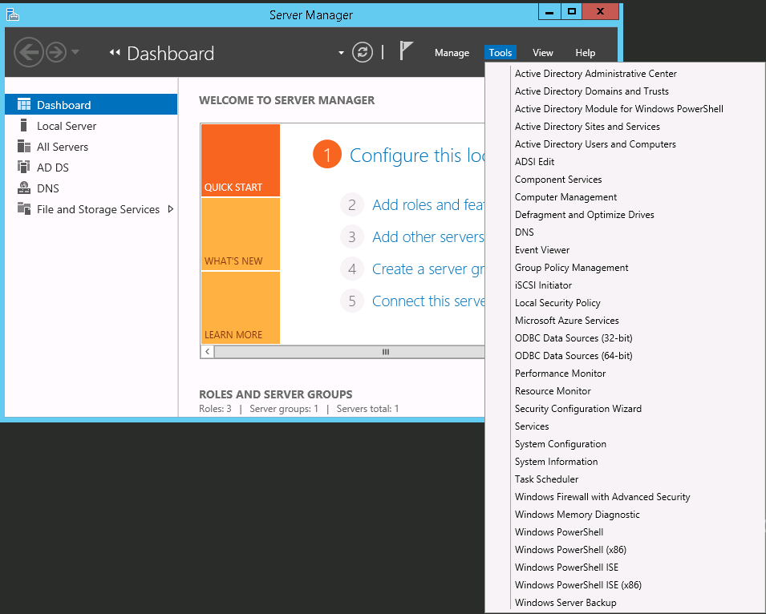
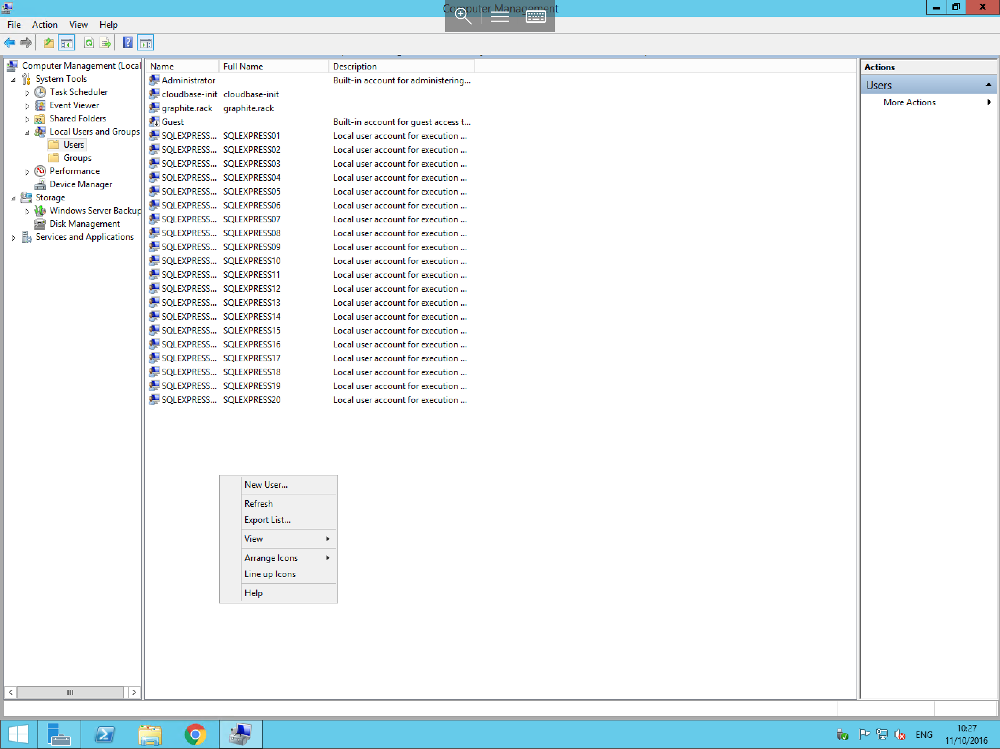
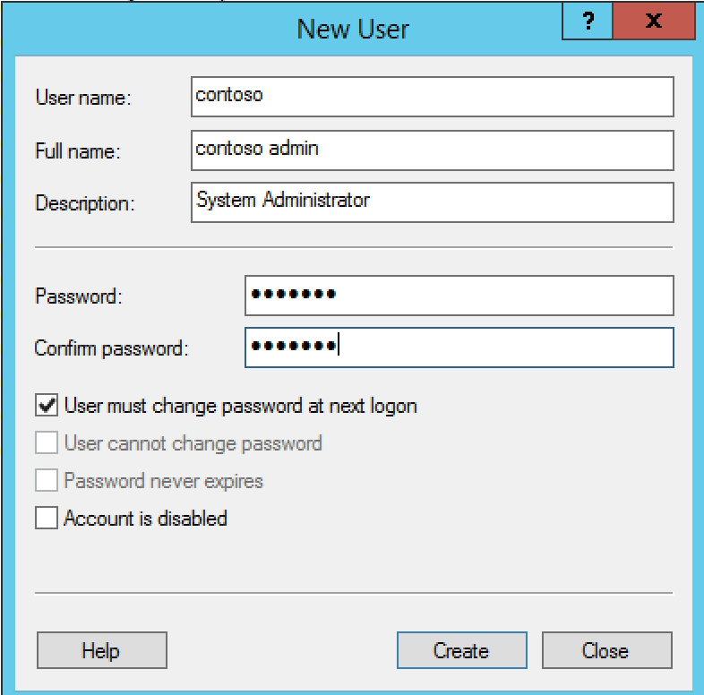

# Creating a new user in a Workgroup

To create a new user account on your server, please follow the below guide:


Open Server manager from the Taskbar > select "Tools" and then select Computer Management as below



Once the computer management console opens, you will see a selection of menu entries in the left hand field under the headings System Tools,Storage & Services and applications.
Pop out the arrow next to system tools, and pop out the arrow next to the newly visible Local Users and Groups menu item.

You should now be presented with 2 folders, one named Users, and the other named Groups, select the Users folder to view the current list of users on your server. right click in any blank area of the central section of the computer management console as below and select New User



You will now be presented with the new user context box, you will need to enter some basic information for your new account, including chosen user name, description and a password for the account.



* Once you have entered the required information, click ok. and your new user has now been created.

```eval_rst
  .. title:: Creating a new user in a workgroup
  .. meta::
     :title: Creating a new user in a workgroup | UKFast Documentation
     :description: A guide for creating a new user account on your Windows Server
     :keywords: ukfast, server, windows, manager, user, create, workgroup, administration


