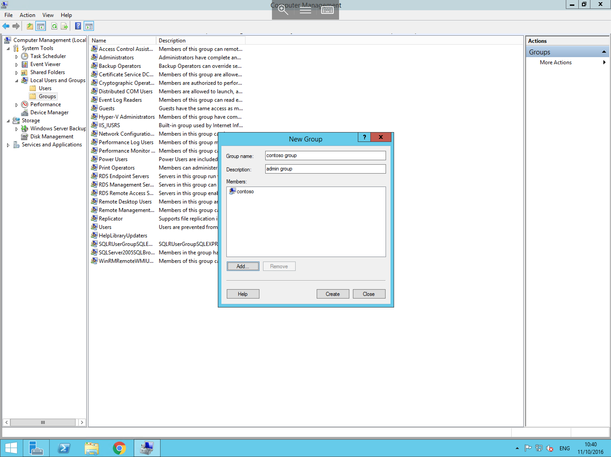

# Creating a new group

Groups can be useful for the separation of users, allowing you the ability to manage access to certain files/folders/applications on a group basis both locally and in a domain environment. which in the correct circumstances is more efficient than doing so on a per-user basis.

From the local users and groups menu within the computer management console, select groups, you will now be presented with a list of available security groups on your server as below


To create a new group; Right click the "Groups" folder and select New Group, you will now be presented with the new group window, 

In the new window you'll be prompted for the following information:
* Group Name - This is the name your users will connect using
* Description - This isn't compulsory but can be used to store information that pertains to the group i.e. Sales, Accounts, etc...
* Members - Using the Add button you may add users to this group

The New group window should look similar to below



Once complete, click "OK" to finalise the creation of this group.
```eval_rst
  .. meta::
  :title:Creating a new group in Computer Management
  :description:Teaching you how to setup groups within computer managementon a windows server
  :keywords:ukfast, windows, computer, management, users, groups, server, vm, virtual, cloud, admin
