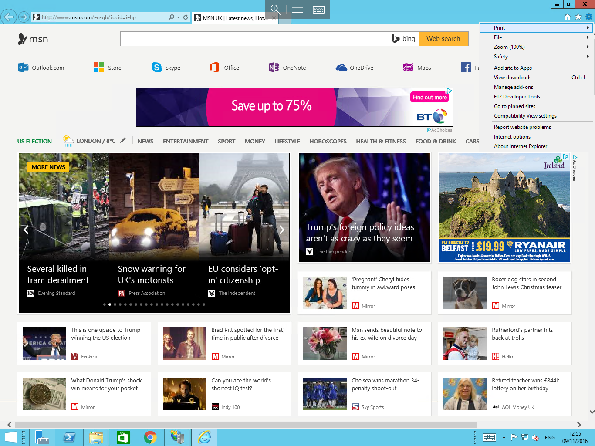
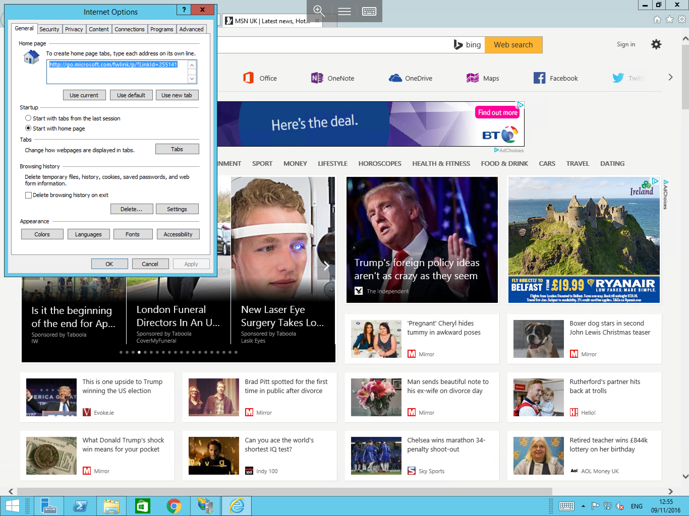
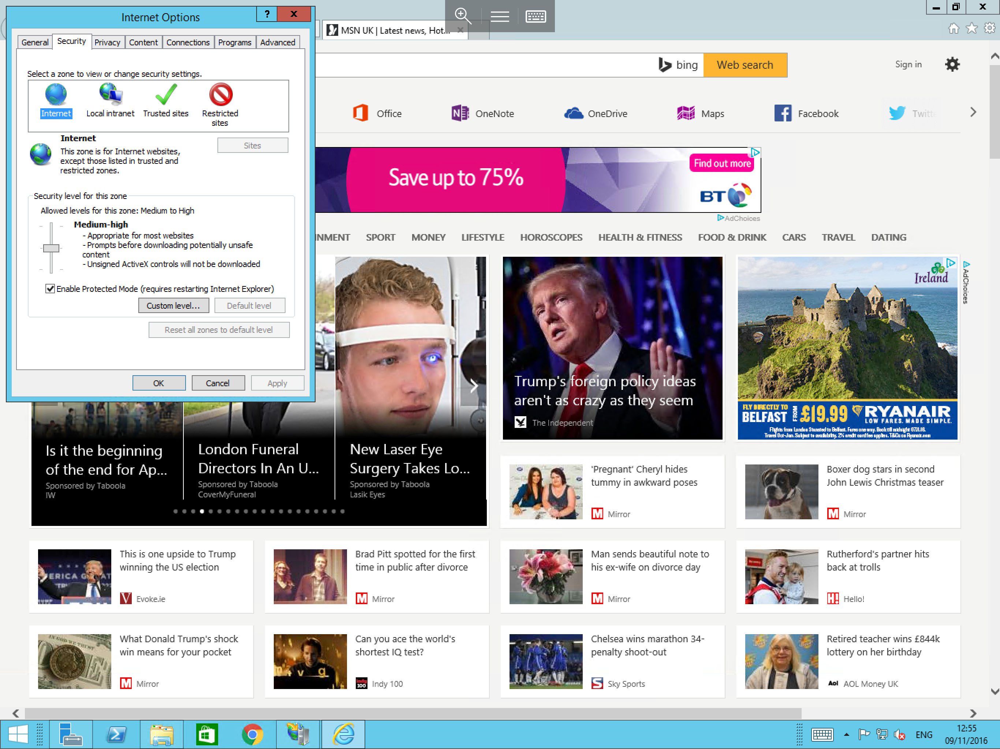

# How to Enable File Download in Internet Explorer on a Windows Server


* In windows Server 2008/2008R2 and Windows Server 2012/2012R2, File downloading in Internet Explorer is disabled by default for added security, to enable file downloads in Internet Explorer, please follow the below guide


## In Windows Server 2008/2008R2 & Windows Server 2012/2012R2

Open internet explorer using the taskbar icon, alternatively, you can open it by selecting start and selecting "Internet Explorer" from the list of available applications, once opened, please select the Cog in the top right hand corner of the screen, and select "Internet Options" from the resulting context box, as below



You will now be presented with the internet options general tab as below



Select the "Security" tab along the top line, you will now see several zones across the top of the window as below, please ensure that you have "internet" selected, and select Custom Level



The Security Settings for the Internet Zone will now be presented, scroll down the list until you reach the "File Download" option around a third of the way down the list and select "Enabled" as below


Select OK and attempt to download your required file.

## In Windows Server 2016

* No Action is required in Windows Server 2016 as file downloads are enabled by default in Internet Explorer.

```eval_rst
  .. title:: Internet Explore file downloads on the Windows Server OS
  .. meta::
     :title: Internet Explore file downloads on the Windows Server OS | UKFast Documentation
     :description: How to enable file downloads in Internet Explorer on a Windows Server
     :keywords: ukfast, windows, download, internet, explorer, iex, ie, server, cloud, enable, tutorial
