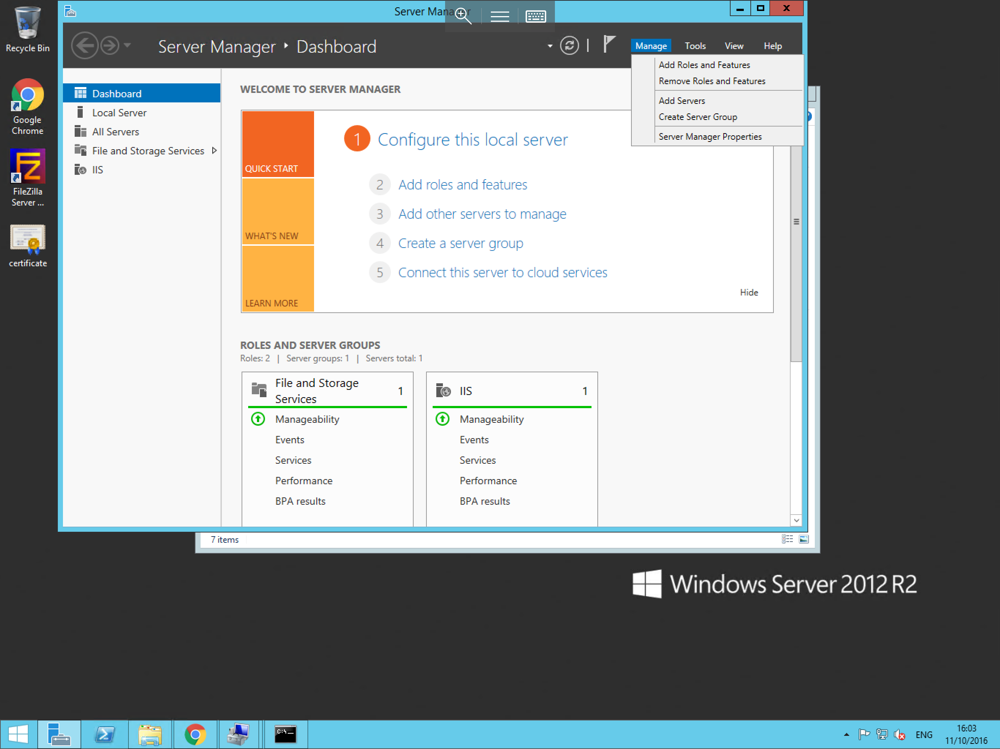
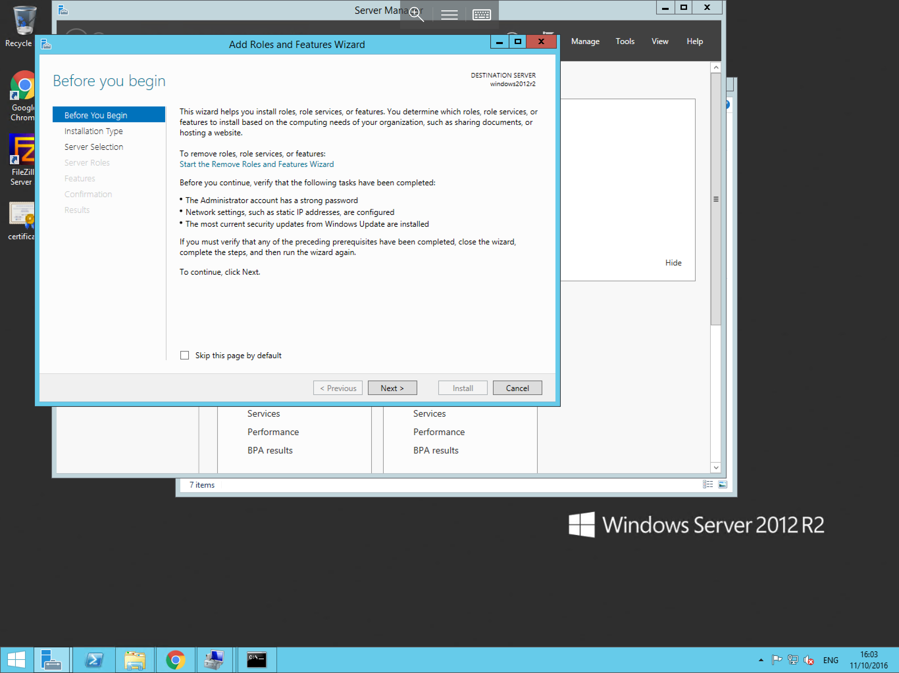
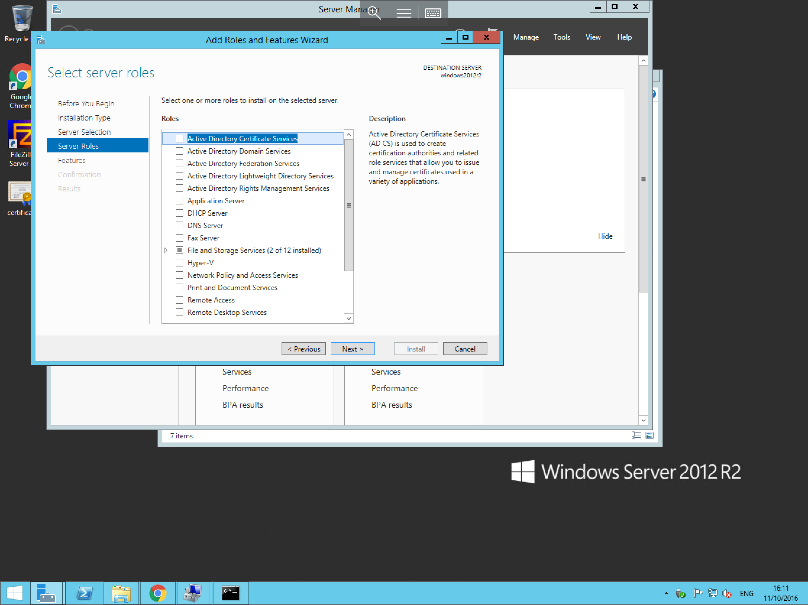

# Installing Roles/Features on Windows Server

In order to install Roles and Features on your Windows Server, Please carry out the following steps

Open the server manager, this can be done via the server manager icon next to the start button, or by selecting the start menu, right clicking on "This PC" and selecting manage.
You should now be presented with the Server Manager window, from this window, select the "Manage" button in the top right hand corner of the window as below, within this context box, you will be given 5 options.
For this guide, please select "Add Roles and Features"



You will now be presented with the Add Roles and Features Wizard as below, the first page of the wizard is the "Before You Begin" page, this page outlines a small number of prerequisite recommendations, these recommendations are not compulsory, however it is advised that you ensure these are in place, if you are happy that your server meets these requirements, please select next



The next page asks you to select the installation type, this provides you with the option to select a Role or Feature Based installation, or a Remote Desktop Services installation, in this instace, the default option of "Role-Based or feature-based Installation" is the suitable option, with this selected, please select next.


You will now be presented with the select destination server window, within this window, you will need to ensure that the "select a server from the server pool" radio button and your server are selected as below, once selected, please select next.


The Wizard will now ask you to choose the Required Roles as below, within this window, search the "Roles" menu, and select the Role/s which you wish to install. Once you have made your selection, select next.



The next window is the Select Features window as below, Features which are directly related to the Roles which you selected on the previous page, will automatically be selected here, however you can choose to install additional features if required.


Once you have selected the required features, please select next, and you will be asked to confirm the installation selections, on this pane, you will also be given the option to Restart the server if required. once you have reviewed this page, please select install as below


The installation of your chosen Roles and Features will now begin and will look similar to the example below, once the installation is complete, this pane will notify you. and you can select close.


* This process can be repeated as and when you need to install any new roles or features on the server.

```eval_rst
  .. title:: Installing Roles and Features on Windows Server | UKFast Documentation
  .. meta::
     :title: Installing Roles and Features on Windows Server | UKFast Documentation
     :description: A guide to installing new roles and features on Windows
     :keywords: ukfast, windows, server, install, roles, features, cloud, tutorial
