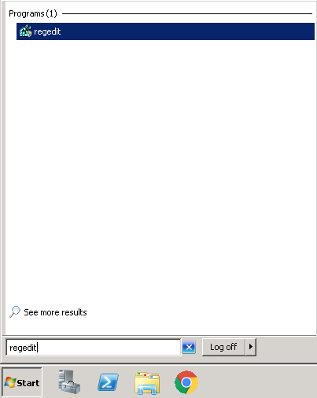
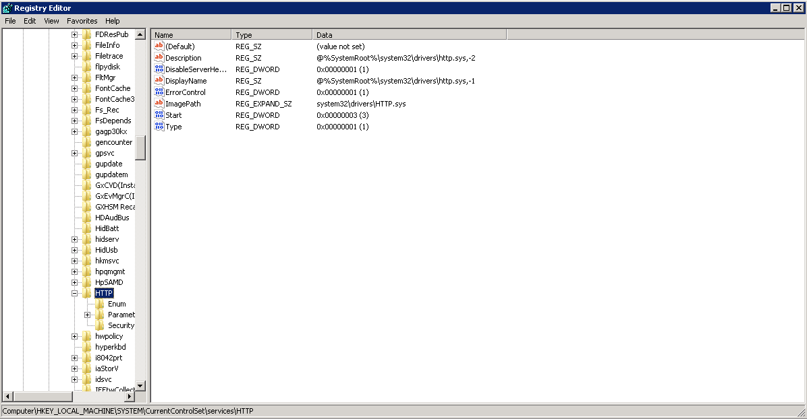
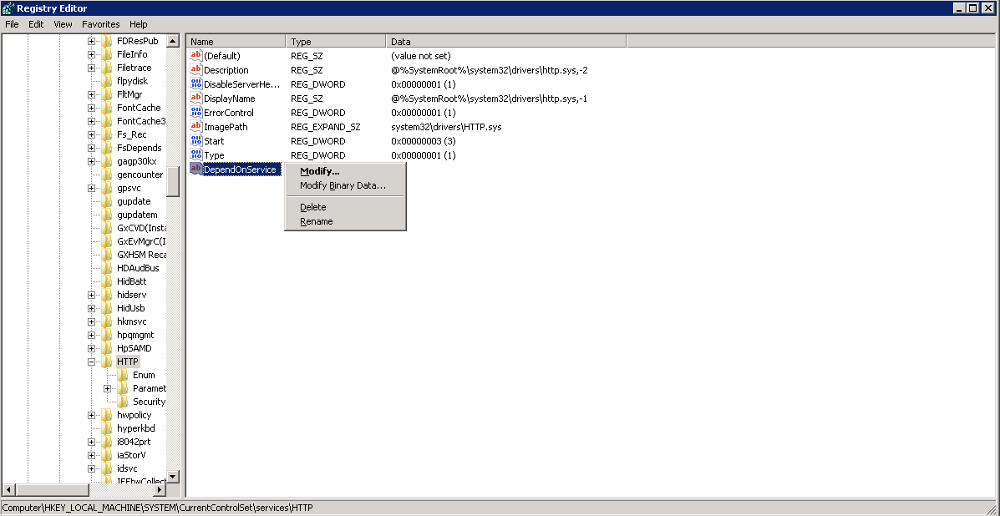
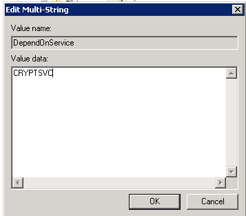

# KB2379016 - Windows Server 2008 stuck at "Applying user settings..."

This is a known issue in Windows Server 2008 that has subsequently been fixed in Windows Server 2008R2


The issue occurs because of a deadlock in the Service Control Manager database.

The Service Control Manager tries to start the `HTTP.sys` service and then puts a lock in place in the Service Control Manager database.
`HTTP.sys` then makes a call that requires Cryptographic Services during startup, this triggers a request to start Cryptographic Services. 
However, a lock is already in place in the Service Control Manager database. Therefore, a deadlock occurs and neither service can start correctly.

* A Hotfix is available to resolve this issue, which can be downloading by visiting the following link

[Hotfix-KB2379016](https://support.microsoft.com/en-gb/kb/2379016)

This patch is a preventative measure, however, and if the issue has already occured and you are unable to log in to your server normally, please follow the below guide to rectify the issue.

* To carry out this manual patch, you will need to boot the server in to safe mode, to do this, press F8 during the POST process at startup, continue to press the key until you are presented with the "Advanced Boot Options" as below and select "Safe Mode"


Once the server has booted in to safe mode, Select the Start menu, type regedit, and then press ENTER as below



You should now be presented with the Registry Editor,navigate through the hive to reach the `HTTP` key, the full path to this key is `HKEY_LOCAL_MACHINE\SYSTEM\CurrentControlSet\Services\HTTP`. Once you have reached the HTTP key, you should now be presented with the required location as demonstrated below



Right click on the HTTP folder, and select "New" then select "Multi-String value" as below


A new key will now be created, name the key `DependOnService` and click in a blank area to set the name. Now Right click the "DependOnService" key and select "Modify" as below



You will now be presented with the "Edit Multi-String" pane, in the "Value Data" field, please enter `CRYPTSVC` and select enter as below



Please close the Registry Editor, and reboot your server at the earliest opportunity to apply the new Registry Key, on this occasion, leave the server to boot normally, and the issue should now be resolved, allowing you to log in as normal.

```eval_rst
  .. title:: KB2379016 - known Windows Server 2008 error | UKFast Documentation
  .. meta::
     :title: KB2379016 - known Windows Server 2008 error | UKFast Documentation
     :description: How to resolve the known Windows Server 2008 error KB2379016 relating to applying user settings
     :keywords: ukfast, windows, windows server, error, 2008, KB2379016, fix, tutorial, guide, cloud, server
