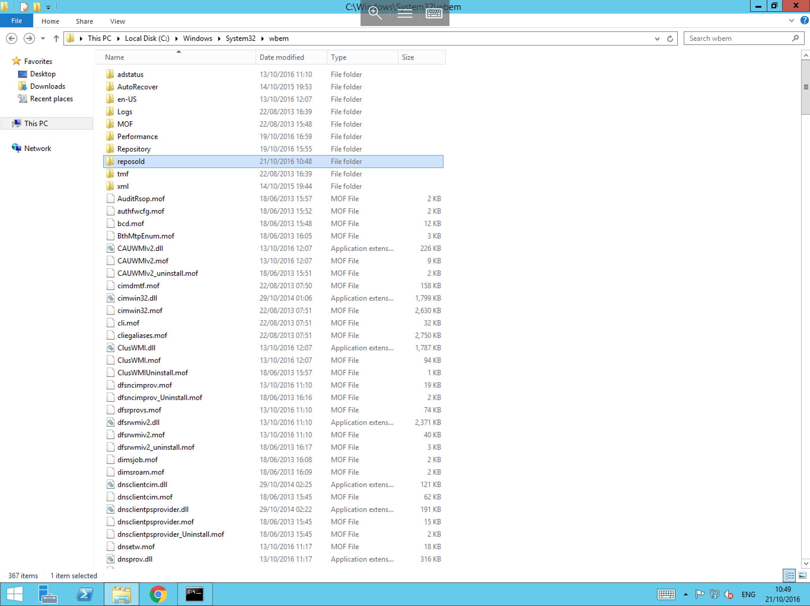

# Cleaning the WBEM Repository

The Web-Based Enterprise Management(WBEM) repository contains the Windows Management Instrumentation (WMI) files.

WBEM is an industry initiative to develop a standard technology for accessing management information in an enterprise environment. WMI uses the Common Information Model (CIM) industry standard to represent systems, applications, networks, devices, and other managed components. CIM is developed and maintained by the Distributed Management Task Force (DMTF).

The WBEM directory is located in `C:\Windows\System32\wbem`

If the directory has grown to an unreasonable size (5GB+), this can be due to a backup of the repository being taken every time the WMI repository is repaired or recreated. You will be able identify if this is the case as several folders called `Repository.xxx` will be present where the `.xxx` is the number of the backup.

If there are a number of `Repository.xxx` files, it is likely that there was a consistency issue detected when the repository was rebuilt, so the backup copy was not removed.

To correct this, and reduce the storage footprint of this location, please follow the below guide:

* Select Start, then type `cmd`, right-click the resultant `cmd.exe` and select "Run as administrator". You will now be presented with a Command Prompt window. Within the Command Prompt, please type `net stop winmgmt` as below and press Enter.


* The command will now stop the `windows management instrumentation` service, in some configurations, the service may also need to close secondary services to completely stop WMI. If so, the command will prompt you to confirm. Enter "Y" and press Enter.
* Once the process has been completed, you will receive a notification in the Command Prompt as shown


* Now navigate to the WBEM directory which is located in `C:\Windows\System32\wbem`, and right click in any blank space. Select "New" and select "Folder". Name this folder something intuitive such as `reposold` as below.
* Move any folder named `repositoryxxx` followed by a number (for example `respository001`) in to the new folder which you have just created.



* Once all of the required files have finished moving to their new directory, return to the Command Prompt, and type `net start winmgmt` then press Enter. This will bring Windows Management Instrumentation back online and will confirm that the process has completed as below


* Once you have completed the above steps, reboot the server to initiate the rebuild of the repository. If everything is working as expected, you can now navigate to the `wbem` folder, and delete the `reposold` folder.
* If you experience issues, please navigate back to `wbem`, and copy the contents of `reposold` back in to the `wbem` folder.

```eval_rst
  .. title:: Cleaning the WBEM Repository
  .. meta::
     :title: Cleaning the WBEM Repository | UKFast Documentation
     :description: Instructions and information on cleaning the WBEM Repository on Windows
     :keywords: ukfast, windows, wbem, clean, remove, repository, directory, folder, guide, cloud, tutorial
```
