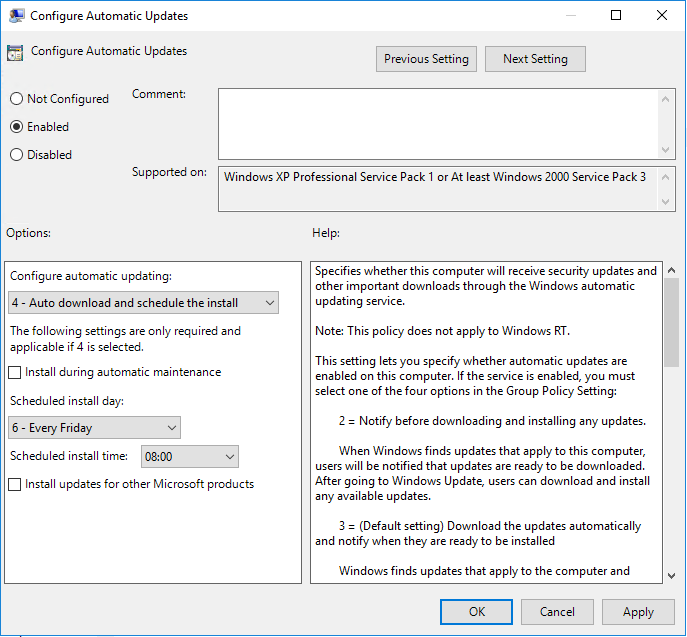
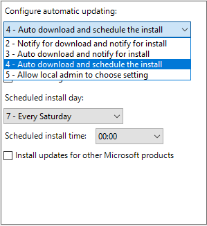
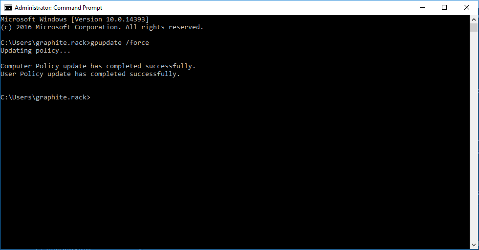

# Changing Windows Updates Installation Options

By default, the policy set for Windows servers is to install Windows Updates each Friday at 08:00. Microsoft release the updates on the second Tuesday of each month, so you'll typically see updates installed on the Friday after that.

This policy can be changed to suit your needs. For example, you may wish for this to take place during the night, when there will be less of an impact to business. We'll detail how to change this below.

* Log into your Windows server via Remote Desktop (RDP). Once you're logged in, click Start, and type `gpedit.msc`. This will bring up the Local Group Policy Editor.

* From here, navigate to the following path:

`Computer Configuration\Administrative Templates\Windows Components\Windows Update`

* Then, click on the following option:

`Configure Automatic Updates`

You should then be able to see a window similar to the below image:



* From here, you can change the day and time this is scheduled for.

Alternatively, you can drop down the first box, and choose one of the other four options:



2 - Notify for Download and Notify for install

This option will require you to manually download and install updates. It's important that if you do choose this option, you ensure you keep on top of updates. These updates contain critical patches to exploits, bug fixes, and much more. If the updates aren't installed frequently, you could be left open to known vulnerabilities.

3 - Auto Download and Notify for install

This option is similar to the one explained above - however the updates will download automatically. It's important to note that, whilst the updates will download automatically, they *won't* install automatically. This still requires manual intervention to install the updates.

4 - Automatically download and schedule the install

This is the option we configure by default. This will handle the download and install of updates automatically for you.

5 - Allow local admin to choose setting

If your server is joined to an Active Directory domain, this allows the local administrator of the server to control how Windows Updates are downloaded and/or installed.

* Finally, once you've made your changes, you can ensure these are updated by doing the following:


* Click Start -> Type `cmd.exe` -> Right click -> Select `Run as Administrator` -> Accept the UAC Prompt -> Type `gpupdate /force`.



Once this has completed, whatever options you've chosen will take effect.

```eval_rst
  .. title:: Changing Windows Updates Options
  .. meta::
     :title: Changing Windows Updates Options | UKFast Documentation
     :description: Information and Instructions about Windows Updates installation options
     :keywords: ukfast, windows, updates, change, date, time, update, group, policy
```
