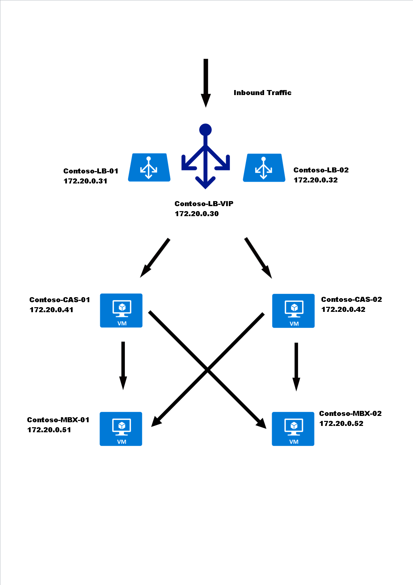

# Exchange 2013 Multi-Server Environment

* The two images below are Physical and Logical Solution diagrams which highlights the flow of mail in a Microsoft Exchange high availability solution. 


## Physical Structure


## Logical Structure



```eval_rst
  .. title:: Microsoft Exchange 2013 Multi-Server Environment | UKFast Documentation
  .. meta::
     :title: Microsoft Exchange 2013 Multi-Server Environment | UKFast Documentation
     :description: Designing a high availability Microsoft Exchange 2013 Multi-Server environment
     :keywords: ukfast, windows, microsoft, exchange, multi, server, environment, structure, cloud
